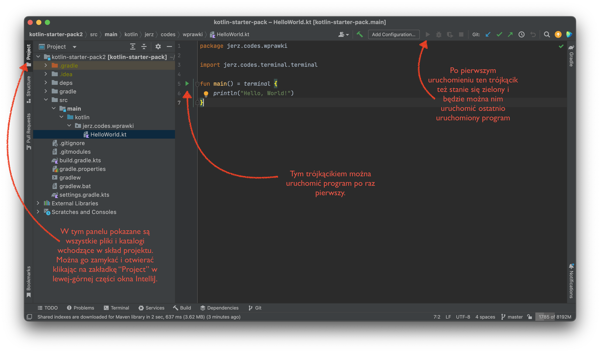
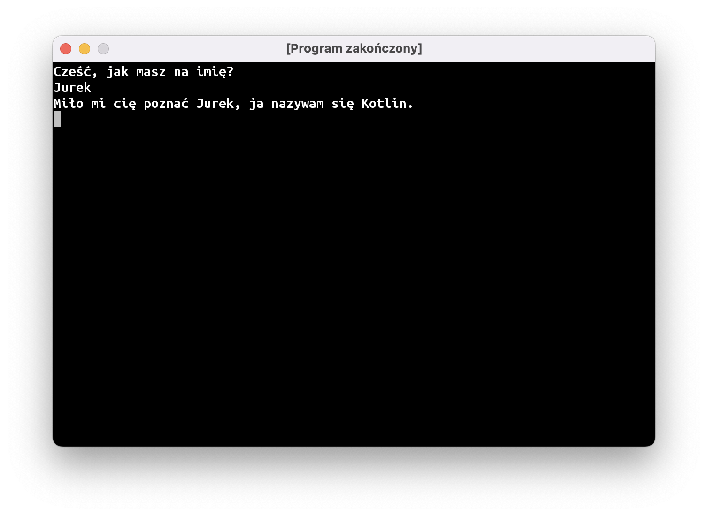

# Gadka-szmatka

Witam was serdecznie!

Zanim przejdziemy do faktycznego programowania, chciałbym udzielić wam kilku rad, żeby dobrze się nam wspólnie pracowało i żebyście wynieśli z tych zajęć jak najwięcej.

Po pierwsze, jeśli czegokolwiek nie będziecie rozumieć, natychmiast dajcie mi znać. Jest to zwłaszcza ważne podczas pierwszych kilku zajęć, podczas których będziemy przechodzić przez fundamenty wiedzy programistycznej. Bez dokładnego opanowania tych podstaw późniejsze lekcje mogą okazać się niezrozumiałe.

Przyznanie się przed całą grupą, że czegoś się nie wie, może być trudne, dlatego musimy postarać się o zbudowanie odpowiedniej atmosfery. Przede wszystkim proszę was o wyrozumiałość względem kolegów i koleżanek (czyli nie przewracać oczami i nie sapać "*Oesu, jak możesz tego nie wiedzieć…*" – takie teksty jeszcze nigdy nikomu nie pomogły) i względem siebie (czyli nie histeryzować "*Jaki ja jestem głupi, ja tego nigdy, przenigdy nie zrozumiem!*" – to też nie pomaga, tylko zatyka się mózg).

Niewiedza na tych zajęciach nie jest niczym wstydliwym: są to przecież **warsztaty** programistyczne, gdzie będziecie się uczyć czegoś nowego, a nie **konkurs** programistyczny, na którym macie zabłysnąć wiedzą i oszołomić umiejętnościami.

Po drugie: uzbrójcie się w cierpliwość. Pierwsze niebanalne gry (np.: Saper) będziecie w stanie napisać dopiero po 2-3 miesiącach, czyli po około 10 spotkaniach. Początkowo wasze programy będą wyglądały i działały dość siermiężnie (screenshoty możecie znaleźć we [wpisie opisującym program i formę zajęć]()), a na poprawę wyglądu i sposobu sterowania będziemy potrzebować kolejnych kilkunastu zajęć.

Ten wolny początkowy postęp wynika głównie z tego, że nie wspomagamy się żadnymi "gotowcami" i szablonami: prawie każdą linijkę kodu będziecie pisać własnoręcznie. W przyszłości zapewni wam to pełną swobodę w tworzeniu waszych wymarzonych gier, ale na wstępie będzie mocno ograniczało wasze możliwości.

Po trzecie: wasza grupa liczy osiem osób, a prowadzący jest jeden. Może zdarzyć się, że kilka osób naraz będzie potrzebowało pomocy i fajnie by było, gdybyście w takich sytuacjach pomagali sobie nawzajem. Przy czym nie na zasadzie "dawaj tę klawiaturę, to ci to napiszę", tylko starajcie się wytłumaczyć koledze lub koleżance, gdzie w ich programie jest błąd, albo o co IntelliJ ma pretensje.

Podsumowując: nie wstydzimy się niewiedzy i śmiało zgłaszamy się, jeśli coś jest niejasne; pomagamy sobie nawzajem i jesteśmy wyrozumiali zarówno względem innych, jak i siebie samych.

# Zapoznanie z IntelliJ

IntelliJ to nasze środowisko programistyczne, czyli, inaczej mówiąc, program do pisania innych programów. Zrobię wam teraz bardzo szybki kurs korzystania z tego programu, żebyśmy mogli przejść do nauki programowania.



Musicie dowiedzieć się trzech rzeczy:

## Jak otworzyć kod programu

Po lewej stronie znajduje się panel `Project` z katalogami i plikami naszego programu. Można go chować i pokazywać naciskając na jego zakładkę albo używając skrótu `Alt + 1` (`⌘1` na MacOS). Na razie nie chcę wam zawracać głowy organizacją plików i katalogów w naszym projekcie. Pierwsze programy będą na tyle małe, że spokojnie możemy napisać każdy z nich w pojedynczym pliku. Możecie otworzyć plik, wybierając go w panelu po lewej stronie. Żeby przejść z panelu plików do pisania kodu, wystarczy nacisnąć przycisk `Esc`.

## Jak uruchomić program

Program po raz pierwszy uruchamiamy skrótem klawiszowym `Ctrl + Shift + F10` (`Ctrl + Shift + r` na MacOS) albo klikając na zielony trójkącik po lewej stronie kodu źródłowego. Drugi raz ten sam program możemy uruchomić skrótem `Shift + F10` (`Ctrl + r`) albo klikając zielony trójkącik na pasku narzędzi.

## Jak stworzyć plik na kolejny program

Żeby stworzyć nowy program, musimy przejść do panelu plików, a następnie najlepiej wybrać jeden z poprzednich programów i zrobić klasyczny manewr `Ctrl + C`, `Ctrl + V` (czyli "*hej, hej, kopiuj-wklej*"), wpisać nazwę nowego programu, a następnie wywalić wszystko z głównej funkcji programu.

# Podstawy podstawowych podstaw programowania

## Funkcja `main`

Funkcja to instrukcja, którą opisujemy, co komputer ma zrobić. W języku Kotlin funkcje tworzymy w następujący sposób:

```kotlin
fun nazwaFunkcji() {
    // Pomiędzy nawiasami klamrowymi jest tzw. ciało funkcji, czyli wszystkie
    // instrukcje, które mają zostać wykonane.

    // W Kotlinie wszystko po dwóch znaczkach / jest ignorowane – to tzw. komentarz do 
    // kodu źródłowego. Komentarze dodaje się po to, żeby wyjaśnić coś osobie czytającej kod.
}
```

Główną funkcję programu przyjęło się nazywać `main`:

```kotlin
fun main() {
    // Najbardziej podstawowy, ale też bezużyteczny program.
    // Nie robi absolutnie nic.
}
```

Funkcja może uruchamiać inne funkcje. Funkcje uruchamiamy (lub inaczej mówiąc: wywołujemy) pisząc jej nazwę i parę okrągłych nawiasów:

```kotlin
fun main() {
    // Program zawierający wywołanie funkcji println.
    // W dalszym ciągu jest on mało użyteczny.
    // Wypisuje na ekran jedną pustą linię. 
    println()
}
```

Niektóre funkcje przyjmują argumenty. Inaczej mówiąc: można im dać "klocek", a one będą się różnie zachowywać w zależności od tego, jaki damy im klocek. Programowanie tak naprawdę sprowadza się do tego, żeby tworzyć różne klocki i przekazywać je do różnych funkcji w taki sposób, żeby komputer robił to, co chcemy, żeby robił. Brzmi prosto, ale oczywiście proste nie jest.

Na przykład, funkcja `println` może wypisać na ekran to, co jej damy. W pierwszym programie testowym, który pobraliście wraz z szablonem projektu, tworzymy klocek zawierający tekst i przekazujemy go do funkcji `println()`, żeby wypisać ten tekst na ekran:

```kotlin
fun main() = terminal {
    println("Hello, World!")
}
```

### Drobna dygresja

Być może zauważyliście, że funkcja `main` w kodzie powyżej wygląda troszkę inaczej niż funkcje `main` opisane wcześniej: pojawił się dziwny zapis `fun main() = terminal {`.

Dzięki temu nasz program uruchomi się w osobnym okienku i powinien działać tak samo na wszystkich komputerach. Na razie nie będę tłumaczył co dokładnie dzieje się "pod spodem" i jak działa ten zapis. To jedna z bardzo niewielu sytuacji na naszych zajęciach, gdy zmuszeni jesteśmy korzystać z "magicznego" kawałka kodu, niestety nie udało mi się znaleźć lepszego rozwiązania.

## Echo

"Klocki", mogą być "tworzone" przez inne funkcje. Mówimy wtedy, że jakaś funkcja "zwraca" nam coś. Przykładowo, funkcja `readln()` czeka, aż użytkownik wpisze na klawiaturze linię tekstu i naciśnie enter. "Klocek" z tekstem, zwrócony przez funkcję `readln` przekazujemy do `println`, dzięki czemu program wypisuje na ekran dokładnie to, co napisał użytkownik.

```kotlin
fun main() = terminal {
    println(readln())
}
```

## Stałe

"Klockom" zwracanym przez funkcje albo tworzonym wewnątrz programu, można nadawać nazwy. Na nazwę, jaką nadamy naszemu "klockowi", mówimy "stała" (stąd też słowo kluczowe, którego używamy: `val`, od "*value*", czyli "*wartość*").

```kotlin
val echo = readln()
```

Jak sama nazwa wskazuje, stała jest czymś stałym, czego nie da się zmienić. To coś w rodzaju naklejki albo metki, na której napisana jest jakaś nazwa, którą przyklejamy do naszego "klocka". W późniejszych częściach programu możemy używać tej nazwy wszędzie tam, gdzie normalnie użylibyśmy jakiegoś "klocka". Czyli te linijki mają mniej więcej takie znaczenie:

```kotlin
// stwórz klocek z tekstem "Hello" i przyklej do niego metkę "cześćPoAngielsku"
val cześćPoAngielsku = "Hello"

// odszukaj klocek z metką "cześćPoAngielsku" i przekaż go do funkcji println,
// żeby wypisała go na ekran.
println(cześćPoAngielsku)       
```

Do każdego "klocka" można przyczepić dowolną liczbę metek, a dalsza część programu może używać dowolnej z nich.

```kotlin
val cześćPoAngielsku = "Hello"
println(cześćPoAngielsku) // dokładnie to samo co println("Hello")

val hello = cześćPoAngielsku
println(hello)            // w dalszym ciągu wypisze to "Hello"
println(cześćPoAngielsku) // możemy używać jednej i drugiej nazwy
```

## Przywitanie

Wykorzystajmy to, co poznaliśmy do tej pory, aby stworzyć program, który przywita użytkownika, zapyta o imię, a potem użyje tego imienia w wypisywanym na ekran tekście:



Żeby wypisywać rzeczy w tej samej linii, możemy użyć kilku instrukcji `print`, które w przeciwieństwie do `println()` nie przechodzi do nowej linii.

Możemy też "skleić" kilka tekstów w jeden używając operatora dodawania:

```kotlin
val imię = readln()
val wiadomość = "Cześć " + imię + ", jak się masz?"
println(wiadomość)
```

### Szablony tekstu

Nieco czytelniej można napisać ten program z wykorzystaniem szablonów tekstu. Szablon tekstu to tekst
z "dziurami", które można wypełnić jakimś kodem. To tak, jak formularz, który wasi rodzice muszą wypełnić przed wycieczką szkolną – duża część tekstu jest wydrukowana, ale są też miejsca na wpisanie informacji o uczniu (imię, nazwisko, klasa, itp.).

W Kotlinie szablon to tekst, który zawiera kawałki kodu po znaczku `$`, najczęściej przekazujemy tam po prostu stałą. Jest to prosty sposób na utworzenie "klocka" z tekstem powstałym z połączenia jakiegoś tekstu oraz stałych:

```kotlin
val imię = readln()
println("Miło mi cię poznać $imię, ja nazywam się Kotlin.")
```

## Najnudniejsza funkcja świata

Oprócz funkcji `main` możemy stworzyć dowolną liczbę własnych funkcji, a każda z tych funkcji może być dowolnie skomplikowana. Na dobry początek stwórzmy najnudniejszą funkcję świata, która po prostu wypisze na ekran kreskę. Tak jak w przypadku funkcji `main`, musi mieć ona jakąś nazwę oraz listę instrukcji w bloku kodu oznaczonym klamerkami.

```kotlin
fun main() = terminal {
    println("Nad kreską")
    kreska()
    println("Pomiędzy kreskami")
    kreska()
    println("Pod kreską")
}

fun kreska() {
    println("-----------------")
}
```

## Parametry funkcji

Funkcje mogą być stworzone ot tak sobie albo mogą być "doklejone" do "klocka". Na przykład każdy klocek z tekstem ma "doklejoną" do siebie funkcję `uppercase`, która zwraca ten sam tekst, tylko że pisany z użyciem samych dużych liter. Żeby wywołać funkcję "doklejoną" do tekstu, musimy użyć takiego zapisu:

```kotlin
println("cichutko...".uppercase()) // wypisze "CICHUTKO..."
```

Wykorzystamy teraz funkcję `uppercase()`, aby stworzyć własną funkcję, która będzie "wykrzykiwać" wszystko to, co jej damy:

```kotlin
fun main() = terminal {
    megafon("uwaga, uwaga")
}

fun megafon() {
    print("📣 ")
    // hmm, ale w jaki sposób dostać się do klocka z tekstem "uwaga, uwaga"?
}
```

No ale właśnie, w jaki sposób przekazać parametry (albo inaczej: argumenty), do naszej funkcji? Pomiędzy nawiasami po nazwie funkcji możemy podać jakie argumenty nasza funkcja przyjmuje, czyli jakie "klocki" można jej podać. Każdy argument, czyli "klocek" przekazany do funkcji, musi mieć jakąś nazwę, oraz typ.

```kotlin
fun megafon(tekst: String) {
    print("📣 ")
    print(tekst.uppercase())
    println("!!!")
}
```

Nazwa, to "metka", jakiej będziemy używać wewnątrz funkcji, żeby skorzystać z "klocka" przekazanego do funkcji. A co to jest typ? Można o tym myśleć, jako o "kształcie klocka". Nasza funkcja `megafon` będzie oczekiwać "klocków" z tekstem, czyli typu `String`.

# Podsumowanie

Podsumujmy to, czego nauczyliśmy się do tej pory:

* Funkcje to bloki instrukcji, które komputer ma wykonać. Główna funkcja, która będzie wykonana po uruchomieniu programu, nosi nazwę `main`. Funkcje wykonują inne funkcje – nasze własne i wbudowane w język.
* Funkcje mogą przyjmować dowolną ilość "klocków"-parametrów. Mogą też zwracać jakiś "klocek" (ale tylko jeden).
* "Klocki" z danymi są albo tworzone w kodzie programu, albo zwracane przez inne funkcje.
* Każdy "klocek" i każdy parametr funkcji ma swój "kształt". Żeby dało się przekazać "klocek" do funkcji jako parametr, te "kształty" muszą się zgadzać
* "Klockowi" można nadać nazwę, tak jakbyśmy przyklejali do niego "metkę" z jego nazwą

Poznajmy też prawidłową terminologię:

* Na "funkcje" faktycznie mówi się po prostu **funkcje** (inne określenie, które możecie spotkać to **metody**).
* "Klocki", które przekazujemy do funkcji to **obiekty**.
* "Metki", przyczepiane do "klocków" to **stałe**.
* "Kształt" obiektu to jego **typ**.

Konkretne funkcje, typy, i mechanizmy języka, które poznaliśmy do tej pory to:

* Funkcja `println()` wypisuje linijkę tekstu na ekran
* Funkcja `readln()` czeka, aż osoba korzystająca z naszego programu wpisze linijkę tekstu i naciśnie ENTER, po czym zwraca obiekt z tym tekstem.
* Funkcja `print()` wypisuje tekst na ekran, ale nie kończy linii. Dzięki temu można wypisać wiele rzeczy w jednej linijce.
* Można łatwo połączyć tekst i obiekty korzystając z szablonów: `"Cześć $imię, jak się masz?"`
* Inny sposób na łączenie obiektów tekstowych to operator dodawania: `"Cześć " + imię + ", jak się masz?"`
* Niektóre funkcje są "doczepione" do obiektów, np.: funkcja `uppercase` doczepiona jest do obiektów tekstowych.
* Obiekty tekstowe mają typ `String`.