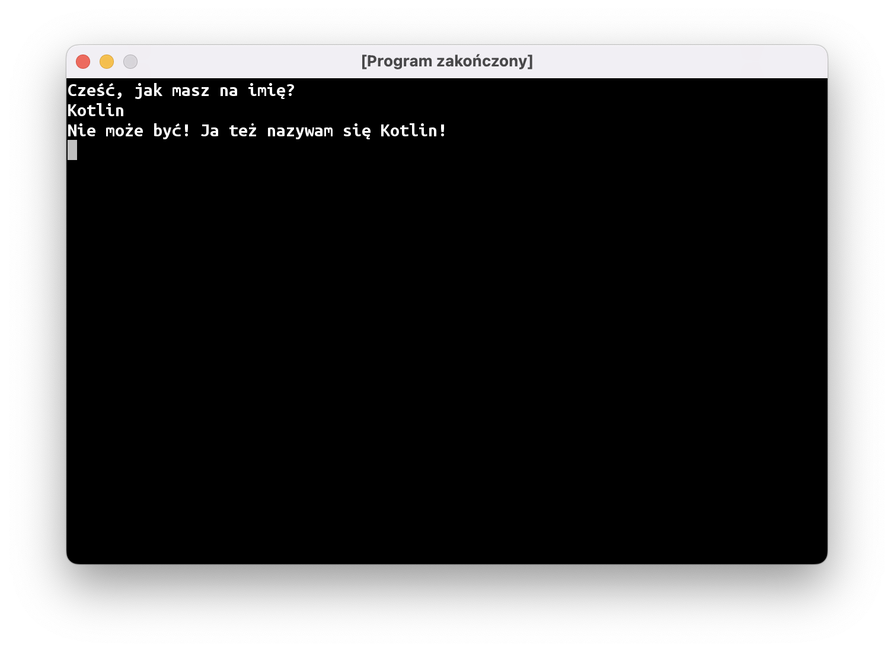



# Funkcje, c.d.

Poprzednie zajęcia skończyliśmy na pisaniu funkcji `megafon`:

```kotlin
fun main() = terminal {
    val ostrzeżenie = "uwaga, uwaga"
    megafon(ostrzeżenie)
}

fun megafon(tekst: String) {
    print("📣 ")
    print(tekst.uppercase())
    println("!!!")
}
```

Jest jeszcze kilka rzeczy, których możemy nauczyć się na tym przykładzie.

## Zakresy widoczności

Jeżeli spróbujemy wewnątrz funkcji `megafon` użyć stałej `ostrzeżenie`, nasz program nie uruchomi się, a IntelliJ podkreśli tę linijkę na czerwono:

```kotlin
fun main() = terminal {
    val ostrzeżenie = "uwaga, uwaga"
    megafon(ostrzeżenie)
}

fun megafon(tekst: String) {
    print("📣 ")
    print(ostrzeżenie.uppercase()) // hmm, czemu to nie działa?
    println("!!!")
}
```

Natknęliśmy się na bardzo ważną programistyczną koncepcję: zakresy widoczności.

Wyobraźcie sobie, że każda funkcja jest pudełkiem. Pudełko ma otworki, przez które można wsunąć do niego "klocki" – to są nasze parametry funkcji. Metki przyczepione do wsuwanych klocków nie są widoczne wewnątrz pudełka, więc nie można ich tam użyć. Zamiast tego, każdy otwór ma swoją nazwę, której można używać wewnątrz funkcji. 

## Typ `Int`

A co stanie się, jeśli spróbujemy przekazać do `megafonu` liczbę?

```kotlin
fun main() = terminal {
    megafon("uwaga, uwaga")
    megafon("rozpoczynamy odliczanie")
    megafon(3) // błąd
    megafon(2) // błąd
    megafon(1) // błąd
    megafon("start")
}
```

Program zostanie podświetlony na czerwono. Liczby i tekst to dwa różne "kształty". Nie możemy przekazać liczby (typu `Int`) do funkcji, która oczekuje argumentu `String`. To tak, jakbyśmy starali się wepchnąć kwadratowy klocek w okrągły otwór.

Na szczęście, da się temu łatwo zaradzić: możemy na podstawie naszego "kwadratowego" (`Int`-owego) klocka z liczbą stworzyć nowy, "okrągły" "klocek" typu `String`. Służy do tego funkcja `toString()`, która "dolepiona" jest do każdego "klocka" w języku Kotlin.

```kotlin
fun main() = terminal {
    megafon("uwaga, uwaga")
    megafon("rozpoczynamy odliczanie")
    megafon(3.toString())
    megafon(2.toString())
    megafon(1.toString())
    megafon("start")
}
```

## Funkcje zwracające obiekt

Funkcje mogą nie tylko przyjmować "klocki", ale także je tworzyć. Używaliśmy już kilku takich funkcji:

- `readln()` zwraca linijkę tekstu wpisaną przez użytkownika
- `uppercase()` zwraca tekst zamieniony na wielkie litery

Napiszmy teraz własną metodę, która będzie zwracać jakieś dane. Po nawiasach okrągłych musimy podać po dwukropku typ, czyli "kształt klocka", który będzie tworzyć nasza funkcja. Następnie, wewnątrz funkcji musimy użyć słowa kluczowego `return`, żeby zakończyć działanie naszej funkcji i zwrócić jakiś "klocek":

```kotlin
fun najfajniejszyWyrazŚwiata(): String {
    return "pomidor"
}
```

# Instrukcja `if`

Załóżmy, że piszemy grę, gdzie gracz steruje statkiem. W zależności od tego, który przycisk naciśnie gracz, powinny dziać się różne rzeczy. Czyli nie chcemy wykonywać wszystkich instrukcji w programie po kolei, z góry na dół. Jeżeli gracz naciska strzałkę w lewo, to statek ma lecieć w lewo; jeśli naciska strzałkę w prawo – to w prawo. Czyli mamy klasyczną sytuację "jeśli dzieje się coś, to zrób to; w przeciwnym razie, zrób tamto". W programowaniu służą do tego instrukcje warunkowe. W języku Kotlin wygląda ona następująco:

```kotlin
if (warunek) {
    // zrób coś
} else {
    // zrób coś innego
}
```

Nasz `warunek` to też tak naprawdę "klocek" o specjalnym kształcie – `Boolean`, czyli obiekt, który reprezentuje Prawdę albo Fałsz. Jednym ze sposobów stworzenia takiego klocka jest operator porównania `==` (używamy dwóch znaczków równości, bo pojedynczy jest używany do tworzenia stałych i zmiennych). Jeśli obiekty po lewej i po prawej stronie są sobie równe, dostaniemy w wyniku obiekt `true`, czyli Prawdę. W przeciwnym razie dostaniemy `false`, czyli Fałsz.

Na próbę przeróbmy nasz program witający użytkownika tak, aby inaczej reagował, gdy użytkownik wpisze imię "Kotlin":



Oczywiście, jeśli ktoś wpisze inne imię, powinien zostać wypisany normalny komunikat:


# Podsumowanie

* Stałe stworzone wewnątrz funkcji nie są widoczne w innych wywoływanych funkcjach. Fachowo nazywamy to **zakresem widoczności**. 
* Liczby całkowite w Kotlinie mają typ `Int` (z angielskiego "*integer*").
* Każdy obiekt ma funkcję `toString()`, która tworzy tekstową reprezentację tego obiektu. W ten sposób możemy zamienić liczbę `1` na tekst `"1"`.
* Dzięki instrukcji warunkowej `if (…) {} else {}` nasz program może wykonać inne kawałki kodu w zależności od sytuacji.
* Typ `Boolean` używany jest do przedstawienia prawdy (obiekt `true`) lub fałszu (`false`).
