

# Nasze zmagania z kodowaniem

Na poprzednich zajęciach spora część grupy miała kłopot z napisaniem programów "Echo" oraz "Przywitanie". Problemy, które zauważyłem, można podzielić na następujące kategorie:

## Nie wiem, jak dokładnie ma działać program?

Kilka osób napisało programy, które teoretycznie działały, ale nie robiły dokładnie tego, co miały robić. Zakładam, że stało się tak, ponieważ na rzutniku wyświetlone były screenshoty, a opis działania przekazałem tylko słownie i niektóre szczegóły mogły umknąć waszej uwadze.

Lepszym pomysłem na przyszłość będzie uruchamianie wzorcowego programu, żeby zademonstrować jego działanie w praktyce, a następnie pokazanie na rzutniku screenów wraz z opisem działania – tak, aby każdy mógł w dowolnej chwili do niego wrócić.

## Nie wiem, od czego zacząć?

Kilka osób nie wiedziało jak zacząć albo utknęło w pewnym momencie pisania programu. To będzie niestety problem, z którym będziecie borykać się przez cały czas i jedynym rozwiązaniem jest praktyka, praktyka i jeszcze raz praktyka.

Programowanie to w dużej mierze umiejętność dzielenia dużego problemu na coraz mniejsze pod-problemy i pod-pod-problemiki, aż do momentu, kiedy da się je rozwiązać za pomocą jednej-dwóch linii kodu. Ponieważ macie małą wprawę w pisaniu faktycznego kodu, dobrym pomysłem może być użycie tzw. pseudokodu, czyli tekstu opisującego poszczególne kroki działania programu. Możecie napisać to sobie na kartce, w osobnym pliku w notatniku, albo w kodzie programu jako komentarz (przypomnienie: komentarz w Kotlinie zaczyna się od dwóch znaków `/`, np.: `println("To jest kod!") // a to jest komentarz`).

Czyli zamiast od razu pisać kod programu "Przywitanie" możecie najpierw napisać pseudokod:

```kotlin
// Wypisz na ekran tekst z pytaniem o imię
// Wczytaj imię
// Przywitaj użytkownika używając wczytanego imienia
```

A następnie zastępować jego fragmenty wywołaniem odpowiednich funkcji albo, w przypadku trudniejszych programów, bardziej szczegółowym pseudokodem:

```kotlin
// Wypisz na ekran tekst z pytaniem o imię
println("Witaj! Jak masz na imię?")

// Wczytaj imię
val imie = readln()

// Przywitaj użytkownika używając wczytanego imienia
println("Cześć $imie, miło mi cię poznać!")
```

Pamiętajcie też o podstawowych pojęciach: funkcjach, obiektach i stałych. Działanie waszych programów zawsze sprowadzać się będzie do uruchamiania funkcji, tworzenia obiektów i przekazywania ich do innych funkcji. Jeśli wczytujecie tekst z klawiatury przez wywołanie funkcji `readln()`, pamiętajcie, że "wypluje" ona obiekt z tekstem i zastanówcie się, co możecie z nim dalej zrobić (podpowiedź: przypisać do stałej przy użyciu `val nazwaStałej = readln()` albo od razu przekazać do jakiejś innej funkcji, np.: `println(readln())`).

## Morze czerwieni

Problem, który dotykał chyba największej liczby osób to błędy składni. Z pozoru IntelliJ jest edytorem tekstu, więc możemy wpisać, co tylko nam się podoba, ale żeby wpisany tekst był poprawnym kodem, każdy nawias i każda klamerka musi być na swoim miejscu. Wystarczy pominąć jeden znaczek, a IntelliJ zaczyna podkreślać wszystko czerwonymi wężykami.

Znalezienie błędu może sprawiać wam początkowo wiele problemów. Oto kilka sposobów, które mogą wam pomóc:

### Automatyczne formatowanie kodu

Język Kotlin tak naprawdę ignoruje zdecydowaną większość "białych znaków" (tj. spacji, tabów, enterów, itp.). Program "Przywitanie":

```kotlin
fun main() = terminal {
    println("Cześć, jak masz na imię?")
    val imię = readln()

    if (imię == "Kotlin") {
        println("Nie może być! Ja też nazywam się Kotlin!")
    } else {
        println("Miło mi cię poznać $imię, ja nazywam się Kotlin.")
    }
}
```

Równie dobrze można by napisać jako:

```kotlin
fun main() = terminal { println("Cześć, jak masz na imię?")
            val imię = readln()

    
if (imię =="Kotlin"){
    println("Nie może być! Ja też nazywam się Kotlin!")
} else
{
println(                   "Miło mi cię poznać $imię, ja nazywam się Kotlin.")
}
}
```

Albo nawet upchnąć wszystko w jednej linijce:

```kotlin
fun main() = terminal { println("Cześć, jak masz na imię?");  val imię = readln(); if (imię == "Kotlin") { println("Nie może być! Ja też nazywam się Kotlin!") } else { println("Miło mi cię poznać $imię, ja nazywam się Kotlin.") } }
```

Jednak moim zdaniem ta pierwsza wersja jest najbardziej czytelna. Zauważcie, że wcięcia tekstu w tamtej wersji wizualnie tworzą nam "bloczki" podobne do tych znanych np.: z języka Scratch.

Na szczęście nie musimy poprawiać wszystkiego ręcznie, IntelliJ ma funkcję automatycznego formatowania kodu. Po naciśnięciu kombinacji klawiszy `Ctrl + Lewy Alt + L` (na MacOS: `⌥⌘L`) IntelliJ postara się doprowadzić nasz kod do porządku, czyli zamienić pokraczną drugą wersję kodu w czytelniejszą, pierwszą wersję.

Pomaga to również w momencie, gdy napiszemy niepoprawny składniowo kod. Na przykład, jeśli pokręcimy coś z nawiasami klamrowymi, jakiś kawałek naszego kodu zostanie przedwcześnie wyrównany do lewej krawędzi:

```kotlin
fun main() = terminal {
    println("Cześć, jak masz na imię?")
    val imię = readln()

    if (imię == "Kotlin")
        println("Nie może być! Ja też nazywam się Kotlin!")
} else { // <----- dziwna sprawa 🤔  
    println("Miło mi cię poznać $imię, ja nazywam się Kotlin.")
}
}
```

Kod nigdy nie dojdzie do lewej krawędzi:

```kotlin
fun main() = terminal {
    println("Cześć, jak masz na imię?")
    val imię = readln()

    if (imię == "Kotlin") {
        {
            println("Nie może być! Ja też nazywam się Kotlin!")
        } else {
            println("Miło mi cię poznać $imię, ja nazywam się Kotlin.")
        }
    }
// <------- w poprawnym kodzie powinna być tutaj klamerka zamykająca funkcję main
```

Ewentualnie będziemy mieli dodatkowe klamerki na końcu funkcji:

```kotlin
fun main() = terminal {
    println("Cześć, jak masz na imię?")
    val imię = readln()

    if (imię == "Kotlin") {
        println("Nie może być! Ja też nazywam się Kotlin!")
    } else {
        println("Miło mi cię poznać $imię, ja nazywam się Kotlin.")
    }
}
} // dodatkowa klamerka podświetlona na czerwono
```

Autoformatowanie nie usuwa domyślnie pustych linii, tak więc z tym musicie robić porządek sami. Czasami programiści celowo zostawiają pustą linijkę tu i ówdzie, żeby oddzielić od siebie jakieś fragmenty kodu. Zostawianie kilku pustych linijek jedna pod drugą raczej nie ma sensu: to polecam usunąć (skrót klawiszowy: `Ctrl + Y`/`⌘⌫`).

### Popatrzcie na linijkę przed podkreślonym kodem

```kotlin
fun main() = terminal {
    println("Cześć, jak masz na imię?")
    val imię = readln(       // problem jest tutaj… (brakujący nawias okrągły) 

        // … ale IntelliJ zaczyna podkreślać kod od tego miejsca 
        if (imię == "Kotlin") { 
            println("Nie może być! Ja też nazywam się Kotlin!")
        } else {
            println("Miło mi cię poznać $imię, ja nazywam się Kotlin.")
        }
}
```

### Czytanie kodu z góry na dół

Spokojnie czytamy kod i patrzymy czy każda linijka ma sens. Na razie poznaliśmy tylko garść składni:

```kotlin
// komentarz
println()                    // wywołanie funkcji
println("Hello")             // wywołanie funkcji z parametrem
val czesc = "Cześć"          // przypisanie do stałej obiektu stworzonego w kodzie
val imie = readln()          // przypisanie do stałej obiektu zwróconego przez funkcję
println(czesc)               // użycie stałej
println(y.uppercase())       // wywołanie funkcji na obiekcie (i przekazanie wyniku do innej funkcji)
println(czesc + " " + imie)  // klejenie tekstów przy użyciu +
println("$czesc $imie")      // klejenie tekstów przy użyciu szablonów

// bloczek if..else
if (1500 == 2900) {          // porównywanie dwóch obiektów

} else {

}

// definiowanie funkcji
fun funkcja(parametrA: TypParametruA, parametrA: TypParametruB): String {
    return "💥 KABOOM! 💥"    // zwracanie wyniku z funkcji
}
```

Jeśli jakaś linijka nie pasuje do tych wzorców, jest duża szansa, że właśnie w niej jest błąd.

### Pisanie najpierw "bloczku", wypełnianie luk później

Wasza największa zmora to brakujące nawiasy – okrągłe albo klamrowe. Starajcie się pisać kod "bloczkami": pisząc wywołanie funkcji, dajcie od razu dwa nawiasy. Pisząc `if`'a albo `if..else`'a napiszcie najpierw coś takiego:

```kotlin
if () {
    
} else {
    
}
```

I dopiero potem wypełniajcie brakujące luki.

Podobnie, jeśli chcecie napisać funkcję, która będzie przyjmować jeden argument typu `Int` i zwracać `String`, nie starajcie się napisać wszystkiego od razu. Zacznijcie od najprostszego bloczku funkcji i dodawajcie kolejne rzeczy krok po kroku, upewniając się cały czas, że nic nie jest podkreślone na czerwono:

```kotlin
fun mojaSuperFunkcja() {
}
```

Następnie dodajcie argument:

```kotlin
fun mojaSuperFunkcja(argument: Int) {
}
```

Dodajcie informację o zwracanym typie:

```kotlin
fun mojaSuperFunkcja(argument: Int): String {
} // <------- tutaj pojawi się błąd, IntelliJ narzeka na brakujący return
```

Dodajcie wyrażenie `return` z jakimkolwiek tekstem:

```kotlin
fun mojaSuperFunkcja(argument: Int): String {
    return ""
}
```

Dopiero teraz, gdy macie gotowe "rusztowanie" funkcji, zacznijcie pracować nad tym, co funkcja faktycznie ma robić.   

### Cofnięcie zmian do ostatniego działającego stanu

IntelliJ, jak każdy porządny edytor tekstu, ma opcję cofnięcia zmian (skrót `Ctrl + Z`/`⌘Z`). Jeśli wasz program przed chwilą działał i kod był poprawny, możecie spróbować wrócić do tego stanu. Jeśli pojedziecie z cofaniem za daleko, możecie "cofnąć cofnięcie" naciskając `Ctrl + Shift + Z`/`⇧⌘Z`. 

### Zaczynajcie od pustego pliku 

Nie rozszerzajcie jednego pliku `HelloWorld.kt` w nieskończoność. Zamiast tego trzymajcie każdy programik testowy w osobnym pliku. Dzięki temu będziecie mogli łatwo wrócić do napisanych wcześniej programów i podejrzeć jak rozwiązaliście jakieś problemy.

### "Nuke the entire site from orbit – it's the only way to be sure"

Ostatnia deska ratunku: wasz program nie działa, opcja `Undo` nie działa, w zasadzie nic nie działa 😱. Wszystko podkreślone jest na czerwono, powoli przechodzicie w tryb "panika" i przestaje działać nawet wasz mózg.

W takich chwilach trzeba wziąć kilka głębokich oddechów, powiedzieć sobie "no trudno", doprowadzić plik do stanu startowego i zacząć od nowa:

```kotlin
package jerz.codes.wprawki

import jerz.codes.terminal.terminal

fun main() = terminal {
    
}
```

# Nowy materiał

## `String.length`

Możemy poprosić obiekt tekstowy (typu `String`), żeby powiedział nam, ile znajduje się w nim znaków:

```kotlin
val tekst = "Hello"
println("Tekst '" + tekst + "' ma " + tekst.length + " liter.")

// Kod powyżej wypisze na ekran "Tekst 'Hello' ma 5 liter"
```

Możecie zastanawiać się, czy nie brakuje tutaj nawiasów? Czy nie powinno tam być `tekst.length()`? Przypadkiem natknęliśmy się na kolejny element języka: **własności** obiektów (ang. "properties"). Do obiektów, oprócz funkcji (tak jak np.: `uppercase()` na typie `String`), mogą być "przyczepione" także stałe i zmienne. `length` jest stałą typu `Int`, która zawiera liczbę liter w tekście. 

### Szablony tekstu, ciąg dalszy

W kodzie powyżej użyłem operatora `+` do łączenia tekstów w jeden `String`. Zamiast tego, możemy użyć szablonu tekstu. Postawcie kursor w dowolnym miejscu tego wyrażenia i naciśnijcie kombinację `Alt + Enter`/`⌥⏎`. Jest to tak zwane okienko akcji kontekstowych (ang. *context actions*) albo inaczej *quick fixów*.

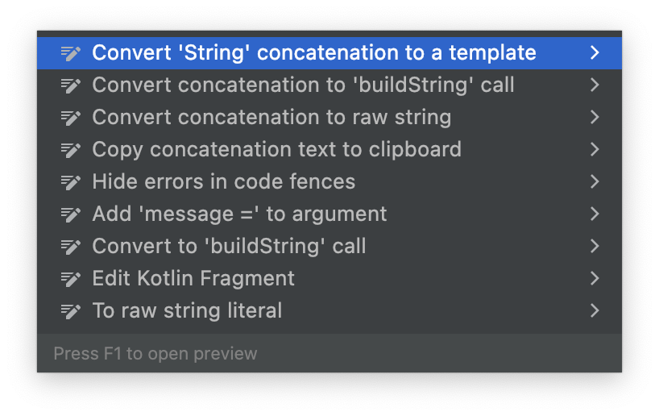

Jeśli wybierzecie opcję `Convert 'String' concatenation to a template`, kod zmieni się w następujący sposób:

```kotlin
val tekst = "Hello"
println("Tekst '$tekst' ma ${tekst.length} liter.")
```

Zaskakujące mogą być dla was klamerki przy drugiej "dziurze" w szablonie. Okazuje się, że jeśli w szablonie tekstu chcemy wstawić tekst zwrócony przez kawałek kodu, musimy ten kod otoczyć nawiasami klamrowymi (spróbujcie, co się stanie, jeśli pominiecie nawiasy!). Jeśli "dziura" zawiera tylko wartość jakiejś stałej, klamerki można pominąć (jest to nawet sugerowane przez IntelliJ jako quickfix; sprawdźcie sami).

### Inne operatory porównania

Na poprzednich zajęciach pokazałem pierwszy operator porównania `==` służący do sprawdzenia, czy dwa obiekty są sobie równe. Są oczywiście dostępne inne operatory arytmetyczne. `a > b`, `a < b`, `a >= b` i `a <= b` są raczej oczywiste (trzeba pamiętać tylko o tym, że dla `>=` i `<=` znak równości jest drugi, nie można napisać `=>` albo `=<`), dziwnym może wydawać się wam operator `!=`. Jest to odwrotność operatora `==`, tj. wyrażenie `a != b` jest prawdziwe, jeśli `a` **nie** jest równe `b`.

## Łańcuszki instrukcji warunkowych

W programie "Przywitanie" reagowaliśmy w szczególny sposób, gdy użytkownik wpisał jako imię `Kotlin`. Jeśli chcielibyśmy dodać więcej reakcji na inne imiona, moglibyśmy osiągnąć ten efekt zagnieżdżając kilka `if..else'ów`:

```kotlin
if (imie == "Kotlin") {
    // A
} else {
    if (imie == "") {
        // B
    } else {
        if (imie == "Jerzy") {
            // C
        } else {
            // D
        }
    }
}
```

W praktyce nie jest to zbyt czytelne, głównie dlatego, że "gałęzie" kodu `A`, `B`, `C` i `D` są tak samo ważne, ale mają różnej wielkości wcięcia i wizualnie wygląda, jakby `A` było ważniejsze od `C` i `D`.

Na szczęście tego typu "serię" instrukcji warunkowych można napisać z pominięciem klamerek dla pośrednich `else`'ów:

```kotlin
if (imie == "Kotlin") {
    // A
} else if (imie == "") {
    // B
} else if (imie == "Jerzy") {
    // C
} else {
    // D
}
```

## Operatory matematyczne

Zrobiliśmy przegląd operatorów matematycznych. Dodawanie `+`, odejmowanie `-` i mnożenie `*` zachowywało się całkowicie normalnie.

Drobnym zaskoczeniem był operator dzielenia `/`. Dzielenie dwóch liczb całkowitych (`Int`) daje w wyniku także liczbę całkowitą, a część ułamkowa jest ignorowana:

```kotlin
println(9 / 3) // wypisze 3
println(9 / 2) // wypisze 4, część ułamkowa z 4½ zostanie odrzucona  
```

Ma to też pewną przykrą konsekwencję: dzielenie i mnożenie liczb całkowitych w Kotlinie nie zawsze jest przemienne. Działania wykonywane są kolejno od lewej do prawej strony i odrzucona część ułamkowa może zmienić końcowy wynik:

```kotlin
println(99 / 100 * 1000) // daje w wyniku 0, ponieważ 99 / 100 == 0
println(99 * 1000 / 100) // daje w wyniku 990
```

Ostatni operator, który poznaliśmy to operator `%`, czyli dla liczb dodatnich reszta z dzielenia:

```kotlin
println(9 % 3) // wypisze 0
println(9 % 2) // wypisze 1
```

## Operatory logiczne

Jeśli chcemy połączyć kilka warunków w jeden, konieczne będzie użycie **operatora logicznego** "lub" albo "i".

Logiczne "lub" w Kotlinie to operator `||`. Zwraca on `true` (prawdę), jeśli przynajmniej jeden z dwóch obiektów `Boolean` po jego stronach jest prawdą:

```kotlin
val prawda     = true  || true   // true
val teżPrawda  = true  || false  // true
val innaPrawda = false || true   // true
val nieprawda  = false || false  // false
```

Bliźniaczy operator logiczny "i" to `&&`. Zwraca `true` tylko jeśli zarówno `Boolean` po jego lewej, jak i po prawej stronie są także prawdziwe, czyli `true`:

```kotlin
val prawda            = true  && true   // true
val nieprawda         = true  && false  // false
val dalejNieprawda    = false && true   // false
val totalnaNieprawda  = false && false  // false
```

Jest również negacja (zaprzeczenie), czyli operator `!`:

```kotlin
val nieprawda           = !true   // false
val nieFałszCzyliPrawda = !false  // true
```

## Konwersja `String` -> `Int`

Poznaliśmy już funkcję `.toString()`, która zamienia obiekty dowolnego typu na tekst. Teraz kolej na zamianę w drugą stronę. Do obiektu `String` "dolepiona" jest metoda `.toInt()` zamieniająca tekst na liczbę.

Wykorzystajmy tę funkcję w kolejnej wersji programu "Przywitanie": będziemy pytać użytkownika o wiek i porównywać go z wiekiem Kotlina (prace nad językiem rozpoczęły się w roku 2010, więc załóżmy, że Kotlin ma 12 lat). Dla każdej możliwości (użytkownik mający mniej/więcej/tyle samo lat) wypiszemy inny tekst:

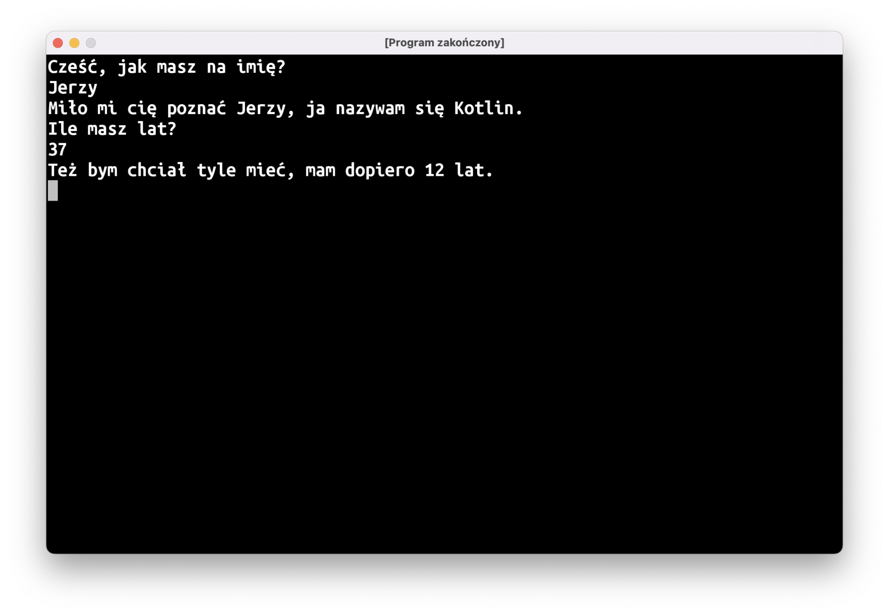

Potrzebny nam będzie łańcuszek instrukcji warunkowych:

```kotlin
println("Ile masz lat?")
val wiek = readln().toInt()
val wiekKotlina = 12

if (wiek == wiekKotlina) {
    println("O, ja też!")
} else if (wiek < wiekKotlina) {
    println("Ha, ja jestem starszy, mam już $wiekKotlina lat!")
} else if (wiek > wiekKotlina) {
    println("Też bym chciał tyle mieć, mam dopiero $wiekKotlina lat.")
}
```

### Nullable types

Zobaczmy teraz, co się stanie, gdy ktoś zamiast wieku wpisze tekst, który nie jest liczbą. Nasz program przestanie działać, a w panelu "Run" w IntelliJ pojawi się czerwony tekst z opisem błędu i informacją, która linijka kodu nie zadziałała.

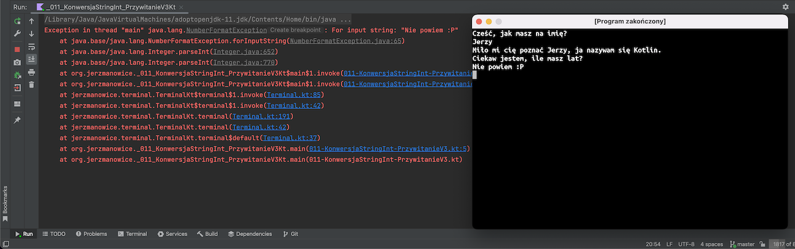

Co konkretnie poszło nie tak? Staramy się w naszym programie wymusić zamianę tekstu wpisanego przez użytkownika na liczbę. Jeśli taka zamiana jest niemożliwa, program się "wykrzaczy". Podobny problem jest bardzo częstą przyczyną błędów w programach. Zapamiętajcie zatem: **ludzie będą wpisywać w waszych programach bardzo dziwne rzeczy i wasze programy muszą być na to gotowe!**

Jak można temu zaradzić? Musimy, niestety, pogodzić się z faktem, że ludzie będą wpisywać różne głupoty. Zamiast funkcji `.toInt()` (czyli "*ten tekst to jest liczba, jestem w 100% pewien, podaj mi ją, proszę*") możemy użyć `.toIntOrNull()`: "*spodziewam się tu liczby; jeśli to możliwe, podaj mi ją, a jeśli nie, no to trudno*".

```kotlin
println("Ile masz lat?")
val wiek = readln().toInt()
```

Po tej zamianie dalsza część kodu zaczęła "świecić się" na czerwono. O co znowu chodzi?

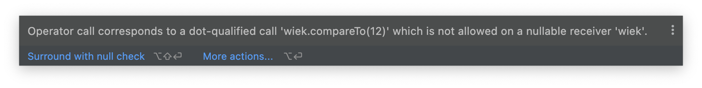

Komunikat o błędzie jest dość enigmatyczny, potrzebna nam będzie jakaś wskazówka. Użyjmy quick-fixa `Specify type explicitly` na stałej `wiek` (czyli musicie najechać na nią kursorem i nacisnąć `Alt + Enter`). Przy stałej powinna pokazać się dodatkowa informacja o typie (wróćcie do pisanej przez nas wcześniej funkcji `megafon`: użyliśmy tam podobnej składni, żeby powiedzieć kompilatorowi, jaki jest typ przekazywanego parametru; w przypadku stałych można ten typ zazwyczaj pominąć i pozwolić, by kompilator się domyślił).

```kotlin
val wiek: Int? = readln().toIntOrNull()
```

Do znanego nam już typu `Int` dolepiony jest znaczek `?`. W ten sposób Kotlin oznacza "typy opcjonalne" albo, jak mówią niektórzy polscy programiści, mieszając polski z angielskim w język Ponglish: "typy nullowalne". Typ nullowalny oznacza, że są dwie możliwości: albo będziemy mieli obiekt spodziewanego typu (czyli w tym przypadku `Int`), albo będziemy mieli specjalną wartość `null` oznaczającą "nic".

Weźcie natomiast pod uwagę, że to nie jest byle jakie "nic", to jest bardzo konkretne "nic" o takim samym kształcie jak "coś", co mogłoby w naszej stałej się znajdować. Jeśli wrócimy do naszej analogii obiektów i typów jako klocków o różnych kształtach, to `null` w stałej typu `Int?` byłoby "pustką" w kształcie `Int`a.

Wróćmy teraz do komunikatu o błędzie: kompilatorowi nie podoba się, że staramy się porównać `wiek` typu `Int?` i liczbę typu `Int`. Jeśli nasz `Int?` będzie faktycznie zawierał liczbę, to sprawa jest jasna, ale co w przypadku, gdy będzie tam `null`? Czy "pustka" jest większa niż 12?

Komputer nie jest w stanie odpowiedzieć na to pytanie, musimy więc zmienić warunki w naszym łańcuszku `if`ów. Możemy przy porównywaniu wieku dodać sprawdzenie, czy `wiek` jest faktycznie liczbą (czyli, inaczej mówiąc, czy `wiek` nie jest `null`em) i połączyć ten warunek z porównaniem przy użyciu logicznego "i", czyli operatora `&&`:

```kotlin
println("Ile masz lat?")
val wiek = readln().toIntOrNull()
val wiekKotlina = 12

if (wiek == wiekKotlina) {
    println("O, ja też!")
} else if (wiek != null && wiek < wiekKotlina) {
    println("Ha, ja jestem starszy, mam już $wiekKotlina lat!")
} else if (wiek != null && wiek > wiekKotlina) {
    println("Też bym chciał tyle mieć, mam dopiero $wiekKotlina lat.")
}
```

Zauważcie, że nie musimy dodawać tego warunku dla operatora `==`: to jest porównanie, które komputer jest w stanie wykonać bez dodatkowej pomocy, bo `null` na 100% nie jest tym samym co jakaś liczba.   

## Pętla `do { … } while (…)`

Czasami chcemy, żeby program powtarzał jakieś instrukcje wiele razy. Jednym ze sposobów na osiągnięcie tego efektu jest instrukcja:

```kotlin
do {
    // to, co ma się powtarzać
} while (warunkek)
```

Tak jak w przypadku instrukcji `if`, nasz `warunek` ma typ `Boolean`. Dopóki warunek jest spełniony (czyli jest to `true`), instrukcje wewnątrz bloku `do { … }` będą wywoływały się w kółko.

Problemem, jaki możemy napotkać, jest sytuacja, gdy nasz problem nigdy się nie kończy. Przy uruchomieniu programu z IntelliJ możemy go zakończyć, naciskając ikonkę z czerwonym kwadratem w lewej dolnej części ekranu.

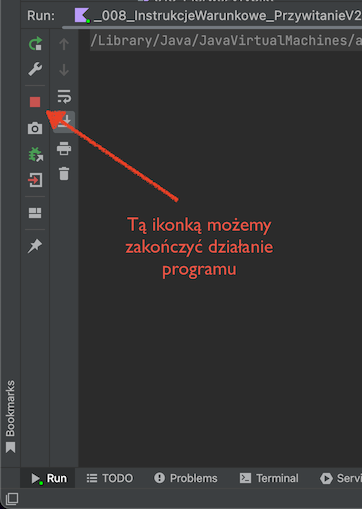

Inna opcja to zamknięcie okna programu.

# Podsumowanie

* Pseudokod to opis programu ukształtowany trochę jak prawdziwy kod, z pętlami if-ami, itd., ale nie zagłębiający się w szczegóły. To dobre narzędzie do "naszkicowania" ogólnej struktury programu i rozbicia problemu na mniejsze kawałki.
* Autoformatowanie kodu czasami pomaga w znalezieniu błędów składni (brakujących nawiasów, itp.)
* Żeby zmniejszyć szansę popełnienia błędów składni, piszcie najpierw "bloczek" (`if`, `do..while`, definicję funkcji), a dopiero później wypełniajcie luki faktycznym kodem.
* Instrukcje `if … else` można łączyć w "łańcuszek": `if (…) {} else if (…) {} else if (…) {} else {}`.
* IntelliJ ma wbudowane wiele tzw. Quick Fixów, czyli typowych zmian kodu. Menu quick fixów dostępne jest po naciśnięciu skrótu klawiszowego `Alt + Enter`.
* Typ `Boolean` używany jest do przedstawienia prawdy (obiekt `true`) lub fałszu (`false`).
* Możemy łączyć obiekty `Boolean` operatorami logicznymi `&&`, `||` oraz `!`.
* Do działań na liczbach wykorzystujemy operatory matematyczne (`+`, `-`, `/`, `*`, `%`).
* Dzielenie na liczbach całkowitych daje w wyniku liczbę całkowitą, część ułamkowa jest ignorowana.
* Możemy użyć operatorów porównania `==` lub `!=`, żeby sprawdzić, czy dwa obiekty są sobie równe. Te operatory to tak naprawdę funkcje, które zwracają typ `Boolean`, tylko zapisujemy je w nietypowy sposób, żeby kod był czytelniejszy.
* Inne operatory porównania to `>`, `<`, `>=` i `<=`.
* Typ może być opcjonalny, jeśli do nazwy typu dodamy znak `?`. Ta "opcjonalność" oznacza, że albo będziemy mieli obiekt tego typu, albo specjalną wartość `null` oznaczającą "nic".
* Funkcja `toInt()` na type `String` pozwala zamienić tekst na liczbę. Musimy mieć jednak pewność, że ten tekst faktycznie zawiera liczbę, w przeciwnym razie ryzykujemy "wykrzaczenie" się programu.
* Program po "wykrzaczeniu" się wypisuje w panelu `Run` w IntelliJ co dokładnie poszło nie tak.
* Jeśli nie mamy pewności, czy tekst zawiera liczbę (bo np.: jest to tekst wpisany z klawiatury przez użytkownika), możemy użyć metody `.toIntOrNull()`, która zwraca `Int?`.
* Możemy kilka razy wykonać ten sam kod przy użyciu pętli `do {} while (…)`. Pętla będzie wykonywała się tak długo, jak warunek sprawdzany w instrukcji `while(…)` będzie spełniony.

# Programy do napisania

Następne spotkanie dopiero za dwa tygodnie (**2022-11-08**), więc żeby wam się nie nudziło 😈, zamieszczam listę programów do samodzielnego napisania w domu. Trochę tego jest, więc nie odkładajcie pisania na ostatnią chwilę!

Pamiętajcie o różnych sposobach rozwiązywania problemów ze składnią, które omawialiśmy na zajęciach. Jeśli utkniecie albo pomimo waszych najszczerszych wysiłków IntelliJ dalej będzie podkreślał pół kodu na czerwono, poproście o pomoc na kanale `#pomocyyy` na Slacku.

Niektóre z zadań polegają na rozszerzeniu funkcjonalności programów, które pisaliśmy na wcześniejszych zajęciach. Dopilnujcie, żeby nie popsuć wcześniejszej funkcjonalności, tj. wersja 3 programu "Przywitanie" oprócz nowych rzeczy powinna robić wszystko to, co wersja 2! Na razie polecam wam pisanie kolejnych wersji w osobnych plikach (kiedyś pokażę wam lepszy sposób, ale na teraz tworzenie osobnych plików będzie wystarczająco dobrym rozwiązaniem). 

## 1. Przywitanie v3

Jeśli użytkownik wpisze imię dłuższe niż 8 liter, program powinien wyrazić swój zachwyt tak długim imieniem.

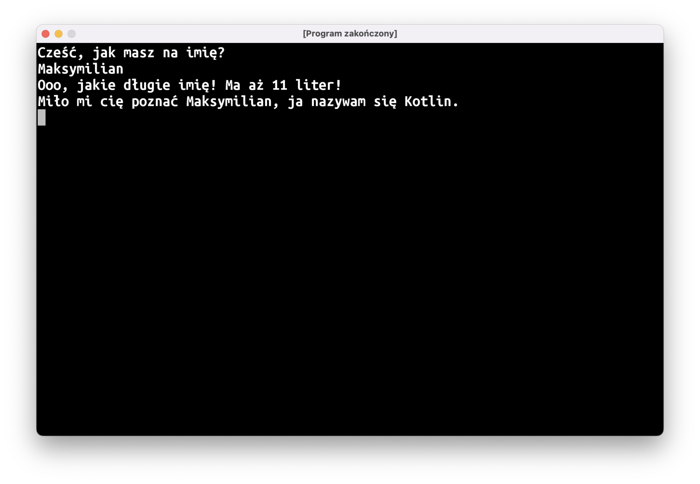

## 2. Przywitanie v4

Niech program reaguje inaczej, jeśli wpisane imię jest nazwą języka programowania (dodajcie przynajmniej 2 języki programowania)

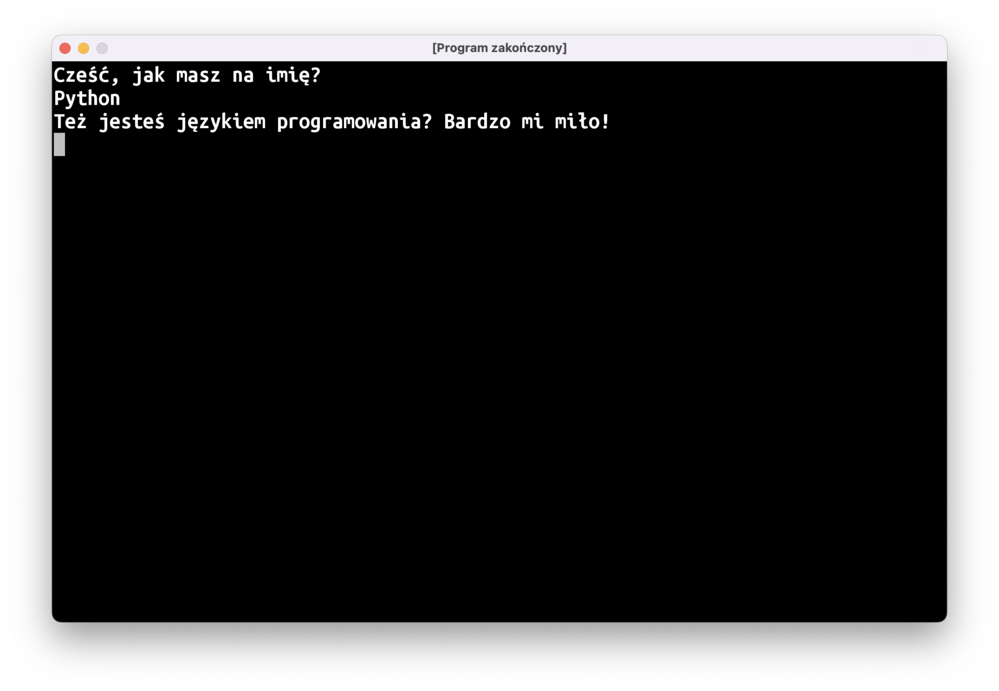

## 3. Przywitanie v4.1

Niech program nie zwraca uwagi na wielkość liter.

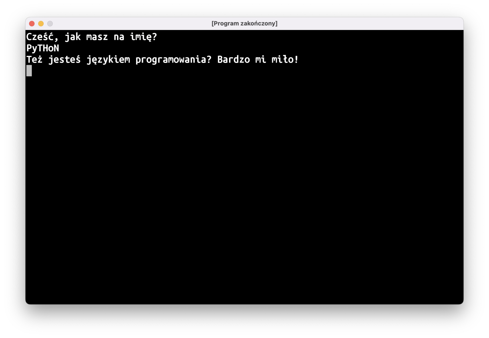

**Uwaga**: nie próbujcie rozwiązać tego problemu przy użyciu operatora `||`. Potrzebne będzie inne podejście...

## 4. Echo v2

Powtarza w nieskończoność.

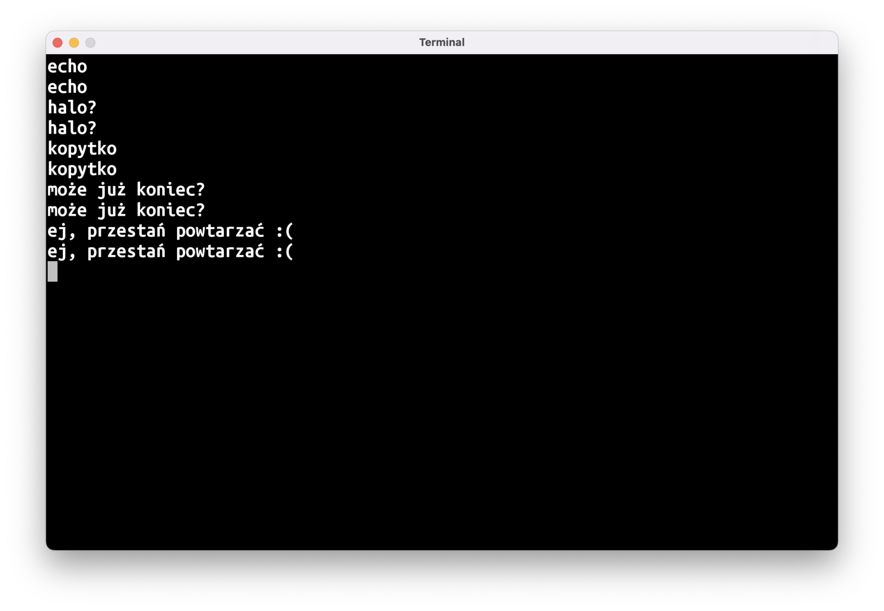

## 5. Echo v3

Jeśli echo dostanie tekst `"STOP!"`, nie powinno powtarzać tego tekstu, tylko wypisać `"no dobra..."` i zakończyć działanie programu.

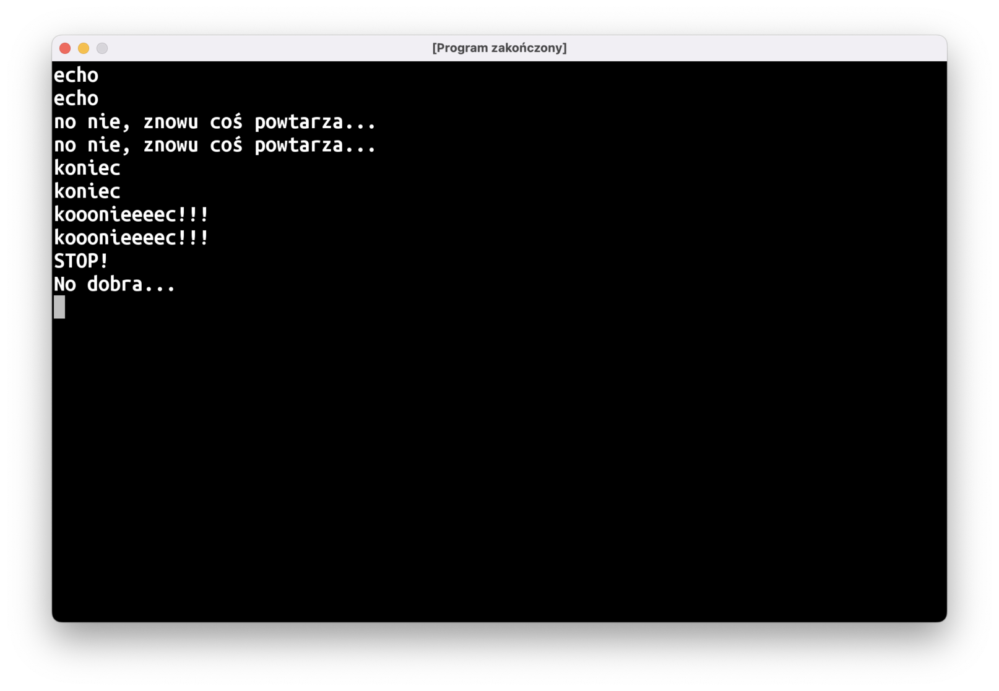

## 6. Echo v4

Sprawcie, aby nasze echo było leniuchem. Dla długich tekstów (więcej niż 10 znaków) niech mówi tylko `"bla, bla, bla 🥱"`.

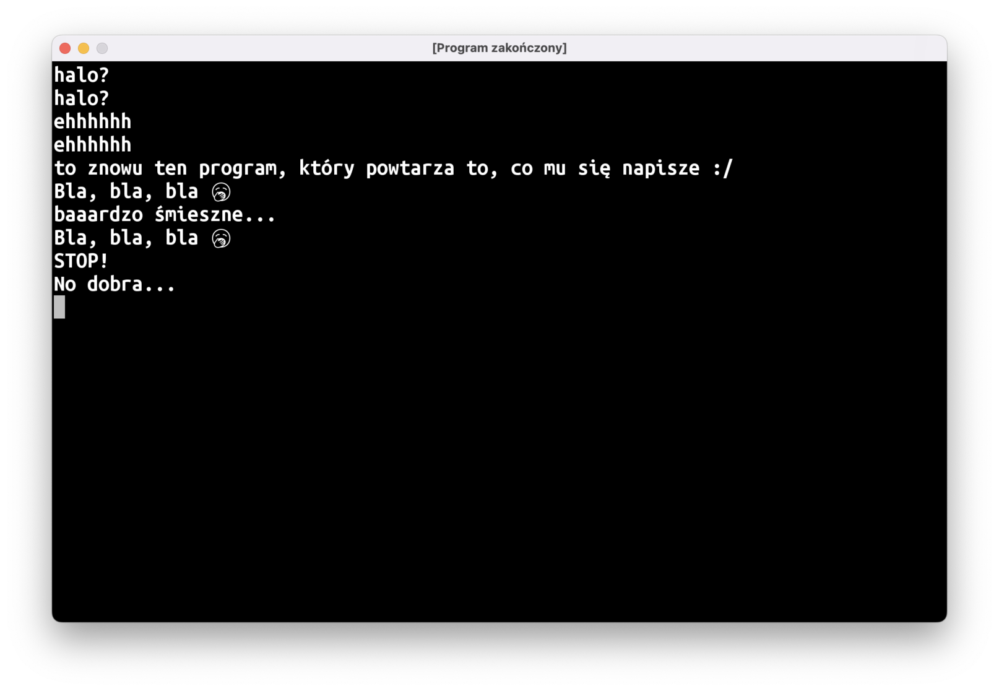

## 7. Tabliczka

Napiszcie funkcję, która wypisuje podany tekst wielkimi literami w tabliczce-ramce złożonej ze znaków `|-+`. Czyli dla następującej funkcji `main`:

```kotlin
fun main() = terminal {
    tabliczka("uwaga, tygrys!")
}
```

Program powinien wypisać na ekran coś takiego:

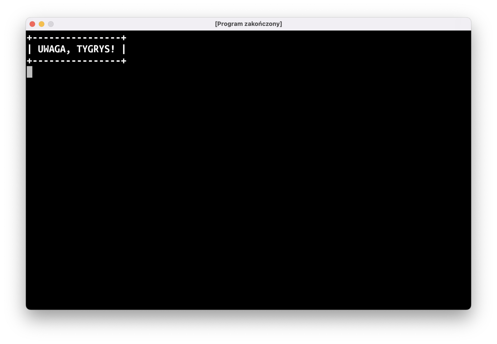

Konieczne będzie użycie funkcji `String.repeat(n: Int): String`, która zwraca tekst powtórzony `n` razy:

```kotlin
val trzyIksy = "X".repeat(3) 
println(trzyIksy) // ta linijka wypisze na ekran XXX 
```

## 8. Funkcja `input`

*(Zadanie dedykowane Bartkowi, który z uporem godnym lepszej sprawy stara się przekazać tekst do funkcji `readln`)*

Napiszcie Kotlinowy odpowiednik funkcji `input` z Pythona: ma ona wypisać przekazany jej tekst (bez przechodzenia do następnej linii!), a następnie zwrócić tekst wpisany przez użytkownika z klawiatury. Inaczej mówiąc, wynikiem działania tego programu:

```kotlin
fun main() = terminal {
    val tekst = input("Napisz coś: ")
    println("Napisałeś: $tekst")
}
```

Powinno być to:

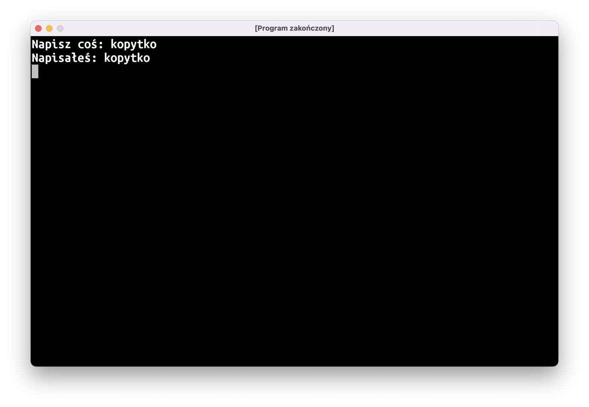