# Smart casting

Wróćmy do przykładu "Przywitania" pytającego o wiek:

```kotlin
println("Ile masz lat?")
val wiek = readln().toIntOrNull()
val wiekKotlina = 12

if (wiek == wiekKotlina) {
    println("O, ja też!")
} else if (wiek != null && wiek < wiekKotlina) {
    println("Ha, ja jestem starszy, mam już $wiekKotlina lat!")
} else if (wiek != null && wiek > wiekKotlina) {
    println("Też bym chciał tyle mieć, mam dopiero $wiekKotlina lat.")
}
```

Dodajmy na początku łańcuszka `if..else`'ów jeszcze jednego `if`a ze sprawdzeniem, czy `wiek == null`:

```kotlin
println("Ile masz lat?")
val wiek = readln().toIntOrNull()
val wiekKotlina = 12

if (wiek == null) {
    println("Nie bardzo rozumiem 😕. Jakby coś, to ja mam już $wiekKotlina lat.")
} else if (wiek == wiekKotlina) {
    println("O, ja też!")
} else if (wiek != null && wiek < wiekKotlina) {
    println("Ha, ja jestem starszy, mam już $wiekKotlina lat!")
} else if (wiek != null && wiek > wiekKotlina) {
    println("Też bym chciał tyle mieć, mam dopiero $wiekKotlina lat.")
}
```

IntelliJ zasugeruje usunięcie `wiek != null` z kolejnych `if`'ów:

```kotlin
println("Ile masz lat?")
val wiek = readln().toIntOrNull()
val wiekKotlina = 12

if (wiek == null) {
    println("Nie bardzo rozumiem 😕. Jakby coś, to ja mam już $wiekKotlina lat.")
} else if (wiek == wiekKotlina) {
    println("O, ja też!")
} else if (wiek < wiekKotlina) {
    println("Ha, ja jestem starszy, mam już $wiekKotlina lat!")
} else if (wiek > wiekKotlina) {
    println("Też bym chciał tyle mieć, mam dopiero $wiekKotlina lat.")
}
```

Jest to przykład tzw. **smart castingu**, czyli automatycznego wnioskowania dotyczącego typu obiektów. Warunki w łańcuszku `if..else`'ów sprawdzane są po kolei, z góry na dół, i zawsze wykonywana jest maksymalnie jedna "gałąź" kodu. Jeśli `wiek` jest `null`em, program wejdzie w pierwszy blok kodu w naszym łańcuszku i dalsze warunki nie są sprawdzane. Analogicznie, jeśli sprawdzane są kolejne warunki, to znaczy, że pierwszy warunek – `wiek == null` – nie jest spełniony, więc `wiek` nie jest `null`em i nie ma po co sprawdzać tego ponownie.

# `when`

Kotlin ma jeszcze jeden rodzaj "instrukcji warunkowych" – bloczek `when`. IntelliJ ma wbudowany mechanizm do zamiany jednej notacji na drugą. Jeśli użyjecie na pierwszym `if`ie w łańcuszku quick fixa `Replace 'if' with 'when'` (skrót `Alt + Enter`), nasz kod zmieni się coś takiego:

```kotlin
when {
    wiek == null -> {
        println("Nie bardzo rozumiem 😕. Jakby coś, to ja mam już $wiekKotlina lat.")
    }
    wiek == wiekKotlina -> {
        println("O, ja też!")
    }
    wiek < wiekKotlina -> {
        println("Ha, ja jestem starszy, mam już $wiekKotlina lat!")
    }
    wiek > wiekKotlina -> {
        println("Też bym chciał tyle mieć, mam dopiero $wiekKotlina lat.")
    }
}
```

Proponuję użyć kolejnego quick fixa, `Remove braces from all 'when' entries`, żeby pozbyć się zbędnych klamerek (są one konieczne, gdy chcemy w jakimś przypadku w wyrażeniu `when` wykonać więcej operacji; przy wywołaniu pojedynczej funkcji są one opcjonalne i ja bym je usunął, żeby nie zaciemniać niepotrzebnie kodu):

```kotlin
when {
    wiek == null -> println("Nie bardzo rozumiem 😕. Jakby coś, to ja mam już $wiekKotlina lat.")
    wiek == wiekKotlina -> println("O, ja też!")
    wiek < wiekKotlina -> println("Ha, ja jestem starszy, mam już $wiekKotlina lat!")
    wiek > wiekKotlina -> println("Też bym chciał tyle mieć, mam dopiero $wiekKotlina lat.")
}
```

## `when` z argumentem

Zastosujmy podobne Quick Fixy do łańcuszka `if`ów sprawdzającego `imię`:

```kotlin
val imię = readln()

if (imię == "Kotlin") {
    println("Nie może być! Ja też nazywam się Kotlin!")
} else if (imię == "Python" || imię == "Scratch") {
    println("Też jesteś językiem programowania? Bardzo mi miło!")
} else {
    if (imię.length >= 9) {
        println("Ooo, jakie długie imię! Ma aż ${imię.length} liter!")
    }
    println("Miło mi cię poznać $imię, ja nazywam się Kotlin.")
}
```

Ponieważ wszystkie warunki w naszym łańcuszku `if`ów porównywały stałą `imię` z jakimiś wartościami, IntelliJ zastosował troszkę inną składnię:

```kotlin
val imię = readln()

when (imię) {
    "Kotlin" ->
        println("Nie może być! Ja też nazywam się Kotlin!")
    "Python", "Scratch" ->
        println("Też jesteś językiem programowania? Bardzo mi miło!")
    else -> {
        if (imię.length >= 9) {
            println("Ooo, jakie długie imię! Ma aż ${imię.length} liter!")
        }
        println("Miło mi cię poznać $imię, ja nazywam się Kotlin.")
    }
}
```

Stała `imię` została przekazana do wyrażenia `when` jako argument. Dzięki temu nie musimy pisać wszędzie `imię == "Cośtam"` i nie musimy używać operatora `||` w drugiej gałęzi kodu – wystarczy podać wszystkie możliwości oddzielone przecinkami.

IntelliJ sugeruje jeszcze jedną zmianę. Jako że stała `imię` używana jest tylko wewnątrz wyrażenia `when`, możemy zadeklarować ją bezpośrednio w tym wyrażeniu:

```kotlin
when (val imię = readln()) {
    "Kotlin" ->
        println("Nie może być! Ja też nazywam się Kotlin!")
    "Python", "Scratch" ->
        println("Też jesteś językiem programowania? Bardzo mi miło!")
    else -> {
        if (imię.length >= 9) {
            println("Ooo, jakie długie imię! Ma aż ${imię.length} liter!")
        }
        println("Miło mi cię poznać $imię, ja nazywam się Kotlin.")
    }
}
```

# Zmienne

Na samym początku naszych zajęć poznaliście koncepcję stałych. Porównywaliśmy je do metek, które przyczepione są do różnych rzeczy. Dzięki stałym można nadać obiektowi nazwę, żeby w dalszej części programu móc go użyć wiele razy. Jak sama nazwa wskazuje, stałe są ustalane raz na zawsze, i nie da się ich już zmienić: nie można przekleić tej samej "metki" na inny obiekt.

Można natomiast stworzyć coś w rodzaju pudełka z etykietą. Można do niego wkładać różne rzeczy albo spojrzeć co jest w środku. Takie pudełko to **zmienna** i w Kotlinie tworzymy ją słowem kluczowym `var`. Tak jak stałe, nasze zmienne mają nazwę, oraz typ (którego nie musimy podawać): w analogii pudełka, typ jest oczywiście kształtem "klocków", które można w tym pudełku przechowywać.

```kotlin
val stała = 1500
stała = 2900 // błąd kompilacji, nie można zmienić wartości stałej

var zmienna = 1500
zmienna = 2900 // wszystko w porządku, zmieniamy zawartość pudełka z etykietą "zmienna"
zmienna = "kopytko" // błąd kompilacji, nie da się wsadzić Stringa do zmiennej typu Int
```

Drobna dygresja: wszystkie te porównania do pudełek, metek i innych fizycznych przedmiotów w pewnym momencie stają się naciągane (i to dość mocno). Na przykład, jeden obiekt bez problemu można jednocześnie wsadzić do kilku pudełek:

```kotlin
val tekst = readln()

var superTekst = tekst
var hiperTekst = tekst
```

Nie wspominając już o tym, że "pudełka"-zmiennej nie da się po prostu opróżnić, zawsze musi ono zawierać jakiś obiekt. Albo o tym, że obiekt może mieć zmienną własność (czyli "przyczepioną do siebie" zmienną), do której można przypisać ten sam obiekt (czyli mielibyśmy pudełko, które w środku ma samo siebie 🤯).

Może lepszym porównaniem byłyby metki przyczepiane na rzepy 🤔? Tylko jak wtedy wyjaśnić, że zmienna nie może zmieniać typu? Czy trzeba wyobrazić sobie magiczne rzepy, które przyczepiają się tylko do kwadratowych klocków?

Nie chcę wam namieszać w głowach, tylko przestrzec przed zbytnim przywiązywaniem się do tego typu porównań. Postarajcie się zrozumieć ideę, a potem wyrzucić z głowy zbędną analogię.

## Program "Zabawa w chowanego"

Napiszmy program, który będzie "liczył" od 1 do 20, a następnie wypisze tekst "Szuuuukaaaam!" – jak przy zabawie w chowanego.

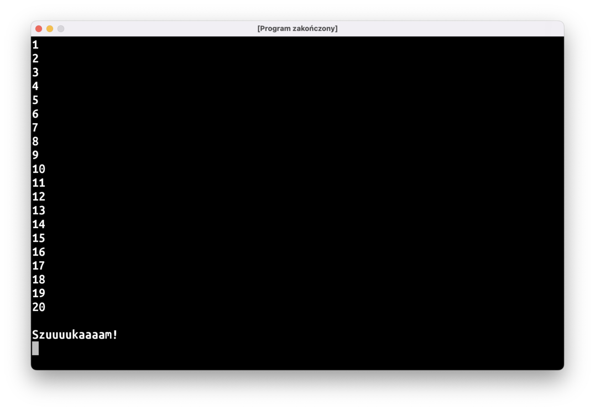

Nie będziemy jednak pisać jak zwierzęta 20 instrukcji `println`, wykorzystajmy zmienną oraz pętlę `do..while`:

```kotlin
fun main() = terminal {
    var odliczanie = 0
    
    do {
        // tu brakuje kodu
    } while (…) // tu też
    
    println()
    println("Szuuuukaaaam!")
}
```

# Przedziały liczb

Typ `Int` reprezentuje w Kotlinie jedną liczbę całkowitą. Typ `IntRange` to przedział liczb całkowitych, czyli np.: "wszystkie liczby od 1 do 20". Tworzymy go za pomocą operatora `..`:

```kotlin
val odliczanie = 1..20
```

Przedziałów liczb można użyć w specjalnej pętli `for`:

```kotlin
for (liczba in 1..20) {
    // blok kodu
}
```

`liczba` jest taką tymczasową stałą, którą widać tylko w bloku kodu pomiędzy nawiasami klamrowymi. Ten blok wykona się po kolei dla każdej liczby w podanym przedziale i za każdym razem stała `liczba` będzie miała inną wartość.

Jak widzicie, jest to idealne rozwiązanie do programu "Zabawa w chowanego": użycie przedziału i pętli `for` pozwoli znacznie uprościć kod.

Możemy też użyć pętli `for` z przedziałem liczb po to, żeby wykonać jakiś kod kilka razy:

```kotlin
// Ten program wypisze "Hello" 10 razy.  
for (i in 1..10) {      // co prawda musimy "stworzyć" tymczasową stałą i… 
    println("Hello")    // …ale wcale nie musimy jej używać!
}
```

# Użycie pętli `for` z typem `String`

Tak naprawdę pętli `for` możemy użyć z dowolnym obiektem, który przedstawia jakiś ciąg elementów. `IntRange` to oczywiście ciąg wszystkich liczb `Int` zawartych w przedziale. A tekst? Możecie myśleć o tekstach `String` jako o sekwencji znaków:

```kotlin
// bardzo skomplikowany sposób na wypisanie "Hello"
for (znak in "Hello") {
    print(znak)
}

println()

// wypisanie "Hello" literka po literce, każda litera w osobnej linii 
for (znak in "Hello") {
    println(znak)
}
```

Pojedynczy znak w Kotlinie to typ `Char` (od angielskiego słowa *character*), i można utworzyć go przy użyciu apostrofów:

```kotlin
val jednaLiterka: Char = 'a'
val jednoliterkowyTekst: String = "a"
```

# Losowanie liczby

Inną rzeczą, którą możemy zrobić z przedziałem liczb to wybranie losowej liczby przy użyciu funkcji `fun IntRange.random(): Int`:

```kotlin
val kostkaDoGry = 1..6
println("Super, wyrzuciłem ${kostkaDoGry.random()} oczek!")
```

# Losowanie `Boolean` (rzut monetą)

Jeśli będziemy potrzebowali "rzutu monetą", czyli losowego wybrania czy coś ma się wydarzyć, czy nie, możemy oczywiście użyć przedziału liczb:

```kotlin
fun main() = terminal {
    if (rzutMonetą()) {
        println("Pójdę w lewo!")
    } else {
        println("Pójdę w prawo!")
    }
}

fun rzutMonetą(): Boolean {
    return (0..1).random() == 1
}
```

Jednak sensowniejszą opcją będzie użycie bibliotecznej funkcji `Random.nextBoolean()`:

```kotlin
fun main() = terminal {
    if (Random.nextBoolean()) {
        println("Pójdę w lewo!")
    } else {
        println("Pójdę w prawo!")
    }
}
```

Możecie też być trochę zaskoczeni tym zapisem, zazwyczaj funkcje albo wykonywaliśmy "po prostu", jak `println()`, albo one doklejone do konkretnego obiektu, jak np.: `"tekst".uppercase()`, natomiast `Random` wygląda na typ, tak jak `Int` czy `String`. Zapis `Random.nextBoolean(…)` oznacza, że funkcja nie jest "przyczepiona" do konkretnego obiektu tego typu, ale do samego typu. Czyli tak jakby to była funkcja powiązana z jakimś konkretnym "kształtem" (w Kotlinie można też o tym myśleć jako o funkcji przyczepionej do specjalnego obiektu "doczepionego" do kształtu).

## Pakiety i `import`y

Spróbujcie wpisać powyższy kod, przy czym celowo pisząc `Random.nextBoolean()` **nie** korzystajcie z sugestii IntelliJ, tylko napiszcie wszystko sami. `Random.nextBoolean()` zostanie podkreślone na czerwono i IntelliJ będzie sugerowało naciśnięcie `Alt + Enter`

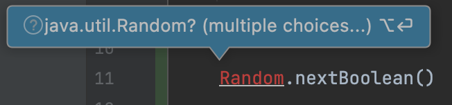

Kotlin w ten sposób sygnalizuje, że nie wie, co to jest `Random`: poszukał czegoś takiego w naszym katalogu z kodem, ale nie udało mu się znaleźć. Musimy pomóc mu i naprowadzić go na kawałek kodu, którego chcemy użyć. Po naciśnięciu `Alt + Enter` (czyli tak naprawdę użyciu quick fixa `Import`) dostaniemy do wyboru dwie opcje: IntelliJ znalazł dwa typy `Random`, o które mogło nam chodzić. Ten, którego chcemy użyć, to `kotlin.random.Random`. Po wybraniu tej opcji przed naszą funkcją `main` pojawi się linijka:

```kotlin
import kotlin.random.Random
```

W ten sposób mówimy kompilatorowi: "*jeśli w tym pliku znajdziesz kod, który robi coś z typem `Random`, chodzi tutaj o typ `kotlin.random.Random`, ok?*".

Pierwszy człon tej nazwy, `kotlin.random`, to inaczej nazwa **pakietu**, w którym znajduje się typ `Random`. Nasze dotychczasowe programy też znajdują się w pewnym pakiecie, a konkretnie w pakiecie `jerz.codes.wprawki`. Jest to określone w pierwszej linijce w pliku: `package jerz.codes.wprawki`.

Możecie spytać: czemu nie musieliśmy robić `import`ów dla funkcji `println()`, albo typu `String`? Przecież ten kod też nie znajduje się w naszym katalogu. Odpowiedź jest prosta: ponieważ są to podstawowe elementy języka i tzw. biblioteki standardowej, nie trzeba ich importować.

Podobnie, nie musieliśmy importować funkcji `megafon`, `kreska`, `rzutMonetą`, czy innych pomocniczych funkcji, które pisaliśmy do tej pory, ponieważ są one w tym samym katalogu (a ściślej rzecz ujmując, w tym samym pakiecie), co kod, który ich używa.

W każdym programie, jaki pisaliśmy do tej pory, znajduje się jeszcze jeden `import`:

```kotlin
import jerz.codes.terminal.terminal
```

W ten sposób "importujemy" do naszego pliku funkcję `terminal` z pakietu `jerz.codes.terminal`: to jest narzędzie użyte na sammy początku waszych funkcji `main`, dzięki któremu wasze programy uruchamiają się w osobnym okienku, a nie w panelu `Run` wewnątrz IntelliJ'a. Nasz kod znajduje się w pakiecie `jerz.codes.wprawki`, funkcja `terminal` jest w pakiecie `jerz.codes.terminal`, więc `import` jest konieczny.

O pakietach warto powiedzieć jeszcze dwie rzeczy.

Po pierwsze, przyjęło się, że nazwa pakietu pokrywa się ze strukturą katalogów, tj. kod w pakiecie `jerz.codes.wprawki` powinien znajdować się w podkatalogu `jerz/codes/wprawki`. Starajcie się przestrzegać tej reguły, ułatwia to szukanie kodu w większych projektach. Zresztą, IntelliJ będzie wam w tym dość intensywnie pomagał, marudząc i bazgrząc kod na żółto, w momencie gdy `package` i lokalizacja pliku się rozjadą.

Po drugie nazwa pakietu "dolepiona" jest do każdego typu i każdej funkcji, którą piszecie. Czyli tak naprawdę funkcja `megafon`, którą pisaliśmy na pierwszych zajęciach, nazywa się `jerz.codes.wprawki.megafon`. W całym waszym projekcie nie może być dwóch funkcji o tej samej pełnej nazwie i tych samych parametrach. Możecie mieć dwie funkcje o tej samej nazwie, ale różniące się parametrami:

```kotlin
package jerz.codes.wprawki

fun rysujKreske() {
    println("--------------------")
}

fun rysujKreske(dlugosc: Int) {
    println("-".repeat(dlugosc))
}
```

Albo dwie funkcje o tej samej "krótkiej" nazwie, ale znajdujące się w dwóch plikach w różnych pakietach:

```kotlin
// w pliku /jerz/codes/wprawki/Dorsz.kt
package jerz.codes.wprawki

fun rysujKreske() {
    println("--------------------")
}
```

```kotlin
// w pliku /jerz/codes/wprawki/naryby/Karp.kt
package jerz.codes.wprawki.naryby

fun rysujKreske() {
    println("--------------------")
}
```

Natomiast dwie funkcje o takich samych parametrach, takiej samej nazwie, znajdujące w tym samym pakiecie, spowodują błąd budowania projektu. Wyjątkiem są funkcje `main()`, ale nie będziemy się tutaj zagłębiać w szczegóły.

W przypadku naszych "wprawek", czyli testowych programów raczej nie będziemy mieli konfliktów nazw pomiędzy funkcjami, więc wszystko możemy trzymać w jednym pakiecie. Może natomiast być to problematyczne przy pisaniu większych programów, dlatego też każdą grę będziemy umieszczać w osobnym pakiecie. Najprościej można to osiągnąć zmieniając `package` podany w pierwszej linijce w pliku, a następnie używając quick fixa `Move file to …`.

# Zgadula

Czas, abyśmy napisali naszą pierwszą grę!

Zadaniem gracza, będzie odgadnięcie liczby, którą wylosował komputer. Przy każdej próbie komputer udziela wskazówki: czy podana liczba jest większa, czy mniejsza od wylosowanej. Gra kończy się, gdy gracz udzieli poprawnej odpowiedzi.

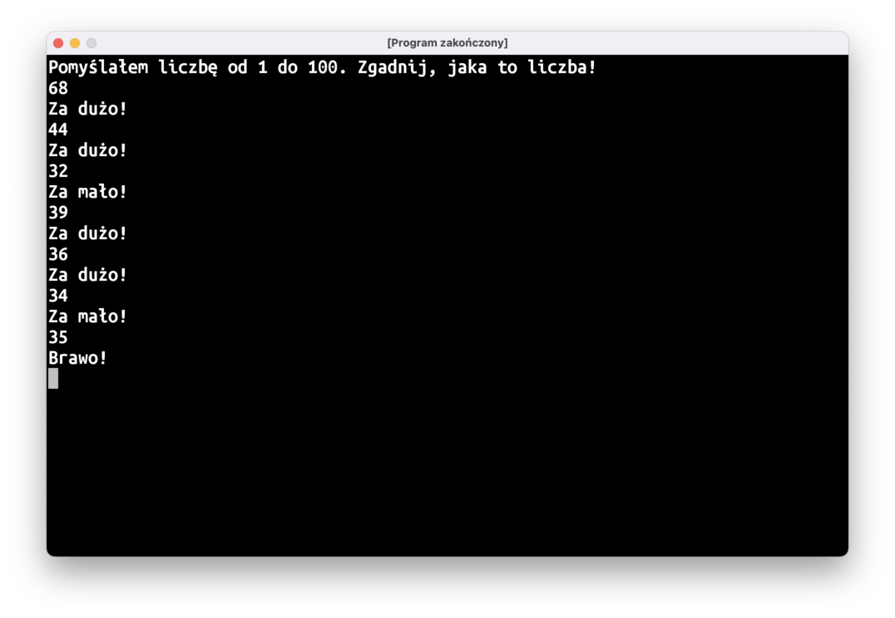

Pamiętajcie o obsłudze dziwnego tekstu wprowadzonego z klawiatury przez użytkowników!

Jeśli nie wiecie jak się zabrać za to zadanie, zajrzyjcie na kanał `#pomocyyy` na Slacku, zamieściłem tam pseudokod do podstawowej wersji Zgaduli. W razie dalszych problemów śmiało pytajcie!

Powodzenia!

# Podsumowanie

* Czasami kod staje się bardziej czytelny, gdy łańcuszek `if`ów zastąpimy wyrażeniem `when`.
* **Zmienne** to "pudełka", do których można wkładać obiekty. Zawartość pudełka można zmienić, można też "spojrzeć" jaki obiekt znajduje się obecnie w pudełku.
* Przedział liczb reprezentowany jest przez typ `IntRange`. Można go utworzyć operatorem `..`. Zarówno lewa, jak i prawa liczba zawiera się tworzonym przedziale, tj. przedział `1..6` oznacza liczby 1, 2, 3, 4, 5, i 6.
* Pętla, która działa z różnego rodzaju zbiorami danych (przedziałami liczb, tekstami, itp.) to pętla `for (cośtam in lista) { … }`. `cośtam` to stała, która będzie widoczna w bloku kodu pomiędzy nawiasami klamrowymi, i w każdym przebiegu pętli będzie wskazywać na kolejną wartość z listy.
* Pojedyncza (lub "pojedyczna", jak wolicie) litera w Kotlinie to typ `Char`. Można stworzyć ją przy użyciu apostrofów: `val literaJ: Char = 'J'`.
* Do losowania liczb służy funkcja `IntRange.random()`.
* Do losowania obiektu `Boolean` (`true` albo `false`) służy funkcja `Random.nextBoolean()`.
* Funkcje mogą być "dolepione" do typu, a nie do konkretnego obiektu tego typu, np.: `Random.nextBoolean()`. Takie funkcje można wywołać, nie tworząc żadnego obiektu tego typu.
* Typy i funkcje spoza naszego pakietu, takie jak `Random`, trzeba zaimportować, żeby kompilator wiedział, o który typ nam chodzi.

# Programy do napisania w domu

Zadania oznaczone ⭐ mają nieco większy poziom trudności. Jeśli sprawiają wam one kłopot albo nie wiecie jak się do nich zabrać, na razie je odpuśćcie. Zawsze możecie do nich wrócić po dalszych zajęciach, gdy nabierzecie większej wprawy.

## 1. Szczęśliwego Nowego Roku!

Napiszcie program, który wypisze noworoczne odliczanie do północy:

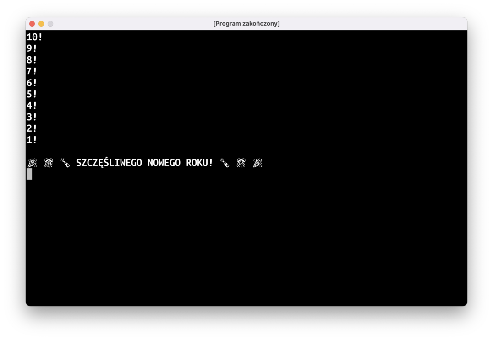

Możecie użyć funkcji `IntRange.reversed()`, która zwraca obiekt `IntProgression`, który zawiera te same elementy co `IntRange`, na podstawie którego został stworzony, ale kolejność przechodzenia przez elementy w pętli `for` jest odwrócona.  

## 2. Kostka do gry

Czeka na naciśnięcie enter i wypisuje wynik rzutu sześciościenną kostką do gry:

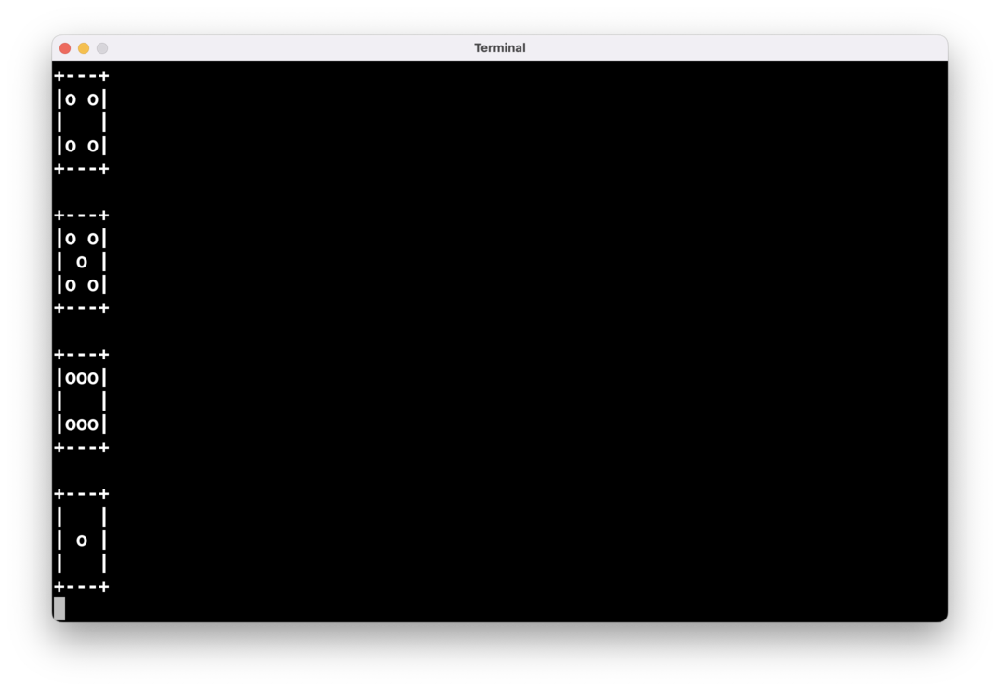

## 3. Megafon v2

Napiszcie funkcję `fun megafon(tekst: String, poziomBaterii: Int)`. W zależności od wartości tego argumentu funkcja powinna zmienić swoje zachowanie:

- `0`: wypisuje tylko `"📣: ..."`
- `<= 5`: wypisuje tylko `"📣: [trzask]"`
- `<= 20`: wypisuje losowo duże i małe litery i może pominąć niektóre wykrzykniki `"📣: UwAGa, uWAGa!"`
- W przeciwnym razie wypisuje tekst wielkimi literami i stawia na końcu trzy wykrzykniki `"📣: UWAGA, UWAGA!!!"`

Przykładowo, wynik uruchomienia tego programu:

```kotlin
fun main() = terminal {
    megafon("uwaga, uwaga", 20)
    megafon("rozpoczynamy odliczanie", 20)
    megafon("hmm, zaraz, coś tu chyba szwankuje", 20)
    megafon("no tak, bateria...", 5)
    megafon("jak się to wymieniało?", 0)
    megafon("test, test, próba", 100)
    megafon("dobra, jedziemy", 100)
    megafon("rozpoczynamy odliczanie", 100)
    megafon("3", 100)
    megafon("2", 100)
    megafon("1", 100)
    megafon("start", 100)
}
```

Może wyglądać następująco:

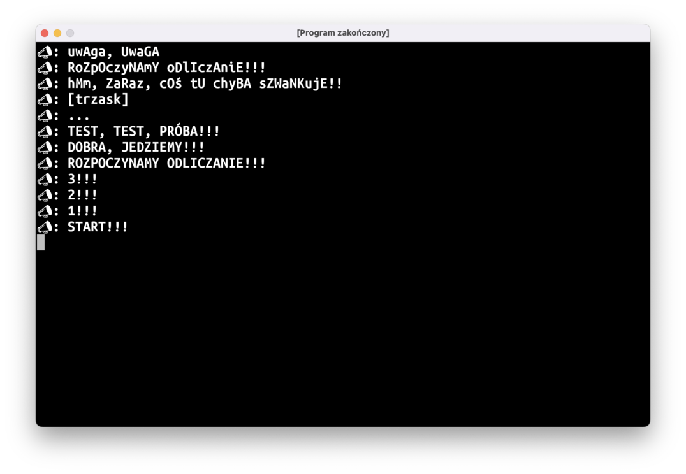

## 4. Przeliterowywacz

Napiszcie program, który wczyta tekst z klawiatury, a następnie "przeliteruje" je, wypisując każdą literę w osobnej linii i dodając "jak Imię-Które-Zaczyna-Się-Na-Tę-Literę":

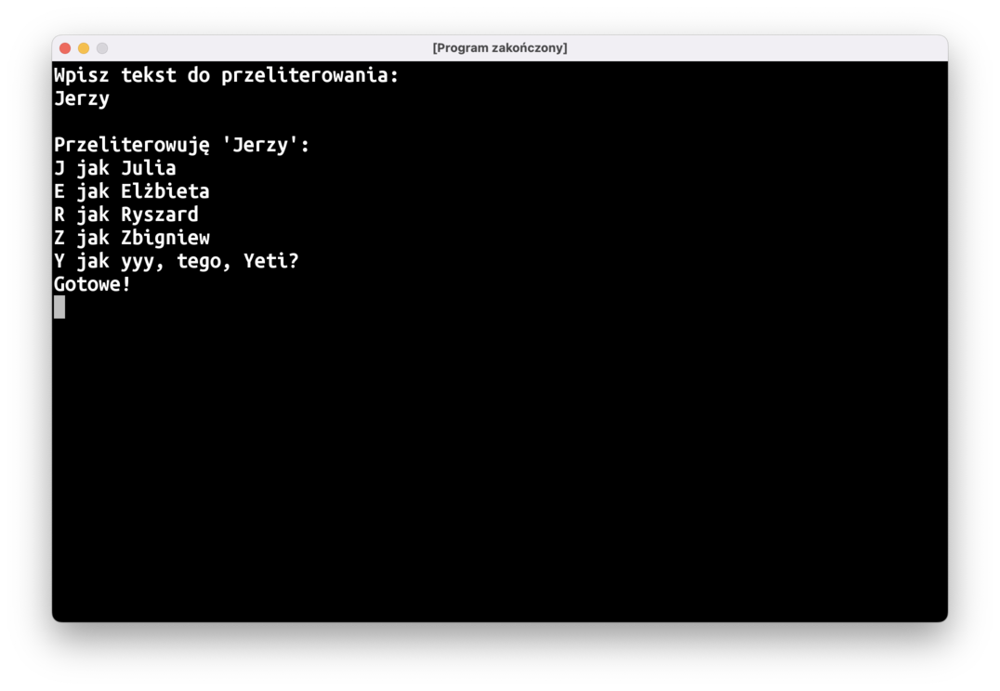

**Uwaga nr 1**: polecam użycie instrukcji `when` zamiast ogromniastego łańcuszka `if..else`'ów, kod będzie dużo bardziej czytelny

**Uwaga nr 2**: pamiętajcie, że ktoś może wpisać tekst ze znakiem, dla którego nie da się wypisać imienia (bo jest to np.: znak interpunkcyjny, albo `'ę'`). W takich wypadkach wypiszcie sam znak, z pominięciem `"jak Imię-Na-Literę"`.

## Ulepszenia "Zgaduli"

### 5. Gramy jeszcze raz?

Po zakończonej grze komputer proponuje kolejną rundę. Jeśli gracz wpisze "tak", gra zaczyna się od nowa.

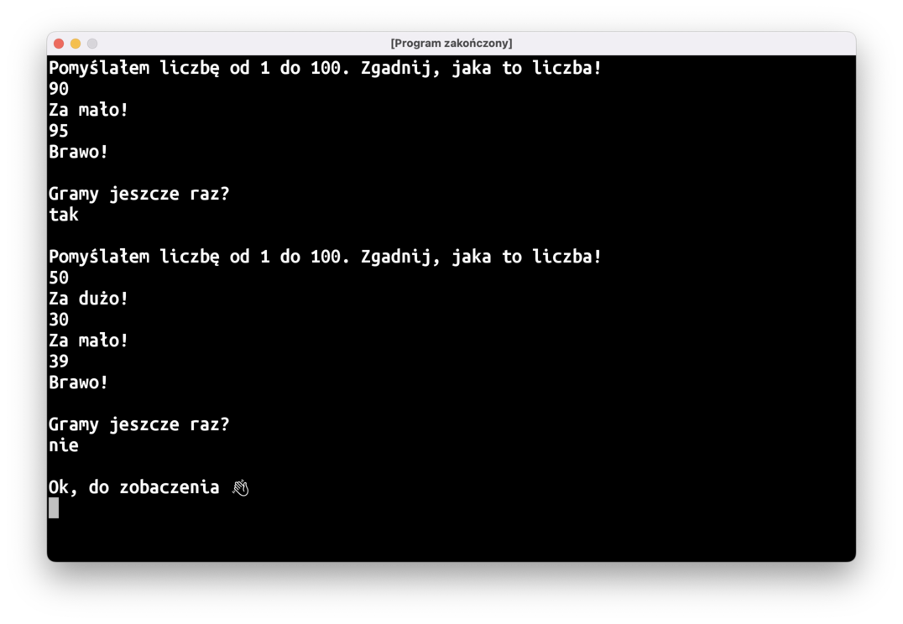

### 6. Frustrat

Jeśli gracz wpisze bezsensowny tekst zamiast liczby, komputer powinien wypisać ostrzeżenie. Przy czwartym ostrzeżeniu program powinien się zakończyć.

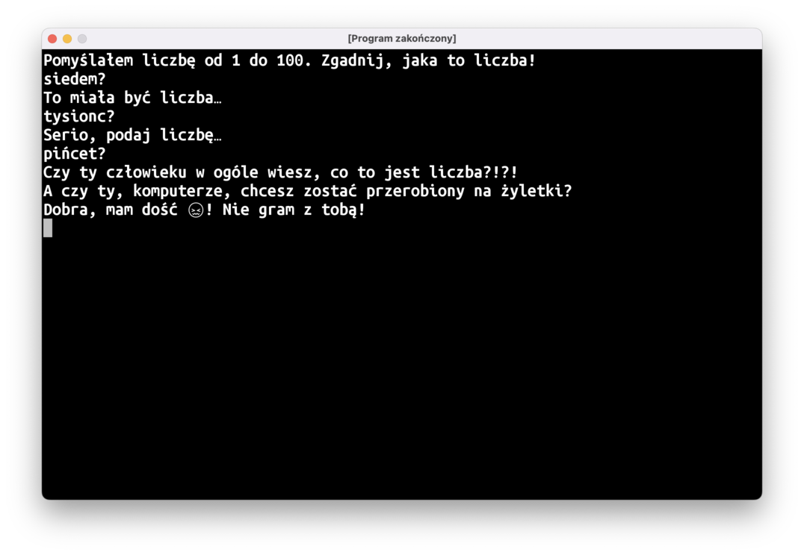

### 7. Blisko/Daleko ⭐️

Jeśli gracz trafi w liczbę o 5 mniejszą lub większą, komputer powinien wypisać troszkę inny komunikat (np. coś w stylu: "Prawie! Jeszcze troszkę więcej!"). Jeśli liczba różni się od wyniku o ponad 50, komunikat też powinien być inny (np.: "Oj, całkiem nie tak. Moja liczba jest dużo większa!").

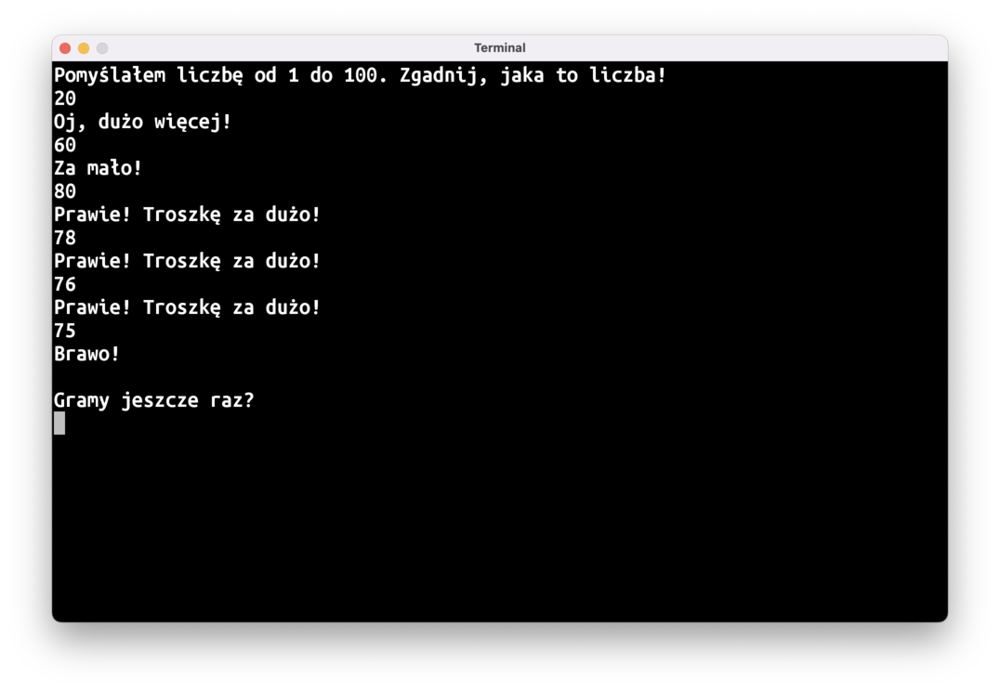

### 8. Pilnowanie sensownego przedziału ⭐

Niech komputer wypisze nieco inny komunikat, jeśli liczba jest spoza możliwego przedziału, tj. jeśli gracz wpisał liczbę `80` i dowiedział się, że jest to za dużo, a potem wpisze `90`, komputer może napisać `"To nie może być poprawna odpowiedź..."`.

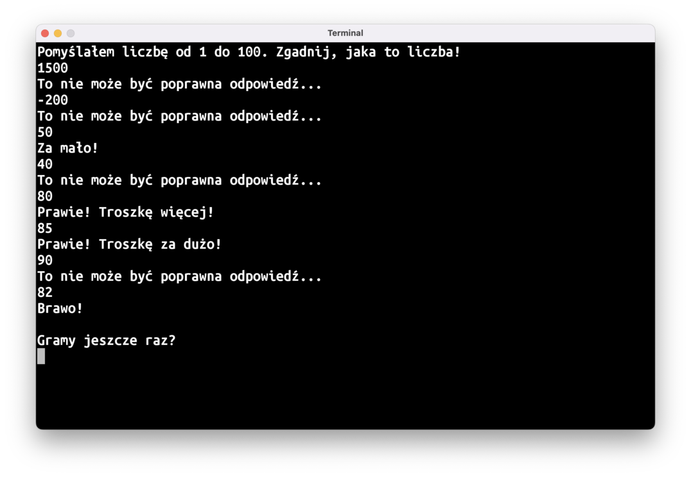