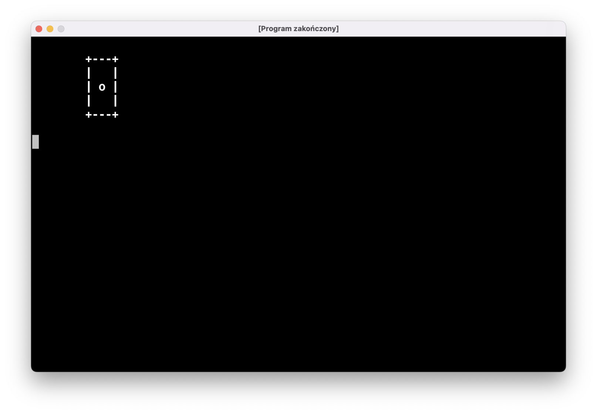
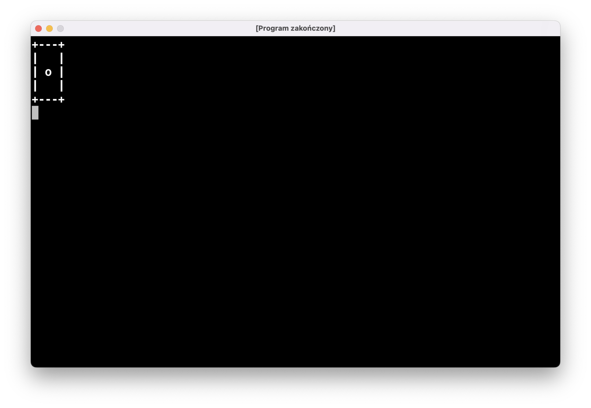
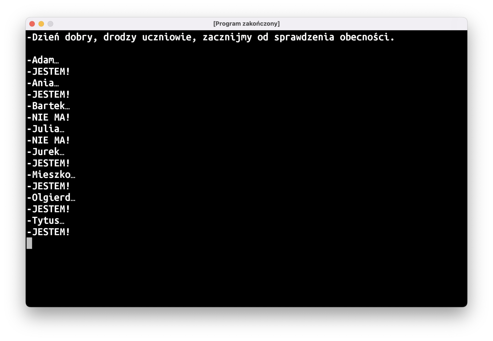
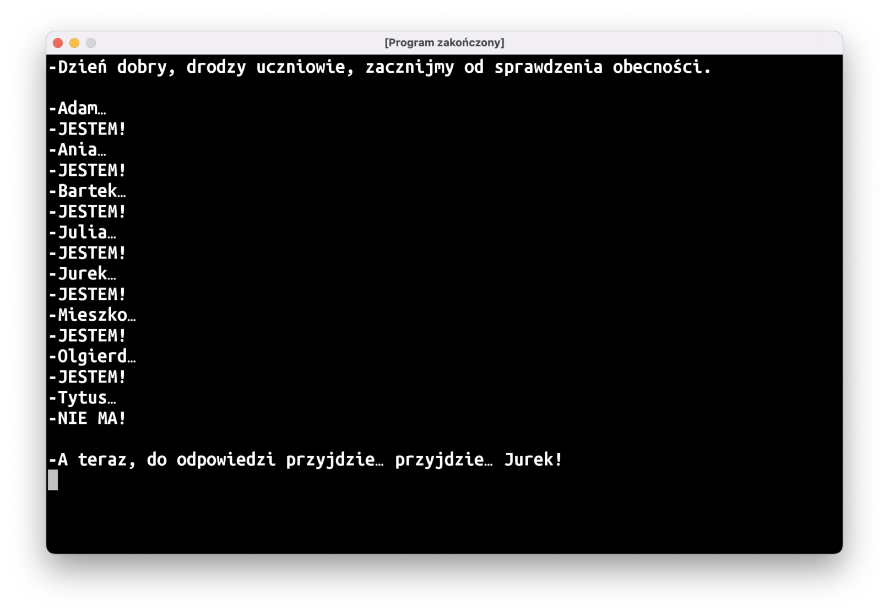
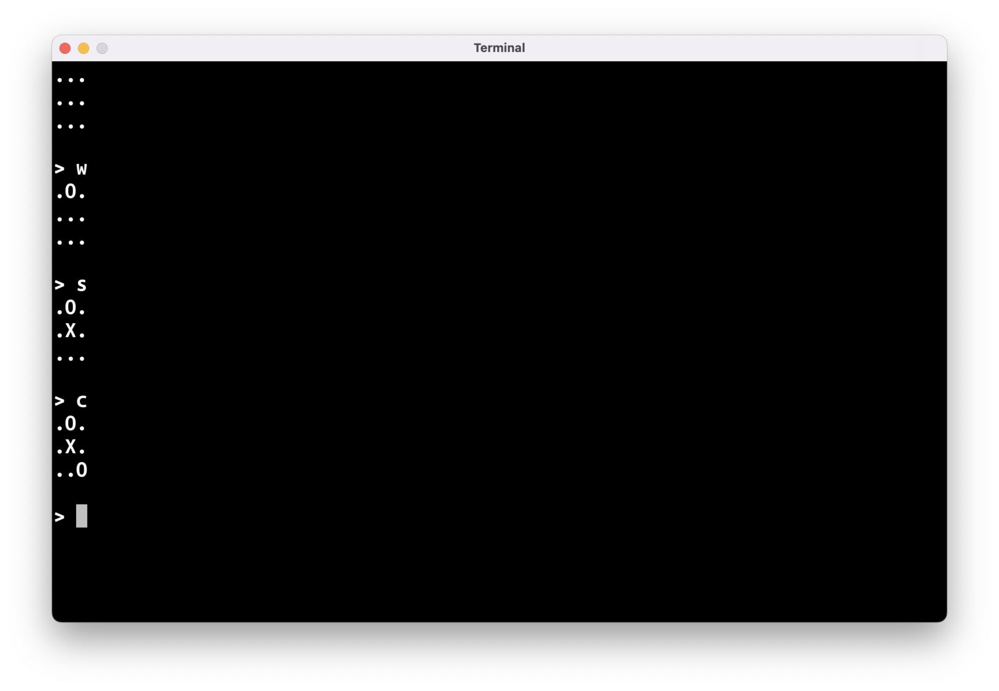
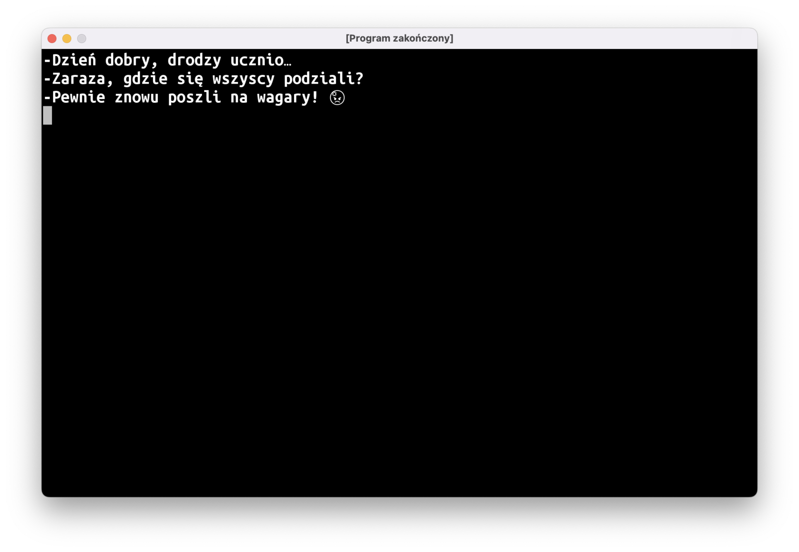
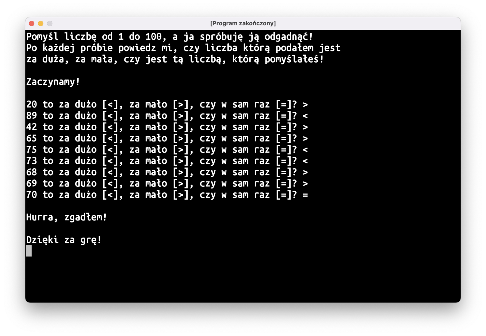
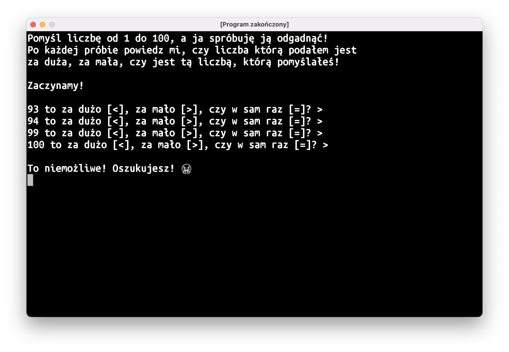
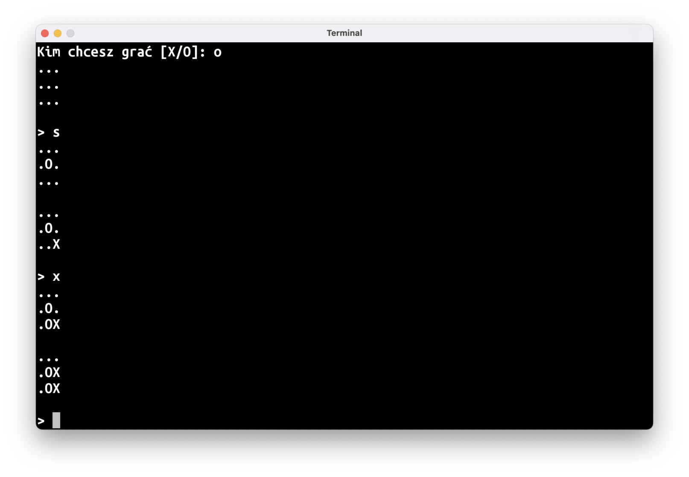

# Teksty wielolinijkowe

Przypuszczam, że większość z was napisała zadany na ostatnich zajęciach program "Kostka do gry" mniej-więcej w ten sposób:

```kotlin
fun rysujKostkę(oczka: Int) {
    when (oczka) {
        1 -> {
            println("+---+")
            println("|   |")
            println("| o |")
            println("|   |")
            println("+---+")
        }
        // itd.
    }
}
```

Zwykłe teksty tworzone w kodzie, `"taki jak ten"`, muszą zaczynać się i kończyć w tej samej linii. Tekst ograniczony z dwóch stron potrójnym cudzysłowem `"""` może obejmować kilka linii:

```kotlin
fun rysujKostkę(oczka: Int) {
    when (oczka) {
        1 -> {
            println(
                """
                +---+
                |   |
                | o |
                |   |
                +---+
                """
            )
        }
        // itd.
    }
}
```

Problem natomiast jest taki, że wcięcia w kodzie, użyte po to, aby nasz kod był czytelniejszy, będą pomieszane ze wcięciami w naszym wielolinijkowym tekście. Chcielibyśmy, aby nasza kostka wyrysowana została przy lewej krawędzi ekranu, ale zamiast tego otrzymamy taki efekt:



Żeby tego uniknąć, możemy dodać w naszym tekscie lewą "granicę" przy użyciu znaczka `|` i użyć metody `trimMargin()`, która "dotnie" tekst do tych znaczników:

```kotlin
fun rysujKostkę(oczka: Int) {
    when (oczka) {
        1 -> {
            println(
                """
                |+---+
                ||   |
                || o |
                ||   |
                |+---+
                """.trimMargin()
            )
        }
        // itd.
    }
}
```



# Listy

Zanim będziemy w stanie napisać kolejne gry, musimy poznać pierwszą, podstawową strukturę danych: listę.

Na szczęście, jest to dość intuicyjne pojęcie: mamy kilka rzeczy, i jeśli poukładamy je w kolejności, otrzymamy właśnie listę. W codziennym życiu znajdziecie dużo takich przykładów: lista zakupów, lista obecności w dzienniku, lista lekcji na waszym planie zajęć, itd., itp.

Kotlinowe listy tworzymy przy użyciu funkcji `listOf(…)`. 

```kotlin
val uczniowie = listOf<>()
```

Pojawi się tutaj coś dziwnego: IntelliJ będzie bardzo chciał, żebyśmy napisali coś wewnątrz "trójkątnych nawiasów", utworzonych ze znaków mniejszości i większości. Chodzi o to, że funkcja `listOf()` będzie tworzyła listę, ale musimy powiedzieć, czym będą elementy tej listy: czy będą to liczby, tekst, albo jeszcze coś innego. Na naszej liście będziemy zamieszczać imiona uczniów, będzie to zatem lista tekstów, a więc `listOf<String>()`.

```kotlin
val uczniowie = listOf<String>(
    "Adam",
    "Ania",
    "Bartek",
    "Julia",
    "Jurek",
    "Mieszko",
    "Olgierd",
    "Tytus",
)
```

Po dodaniu imion `<String>` zmieni kolor na szary: IntelliJ daje nam w ten sposób znać, że teraz już sam się domyśla, jaki jest typ elementów na liście i można tę informację usunąć.  

## Podstawowe operacje na listach

```kotlin
// ilość elementów na liście
println(uczniowie.size)                     // 8

// n-ty element z listy wyciągamy operatorem []
println(uczniowie[1])                       // Ania

// przy czym elementy numerowane są od 0!
println(uczniowie[0])                       // Adam
println(uczniowie[2])                       // Bartek

// zakres poprawnych indeksów, których możemy użyć z operatorem []
println(uczniowie.indices)                  // 0..7

// wybranie losowej osoby z listy
println(uczniowie.random())

// sprawdzenie, czy element znajduje się na liście
println(uczniowie.contains("Krzysztof"))    // false, bo nie mamy Krzyśka na liście
println(uczniowie.contains("Adam"))         // true, bo Adam jak najbardziej jest

// wypisze wszystkich uczniów jedno pod drugim
for (uczen in uczniowie) {
    println(uczen)
}
```

# "Lista Obecności"

Czas na rozgrzewkę przed trudniejszym wyzwaniem: napiszmy program, który wypisuje tekst, który wygląda jak dialog nauczyciela z uczniami. Dla każdego ucznia na będziemy "rzucać kostką": jeśli wypadnie jedno oczko, oznacza to, że uczeń jest nieobecny; inny wynik oznacza, że uczeń jest obecny:



"Rzut kostką" to oczywiście losowanie liczby z przedziału `1..6` przy użyciu `fun IntRange.random(): Int`, tak jak w "Zgaduli". Po sprawdzeniu obecności nauczyciel może wywołać kogoś do odpowiedzi:



## `List` vs `MutableList`

Jeśli wykonamy nasz program w obecnej formie, może dojść do krępującej sytuacji: nauczyciel może wywołać do odpowiedzi nieobecną osobę. Moja propozycja na rozwiązanie tego problemu to utworzenie drugiej listy, do której będziemy dodawać tylko obecnych uczniów.

Jeśli zdefiniujemy tę drugą listę jako `val obecni = listOf<String>()`, czeka nas przykra niespodzianka: nie znajdziemy żadnej metody w stylu `add`, `insert`, ani nic takiego.

W Kotlinie standardowe listy są "stałe", nie można zmieniać ich zawartości po ich utworzeniu. Jeśli potrzebujemy listy, którą będzie można w dowolny sposób zmieniać w dalszej części programu, musimy stworzyć inny obiekt: `mutableListOf<String>()`. Nie chodzi tu o żadne mutanty z horrorów z trzecią ręką wyrastającą z pleców, po prostu "*mutable*" oznacza po angielsku "*zmienny*". Ten podział na zmienne/niezmienne struktury danych może wydawać wam się dziwny, ale jest to bardzo dobry pomysł, który zapobiega wielu rodzajom błędów.

Posłużę się kolejnym porównaniem: zwykła, niezmienna `List` to jak kamienna tablica z wyrytymi napisami: raczej ciężko zmienić ich zawartość. "Zmienialna" `MutableList` jest jak pociąg: można doczepić do niego więcej wagonów, albo jakieś odczepić, można też zmienić zawartość wagonu.

Ważne jest też to, że mutowalność (bądź niemutowalność) listy nie ma nic wspólnego z tym, czy nasza lista jest przypisana do zmiennej, czy stałej:

- `val list = listOf(…)`: kamienne tablice z metką
- `var list = listOf(…)`: pudełko na kamienne tablice
- `val list = mutableListOf(…)`: pociąg z metką
- `var list = mutableListOf(…)`: pudełko na pociągi

Do `MutableList` możemy dodawać elementy metodą `add()`:

```kotlin
val obecni = mutableListOf<String>()
obecni.add("Krzysztof Jarzyna")
```

A przy użyciu operatora `[]` możemy zmieniać ich zawartość:

```kotlin
val superLiczby = mutableListOf(1, 2, 3, 4)
superLiczby[0] = 42 // po tej zmianie lista będzie zawierać liczby 42, 2, 3, 4 
```

# "Kółko i Krzyżyk"

Pora na prawdziwe wyzwanie: grę w kółko i krzyżyk!



Da się ten program napisać, wykorzystując tylko to, czego nauczyliśmy się do tej pory, ale najprawdopodobniej nie macie pojęcia jak się za to zabrać. Proponuję podzielić pracę na następujące kroki:

* Stan gry
* Pseudokod
* Puste funkcje
* Integracja
* Wypełnianie dziur

## Stan gry, czyli model danych

Zastanówmy się, jakiego typu danych będziemy używać do przechowywania stanu gry. Przy grze w kółko i krzyżyk musimy jakoś zapisać dwie rzeczy:

* Co jest na planszy
* Kto jest aktywnym graczem

Proponuję, aby planszę zapisać na 9-elementowej liście `String`ów (nie jest to najbardziej odpowiednia struktura danych, ale na razie nie poznaliśmy mechanizmów języka, które pozwoliłyby nam lepiej rozwiązać ten problem), zawierających `"X"`, `"O"`, albo `"."` (dla pustego pola). Będziemy zmieniać zawartość tej listy, więc trzeba użyć `MutableList`.

```kotlin
val plansza = mutableListOf<String>()
// dodajemy dziewięć "." reprezentujących puste pola na planszy
for (i in 1..9) {
    plansza.add(".")
}
```

Będziemy musieli zdecydować które elementy naszej listy odpowiadają poszczególnym polom na planszy. W zasadzie nie ma większego znaczenia, jaki obierzemy system, ale dobrze by było, gdyby był on choć trochę intuicyjny: będzie łatwiej nam później napisać resztę programu. Proponuję obrać następującą numerację:

```text
 0 | 1 | 2
---+---+---
 3 | 4 | 5
---+---+---
 6 | 7 | 8
```

Czyli stan lewego górnego pola będziemy trzymali w pierwszym elemencie naszej listy (o indeksie `0`), prawe pole będzie miało ma indeks `5`, a dolne - `7`. 

Aktywnego gracza też możemy trzymać jako `String`: `"X"` albo `"O"`.

```kotlin
var tura = "O"
```

## Pseudokod

Gwoli przypomnienia: **pseudokod** to tekstowy opis programu poszczególnych kroków programu. Na podstawie screenshota, dla gry "Kółko i Krzyżyk" można stworzyć następujący pseudokod: 

```kotlin
// narysuj planszę
// wczytaj z klawiatury ruch gracza
// nanieś ruch na planszę
```

Te trzy rzeczy powinny powtarzać się do końca gry:

```kotlin
// powtarzaj:
    // narysuj planszę
    // wczytaj z klawiatury ruch gracza
    // nanieś ruch na planszę
// doputy, dopóki gra się nie skończyła
```

Musimy też pamiętać o tym, że ludzie mogą wpisać z klawiatury dziwne rzeczy:

```kotlin
// powtarzaj:
    // narysuj planszę
    // wczytaj z klawiatury ruch gracza
    // jeśli wczytany ruch jest prawidłowy  
        // nanieś ruch na planszę
// doputy, dopóki gra się nie skończyła
```

Na koniec wypadałoby wypisać wynik:

```kotlin
// powtarzaj:
    // narysuj planszę
    // wczytaj z klawiatury ruch gracza
    // jeśli wczytany ruch jest prawidłowy  
        // nanieś ruch na planszę
// doputy, dopóki gra się nie skończyła
// wypisz wynik
```

## Puste funkcje

W naszym pseudokodzie znajdują się dość ogólnikowe stwierdzenia, jak np.: "narysuj planszę". Będziemy potrzebowali do tego kilku instrukcji, więc żeby nie zawalać sobie funkcji `main`, proponuję stworzenie osobnej funkcji `narysujPlansze(plansza: List<String>)`. Dzięki temu kod naszego `main`a stanie się dużo czytelniejszy: będzie przypominał pseudokod, a wszystkie szczegóły i szczególiki będą zamknięte w osobnej funkcji. Na razie nie będziemy pisać wnętrza (czyli inaczej **ciała** funkcji), stworzymy tylko pusty "szkielet" funkcji, który będziemy wypełniać później:

```kotlin
fun narysujPlansze(plansza: List<String>) {
}
```

Podobnie postąpimy z kolejnymi funkcjami. W przypadku funkcji, które powinny coś zwracać, dodamy w ciele funkcji pojedynczy `return` z byle jaką wartością – tylko tyle, żeby IntelliJ nie bazgrał nam na czerwono. 

Idąc dalej tym tropem, powinniśmy też stworzyć funkcję `wczytajRuch()`. Nazwa tej funkcji sugeruje, że powinniśmy z niej zwrócić "ruch", który chce wykonać aktywny gracz (podobnie jak `readln()`, czyli z angielskiego *read line*, wczytuje linię i zwraca ją). Proponuję, żeby reprezentować "ruch gracza" jako `Int`, odpowiadający indeksowi danego pola na naszej liście `plansza`:

```text
 0 | 1 | 2
---+---+---
 3 | 4 | 5
---+---+---
 6 | 7 | 8
```

Jak zawsze, gdy wczytujemy tekst z klawiatury, musimy być gotowi na to, że użytkownicy wpiszą jakieś totalne bzdury. W takich przypadkach nasza funkcja `wczytajRuch()` może zwrócić `null`, a więc zwracanym typem powinien być opcjonalny `Int?`:

```kotlin
fun wczytajRuch(): Int? { 
    return null
}
```

Kolejna rzecz do zrobienia to sprawdzenie poprawności ruchu i naniesienie go na planszę. Można to zawrzeć w jednej funkcji: `wykonajRuch(ruch: Int?, plansza: MutableList<String>, gracz: String): String`. Jeśli ruch jest poprawny i został naniesiony na planszę, powinniśmy zmienić aktywnego gracza. Do tego właśnie służyć będzie wartość zwracana z tej funkcji.

```kotlin
fun wykonajRuch(ruch: Int?, plansza: MutableList<String>, gracz: String): String { 
    return gracz  
}
```

Najtrudniejszą funkcją do napisania w naszym programie będzie sprawdzenie wyniku gry: `wynik(plansza: List<String>): String?`. Znów mamy do czynienia z opcjonalnym typem zwracanym: niech nasza funkcja zwraca `"X"` bądź `"O"` w przypadku wygranej jednego z graczy, `"."` jeśli będzie remis, albo `null`, jeśli gra jeszcze nie została rozstrzygnięta:

```kotlin
fun wynik(plansza: List<String>): String? { 
    return null
}
```

Ostatnia funkcja, która będzie nam potrzebna, służyć będzie do wypisania wyniku gry: 

```kotlin
fun wypiszWynik(plansza: List<String>) {
}  
```

## Integracja

Kolejnym krokiem jest sprawdzenie, jak wszystkie wymyślone przez nas funkcje łączą się w całość i czy niczego nam nie brakuje. Na tym etapie powinniśmy mieć mniej-więcej coś takiego:

```kotlin
fun main() = terminal {
    // ---------- KROK 1: STAN GRY -----------
    val plansza = mutableListOf<String>()
    for (i in 1..9) {
        plansza.add(".")
    }
    var tura = "O"
    
    // ---------- KROK 2: PSEUDOKOD ---------- 

    // powtarzaj:
        // narysuj planszę
        // wczytaj z klawiatury ruch gracza
        // jeśli wczytany ruch jest prawidłowy  
            // nanieś ruch na planszę
    // doputy, dopóki gra się nie skończyła
    // wypisz wynik
}

// ---------- KROK 3: PUSTE FUNKCJE ---------- 
fun narysujPlansze(plansza: List<String>) {
}

fun wczytajRuch(): Int? {
    return null
}

fun wykonajRuch(ruch: Int?, plansza: MutableList<String>, gracz: String): String {
    return gracz
}

fun wynik(plansza: List<String>): String? {
    return null
}

fun wypiszWynik(plansza: List<String>) {
}
```

Możemy zacząć zastępować pseudokod prawdziwym kodem. "Powtarzaj czynność, dopóki jakiś warunek jest spełniony" to tekstowy opis pętli `do…while`: 

```kotlin
    do {
        // narysuj planszę
        // wczytaj z klawiatury ruch gracza
        // jeśli wczytany ruch jest prawidłowy  
            // nanieś ruch na planszę
    } while (wynik(plansza) == null)
    // wypisz wynik
```

Ustaliliśmy wcześniej, że funkcja `wynik(…)` będzie zwracać `null` dla gry, która nie została jeszcze rozstrzygnięta, więc "gra trwa dalej" to `wynik(plansza) == null`.

Parę innych linijek pseudokodu też da się dość łatwo zastąpić wywołaniem pojedynczej funkcji:

```kotlin
    do {
        narysujPlansze(plansza)
        val ruch = wczytajRuch(plansza)
        // jeśli wczytany ruch jest prawidłowy  
            // nanieś ruch na planszę
    } while (wynik(plansza) == null)
    wypiszWynik(plansza)
```

Ostatni kawałek pseudokodu może być troszkę trudniejszy do zastąpienia. Obydwie rzeczy – sprawdzenie poprawności ruchu i naniesienie go na planszę – załatwiane są przez jedną funkcję `wykonajRuch`. Ponadto, "naniesienie ruchu na planszę" powinno też zmienić aktywnego gracza. Dlatego też nasza funkcja `wykonajRuch` zwraca informację, czyja będzie następna tura i musimy tę wartość przypisać do zmiennej `tura`.   

```kotlin
    do {
        narysujPlansze(plansza)
        val ruch = wczytajRuch(plansza)
        tura = wykonajRuch(ruch, plansza, tura)
    } while (wynik(plansza) == null)
    wypiszWynik(plansza)
```

## Wypełnianie dziur

Funkcja `main` jest gotowa, musimy "tylko" 😬 napisać kod pozostałych funkcji. 

Każdą funkcję możecie potraktować jako osobny, mały programik i przechodzić przez ten sam proces, co w przypadku głównego programu: zaczynamy od pseudokodu, tworzymy pomocnicze funkcje (jeśli będzie taka potrzeba), a na końcu zastępujemy pseudokod prawdziwym kodem.

Możecie chcieć przetestować jakąś drobniejszą część programu, np.: tylko funkcję `narysujPlansze`. Najprostszym sposobem na zrobienie tego będzie zmiana nazwy obecnej funkcji `main` na coś innego i napisanie nowego `main`a, zawierającego tylko to, co chcemy sprawdzić:

```kotlin
fun main() = terminal {
    val plansza = mutableListOf<String>()
    for (i in 1..9) {
        plansza.add(".")
    }
    
    narysujPlansze(plansza)
}

// stara funkcja main ze zmienioną nazwą
fun xo() = terminal {
    // dwa i pół kilo kodu 
}

fun narysujPlansze(plansza: List<String>) {
    // kolejne pół kilo kodu
}
```

### Rysowanie planszy

Programowanie bywa kłopotliwe, ponieważ nawet najprostsze czynności trzeba bardzo precyzyjnie wytłumaczyć. Dla człowieka polecenie "narysuj planszę do gry w kółko i krzyżyk" jest proste i oczywiste, dla komputera jest to niezrozumiałe i niewykonalne. Musimy wytłumaczyć po kolei. Każdy. Najmniejszy. Kroczek.    

```kotlin
fun narysujPlansze(plansza: List<String>) {
    // narysuj lewe-górne pole
    // narysuj górne pole
    // narysuj prawe-górne pole
    // przejdź do następnej linijki

    // narysuj lewe pole
    // narysuj środkowe pole
    // narysuj prawe pole
    // przejdź do następnej linijki

    // narysuj lewe-dolne pole
    // narysuj dolne pole
    // narysuj prawe-dolne pole
    // przejdź do następnej linijki
}
```

"Przejdź do następnej linijki" to `println()`. "Narysuj jakieśtam pole" to wypisanie jednego elementu z listy metodą `print()`. Musicie tylko pamiętać sposób indeksowania pól, który przyjęliśmy wcześniej:

```text
 0 | 1 | 2
---+---+---
 3 | 4 | 5
---+---+---
 6 | 7 | 8
```

Jeśli chcecie upchnąć to samo w mniejszej liczbie linijek kodu, możecie użyć szablonów tekstu, albo tekstów wielolinijkowych, ale prosta seria `print`ów i `println`'ów też zrobi robotę.

### Wczytanie ruchu

Wczytanie ruchu z klawiatury to oczywiście `readln()`. Podobnie jak musieliśmy przyjąć jakiś system indeksowania elementów na planszy, musimy przyjąć jakiś zestaw komend do sterowania naszą grą. Proponuję wybrać jakiś w miarę kwadratowy obszar na klawiaturze (np.: literki `qweasdzxc`, albo klawiaturę numeryczną z prawej strony, jeśli ktoś ma pełną klawiaturę w swoim laptopie) i przypisać jedną literkę do jednego pola planszy:

```text
 q | w | e          0 | 1 | 2 
---+---+---        ---+---+---
 a | s | d    =>    3 | 4 | 5 
---+---+---        ---+---+---
 z | x | c          6 | 7 | 8 
```

Czyli literka `q` odpowiadać będzie lewemu-górnemu rogowi planszy. Nasz pseudokod będzie wyglądał następująco:

```kotlin
fun wczytajRuch(): Int? { 
    // wczytaj tekst z klawiatury
    
    // jeśli wczytany tekst
        // to literka q, to zwróć indeks lewego-górnego pola planszy 
        // to literka w, to zwróć indeks górnego pola planszy
        // …
        // w przeciwnym razie to nie może być poprawny ruch, więc zwróć null  
}
```

Można też dodać szczyptę `println()` i `print()`'ów, żeby poprawić wygląd naszej gry.

### Wykonanie ruchu

Wczytaliśmy ruch, mamy indeks pola, które wybrał gracz (lub `null`, jeśli wpisał głupoty), musimy teraz zająć się naniesieniem ruchu na planszę i zwróceniem informacji czyj będzie następny ruch:

```kotlin
fun wykonajRuch(ruch: Int?, plansza: MutableList<String>, gracz: String): String {
    // jeśli gracz wpisał jakieś bzdury
        // nie zmieniamy tury i od razu kończymy tę funkcję

    // jeśli gracz próbuje postawić swój znaczek na zajętym polu
        // nie zmieniamy tury i od razu kończymy tę funkcję
    
    // jeśli gracz próbuje postawić swój znaczek na pustym polu
        // wstawiamy tam jego znaczek
        // zmieniamy turę na drugiego gracza
}
```

"Nie zmieniamy tury i kończymy funkcję" to po prostu `return gracz`. "Zmiana tury na drugiego gracza" to `if…else`, który zwróci `"X"`, jeśli obecnym graczem jest `"O"` i vice versa. 

### Sprawdzenie wyniku

To chyba najtrudniejsza funkcja w naszym programie, postarajmy się więc rozbić ją na drobniutkie kroczki:

```kotlin
fun wynik(plansza: List<String>): String? {
    // jeśli ktoś wygrał, zwróć jego symbol
    
    // ok, doszedłem do tego miejsca w kodzie, czyli nikt nie wygrał
    // w takim razie albo jest remis, albo gra toczy się dalej
}
```

Pamiętajcie, że komputer potrafi wykonać miliardy operacji w ciągu sekundy, ale nie wykazuje się żadną inicjatywą ani samodzielnym myśleniem. "Jeśli ktoś wygrał" musimy rozbić na super drobne kroczki:

```kotlin
fun wynik(plansza: List<String>): String? {
    // jeśli ktoś postawił trzy takie same znaczki w górnym rządku, zwróć jego symbol
    // jeśli ktoś postawił trzy takie same znaczki w środkowym rządku, zwróć jego symbol
    // jeśli ktoś postawił trzy takie same znaczki w dolnym rządku, zwróć jego symbol
    // jeśli ktoś postawił trzy takie same znaczki w lewej kolumnie, zwróć jego symbol
    // jeśli ktoś postawił trzy takie same znaczki w środkowej kolumnie, zwróć jego symbol
    // jeśli ktoś postawił trzy takie same znaczki w prawej kolumnie, zwróć jego symbol
    // jeśli ktoś postawił trzy takie same znaczki w przekątnej \, zwróć jego symbol
    // jeśli ktoś postawił trzy takie same znaczki w przekątnej /, zwróć jego symbol
    
    // ok, doszedłem do tego miejsca w kodzie, czyli nikt nie wygrał
    // w takim razie albo jest remis, albo gra toczy się dalej
}
```

Oczywiście "jeśli ktoś postawił trzy takie same znaczki w górnym rządku" też jest dla komputera zbyt abstrakcyjnym zdaniem, trzeba to rozbić jeszcze bardziej:

```kotlin
    // jeśli:
        // lewy górny symbol, prawy górny symbol i górny symbol są takie same
        // i nie jest to "." (bo sprawdzamy, czy ktoś postawił tam "X" albo "O")
        // to zwróć ten symbol.
```

W Kotlinie nie można porównać naraz trzech wartości, musimy więc rozbić to na dwa porównania i połączyć je operatorem `&&`:

```kotlin
    // jeśli:
        // (górny symbol == lewy górny symbol) && 
        // (górny symbol == prawy górny symbol) && 
        // (górny symbol != ".") 
        // to zwróć górny symbol
```

Myślę, że z takim pseudokodem do warunków wygranej powinniście dać sobie radę.

---

Weźmy na warsztat drugą część pseudokodu: sprawdzenie, czy jest remis, czy gra toczy się dalej. Można spróbować to rozbić na dwa sposoby:
* "Gra toczy się dalej, jeśli na planszy jest jakieś puste pole"
* "Gra zakończyła się remisem, jeśli wszystkie pola na planszy są zajęte i gra nie zakończyła się wygraną"

Zdecydowanie prostsza do napisania będzie pierwsza wersja:

```kotlin
    // popatrz po kolei na wszystkie pola
        // jeśli pole jest puste
            // gra toczy się dalej
```

Tak więc pseudokod naszej funkcji finalnie będzie wyglądał następująco:

```kotlin
fun wynik(p: List<String>): String? {
    // popatrz po kolei na wszystkie pola planszy
        // jeśli pole jest puste
            // gra toczy się dalej, zwróć null
    
    // gra się zakończyła, więc teraz sprawdzę, czy ktoś wygrał
    // … 
    // 8 długaśnych warunków zwycięstwa
    // …
    
    // ok, doszedłem do tego miejsca w kodzie, czyli nikt nie wygrał
    // w takim razie jest remis
}
```

Zmieniłem też nazwę parametru funkcji na `p`: zazwyczaj jestem zwolennikiem dłuższych nazw, które lepiej opisują obiekt, ale w tym przypadku kod będzie dużo czytelniejszy, jeśli użyjemy krótkiej, jednoliterowej nazwy.

# Podsumowanie

- Możemy zdefiniować wielolinijkowy tekst przy użyciu potrójnych `"`: `"""tekst"""`. W przeciwieństwie do zwykłego tekstu taki tekst może zawierać znaki nowej linii.
- Żeby zapobiec wymieszaniu się wcięcia kodu i wcięcia tekstu w wielolinijkowym tekście, możemy dodać znaki lewego marginesu `|` i użyć funkcji `.trimMargin()`.
- Lista obiektów to `List<…>`, można ją utworzyć funkcją `listOf()`. Typ podany pomiędzy `<>` określa jakiego typu elementy zawiera nasza lista.
- Po utworzeniu, listy nie można zmieniać – nie można podmienić żadnego z jej elementów, nie można też dodać ani usunąć żadnego elementu. To jak kamienne tablice z wyrytym tekstem.
- Lista, którą można zmieniać to `MutableList<…>`, tworzona funkcją `mutableListOf()`. Porównaliśmy ją do pociągu, do którego można doczepiać lub odczepiać wagony albo zmieniać zawartość wagonów.
- Napisanie gry, nawet tak prostej jak "Kółko i Krzyżyk", wymaga wiele pracy 🥵.

# Zadanie do domu

Emotka w tytule zadania odpowiada emotce, którą powinniście kliknąć na Slacku po wykonaniu zadania.

## #️⃣ Dokończenie "Kółka i Krzyżyk"

Do zrobienia została zamiana pseudokodu pomocniczych funkcji na normalny Kotlinowy kod. To też może nie być proste! Jeśli gdzieś się zaklinujecie, nie wstydźcie się poprosić o pomoc.

# Zadania dodatkowe

Dla prawdziwie niestrudzonych, których nie wymęczy dostatecznie "Kółko i Krzyżyk". Zadania oznaczone ⭐️ są nieco trudniejsze.

## 1️⃣ Lista Obecności – Wagarowicze 

Program "Lista Obecności" zawiera błąd: jeśli zdarzyłoby się, że wszyscy uczniowie będą nieobecni, nasz program wysypie się, ponieważ będziemy usiłowali wylosować element z pustej listy. Powstaje też niepokojące pytanie: kto odpowiadał nauczycielowi podczas sprawdzania obecności 👻? 

Możecie łatwo powtórzyć ten błąd, usuwając linijkę: `obecni.add(uczen)`. Postarajcie się wykombinować jak zmienić przebieg programu, żeby reagować na taką sytuację w specjalny sposób:



## 2️⃣ Odwrócona "Zgadula" ⭐️

Program zasugerowany przez Mieszka i Bartka na poprzednich zajęciach: odwróćmy role, niech komputer stara się odgadnąć liczbę wymyśloną przez użytkownika:



Pamiętajcie o obsłudze pewnego specjalnego przypadku:



## 3️⃣ Kółko i Krzyżyk single player vs. noob ⭐️

Przeróbcie grę "Kółko i Krzyżyk" tak, aby można było grać przeciwko komputerowi. Nie musi to być bardzo wymagający przeciwnik: możecie losować ruch komputera ze wszystkich dostępnych ruchów.


