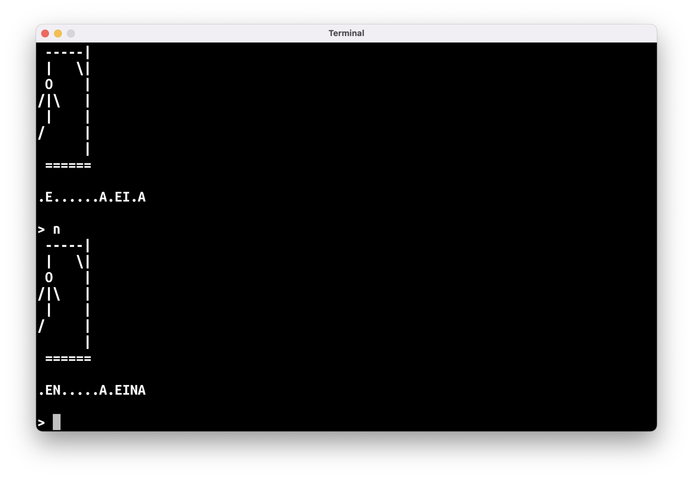
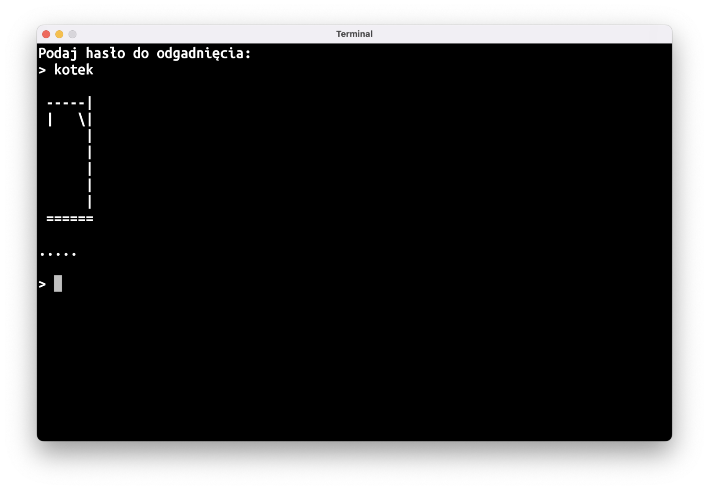
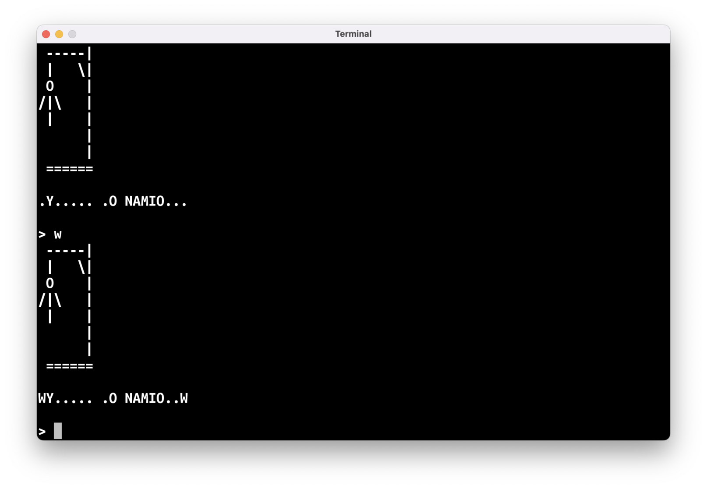



# "Wisielec"

Inną grą, którą możemy napisać dzięki listom, jest "Wisielec".

Celem gry jest odgadnięcie hasła składającego się z jednego wyrazu. Początkowo wszystkie litery hasła są zakryte, tj. zastąpione kropeczkami (czyli od samego początku wiadomo, ile hasło ma liter). Gracz zgaduje po jednej literce: jeśli podana literka jest w haśle, wszystkie jej wystąpienia w haśle zostają odsłonięte; jeśli jej nie ma, gracz traci jedno życie.

Liczba pozostałych żyć przedstawiona jest w dość makabryczny sposób: na ekranie wyświetlona jest szubienica, do której stopniowo dorysowywane są kolejne elementy ludzika – tytułowego wisielca. Gracz wygrywa, jeśli uda mu się odgadnąć hasło, zanim na ekranie pojawi się cała postać wisielca.



Tak jak w przypadku "Kółka i Krzyżyk", przejdziemy kolejno przez pięć kroków:

- **Stan gry**: jakie dane składają się na pełny stan gry
- **Pseudokod**: jak wyglądać będzie główna pętla gry
- **Puste funkcje**: pomocnicze funkcje, którymi zastąpimy fragmenty pseudokodu
- **Integracja**: sprawdzenie, czy pomocnicze funkcje pasują do siebie i czy niczego nie brakuje
- **Wypełnianie dziur**: implementacja pomocniczych funkcji

## Stan gry/model danych

W przypadku "Wisielca" stan gry składa się z następujących danych:
- Ilość popełnionych dotychczas błędów (lub na odwrót – liczba pozostałych "żyć")
- Odgadywane hasło
- Postępy odgadywania

Ilość błędów lub pozostałych żyć to po prostu liczba, a zatem zmienna typu `Int`.

Odgadywane hasło oraz postępy odgadywania możemy przechowywać na liście znaków. W drugim przypadku będziemy tę listę zmieniać, powinna więc to być wartość typu `MutableList<Char>`. Hasło może być typu `List<Char>`.
  
Sugestia, aby przechowywać postępy odgadywania hasła jako `String` o takiej długości jak hasło nie jest dobrym pomysłem: w Kotlinie teksty są stałe (niemutowalne), i nie można zmieniać ich wartości. Da się ten problem obejść, ale byłoby to po prostu dużo mniej poręczne i czytelne niż zastosowanie listy.

Do zamiany tekstu na listę znaków możecie użyć funkcji `fun String.toList(): List<Char>`.

Tak więc nasz model danych przedstawia się następująco:

```kotlin
var błędy: Int = 0
val hasło: List<Char> = "cośtam".toList()
val odkryteLitery: MutableList<Char> = mutableListOf()
```

Początkowo wszystkie litery są zakryte, a więc dodajmy do `odkryteLitery` tyle znaków `'.'`, ile jest liter w haśle:

```kotlin
for (litera in hasło) {
    odkryteLitery.add('.')
}
```

### Dygresja nr 1: czy nasz model danych musi wyglądać w ten sposób?

Absolutnie nie musi! W programowaniu każdy problem można rozwiązać na kilkanaście sposobów.

Nasz model danych można zorganizować zupełnie inaczej, co będzie miało duży wpływ na dalszą implementację: niektóre funkcje pomocnicze mogą stać się prostsze do napisania, niektóre trudniejsze.

Spróbujcie wykombinować inny sposób na przechowywanie stanu gry!

## Pseudokod

Główna pętla gry wygląda następująco:

```kotlin
// narysuj szubienicę
// wypisz odkryte litery
// wczytaj literę
// jeśli wczytana litera jest w haśle
//     odkryj wszystkie wystąpienia tej litery
// w przeciwnym razie
//     zwiększ licznik błędów o jeden
```

I jak każda porządna pętla gry, jest powtarzana, póki gra nie zostanie zakończona:

```kotlin
// powtarzaj
//     narysuj szubienicę
//     wypisz odkryte litery
//     wczytaj literę
//     jeśli wczytana litera jest w haśle
//         odkryj wszystkie wystąpienia tej litery
//     w przeciwnym razie
//         zwiększ licznik błędów o jeden
// tak długo, jak gra nie została zakończona
```

Na koniec wypada też wypisać wynik:

```kotlin
// powtarzaj
//     narysuj szubienicę
//     wypisz odkryte litery
//     wczytaj literę
//     jeśli wczytana litera jest w haśle
//         odkryj wszystkie wystąpienia tej litery
//     w przeciwnym razie
//         zwiększ licznik błędów o jeden
// tak długo, jak gra nie została zakończona
// wypisz wynik
```

## Puste funkcje

Do narysowania szubienicy potrzebna jest tylko informacja o liczbie popełnionych błędów, tak więc nasza pierwsza funkcja pomocnicza będzie wyglądać następująco:

```kotlin
fun narysujSzubienicę(błędy: Int) {
}
```

Wypisywanie odkrytych liter też chyba nie wymaga dłuższego komentarza:

```kotlin
fun wypiszOdkryteLitery(odkryteLitery: List<Char>) {
}
```

Chcemy wczytywać z klawiatury pojedynczą literę, co sugeruje zwracanie obiektu typu `Char`. Musimy jednak pamiętać o tym, że użytkownicy mogą wpisać jakieś bzdury. Użyjmy zatem opcjonalnego typu `Char?`:

```kotlin
fun wczytajLiterę(): Char? {
    return null // zwracamy cokolwiek, żeby IntelliJ nie marudził
}
```

Do sprawdzenia, czy wczytana litera jest częścią hasła, możemy użyć bibliotecznej funkcji `List<T>.contains(T): Boolean`. 

Najtrudniejszym zadaniem będzie odkrywanie odgadniętej litery. Proponuję opakować to w funkcję:

```kotlin
fun odkryjLiterę(
    litera: Char,
    hasło: List<Char>,
    odkryteLitery: MutableList<Char>,
) {
}
```

Nasza funkcja będzie zmieniała przekazaną do niej listę `odkryteLitery` w taki sposób, aby odkryć wszystkie wystąpienia litery `litera` na liście `hasło`.  

---

Ostatnim elementem pseudokodu, który wymaga napisania osobnej funkcji, jest sprawdzenie, czy gra została zakończona w warunku głównej pętli. Proponuję stworzyć funkcję `wynik`: 

```kotlin
fun wynik(błędy: Int, odkryteLitery: List<Char>): Boolean? {
    return null
}
```

Ponieważ grę w "Wisielca" można albo przegrać, albo wygrać, możemy tę informację przekazać typem `Boolean`. Wartość `true` będzie oznaczać wygraną, a wartość `false` – przegraną. Zwrócenie `null` oznacza, że gra wciąż trwa.

Parametr `błędy` potrzebny będzie, aby stwierdzić, czy gra zakończyła się przegraną: gracz przegrywa, jeśli popełni więcej niż dozwoloną ilość błędów.
`odkryteLitery` wykorzystamy, aby sprawdzić, czy gra toczy się dalej: wystarczy poszukać, czy w dalszym ciągu mamy tam znak `'.'`, którym zastąpiliśmy litery hasła (wymaga to przyjęcia radosnego założenia, że `hasło` samo w sobie nie ma znaku `'.'`; pomyślcie, jak trzebaby zmienić program, aby takie hasła były wspierane).

### Dygresja nr 2: po co nam te wszystkie funkcje?

Inaczej mówiąc, czy nie dałoby się tego napisać wszystkiego w `main`?

Oczywiście, że by się dało, ale ładowanie wszystkiego do jednej funkcji nie jest najlepszą praktyką. W przypadku tak krótkiego programu jak "Wisielec" czy "Kółko i Krzyżyk" nie będzie to miało większego znaczenia, ale przy dłuższych programach rozbijanie kodu na mniejsze funkcje jest bardzo pomocne.

Dzięki tym pomocniczym funkcjom kod naszej funkcji `main` będzie przypominał pseudokod, czyli będzie łatwiej się zorientować, co się tam po kolei dzieje.

## Integracja

Pseudokod i puste funkcje pomocnicze wyglądają następująco:

```kotlin
fun main() = terminal {
    // ---------- KROK 1: STAN GRY -----------
    var błędy: Int = 0
    val hasło: List<Char> = "cośtam".toList()
    val odkryteLitery: MutableList<Char> = mutableListOf()
    
    // ---------- KROK 2: PSEUDOKOD ---------- 

    // powtarzaj
    //     narysuj szubienicę
    //     wypisz odkryte litery
    //     wczytaj literę
    //     jeśli wczytana litera jest w haśle
    //         odkryj wszystkie wystąpienia tej litery
    //     w przeciwnym razie
    //         zwiększ licznik błędów o jeden
    // tak długo, jak gra nie została zakończona
    // wypisz wynik
}

// ---------- KROK 3: PUSTE FUNKCJE ---------- 
fun narysujSzubienicę(błędy: Int) {
}

fun wypiszOdkryteLitery(odkryteLitery: List<Char>) {
}

fun wczytajLiterę(): Char? {
    return null
}

fun odkryjLiterę(
    litera: Char,
    hasło: List<Char>,
    odkryteLitery: MutableList<Char>,
) {
}

fun wynik(błędy: Int, odkryteLitery: List<Char>): Boolean? {
    return null
}
```

Kilka linii pseudokodu można zastąpić wywołaniem jednej z pomocniczych funkcji:

```kotlin
do {
    narysujSzubienicę(błędy)
    wypiszOdkryteLitery(odkryteLitery)
    val litera =  wczytajLiterę()
    if (…) { // jeśli wczytana litera jest w haśle
        odkryjLiterę(litera, hasło, odkryteLitery)
    } else {
        błędy = błędy + 1
    }
} while (…) // gra trwa dalej
// wypisz wynik
```

Warunek `gra trwa dalej` można inaczej zapisać jako `wynik gry nie jest jeszcze znany`, czyli inaczej `wynik(…) == null`.

Warunek `wczytana litera jest w haśle` to inaczej `hasło zawiera wczytaną literę`, co w zasadzie 1:1 tłumaczy się na wywołanie bibliotecznej funkcji: `hasło.contains(litera)`.

Do wypisania wyniku nie stworzyliśmy osobnej funkcji. Możemy użyć prostego wyrażenia `when`. 

Finalnie daje nam to:

```kotlin
do {
    narysujSzubienicę(błędy)
    wypiszOdkryteLitery(odkryteLitery)

    val litera = wczytajLiterę()

    if (hasło.contains(litera)) {
        odkryjLiterę(litera, hasło, odkryteLitery)
    } else {
        błędy = błędy + 1
    }
} while (wynik(błędy, odkryteLitery) == null)

when (wynik(błędy, odkryteLitery)!!) {
    true -> {
        // pogratuluj graczowi wygranej
    }
    false -> {
        // wyświetl komunikat o przegranej
    }
}
```

Treść komunikatów o wygranej/przegranej pozostawiam waszej inwencji twórczej.

### Operator `!!`

Zwróćcie uwagę na linię:

```kotlin
when (wynik(błędy, odkryteLitery)!!) {
    // …
}
```

Dwa wykrzykniki (`!!`) służą do wymuszenia na Kotlinie zmiany opcjonalnego obiektu (w tym przypadku `Boolean?` zwróconego z funkcji `wynik`) na jego nie-opcjonalny odpowiednik. Dzięki temu musimy obsłużyć w naszym wyrażeniu `when` tylko dwa przypadki – dla `true` i `false` – możemy natomiast pominąć obsługę sytuacji dla `wynik(…)` zwracającego `null`:

```kotlin
when (wynik(błędy, odkryteLitery)!!) {
    true -> {
        // pogratuluj graczowi
    }
    false -> {
        // wyświetl komunikat o przegranej
    }
    // nie ma potrzeby dodawania jeszcze:
    // null -> { … } 
}
```

Jako twórcy programu mamy 100% pewność, że w tym momencie wartość zwrócona z funkcji `wynik()` nie może być równa `null` – gdyby taka była, nasza główna pętla gry działałaby nadal. Kotlin nie jest w stanie sam tego stwierdzić, więc musimy mu pomóc.

Nadużywanie operatora `!!` nie jest dobrą praktyką. Wręcz przeciwnie – za każdym razem, gdy musicie go użyć, powinniście też zastanowić się, czy nie da się jakoś przerobić powiązanego kodu tak, aby użycie `!!` nie było konieczne.

## Wypełnianie dziur

Ostatni krok to dodanie kodu w pustych "wydmuszkach" funkcji pomocniczych. W tym wpisie zamieszczę tylko pseudokod dla każdej funkcji, a waszym zadaniem do domu będzie zamiana tego pseudokodu na Kotlinową implementację.

### `narysujSzubienicę`

```kotlin
fun narysujSzubienicę(błędy: Int) {
    // jeśli ilość popełnionych błędów jest równa
    //     0 -> narysuj tylko szubienicę
    //     1 -> narysuj szubienicę oraz główkę
    //     2 -> narysuj szubienicę oraz główkę i brzuszek
}
```

Do rysowania możemy użyć serii `println`'ów albo pojedynczego `println` z [tekstem wielolinijkowym]().

**Uwaga**: możecie mieć problem z narysowaniem prawej rączki ludzika. Znak `\` wewnątrz zwykłego tekstu traktowany jest w specyficzny sposób – łączy się on z następnym znakiem:

```kotlin
// \n przechodzi do następnej linijki
println("Hello\nWorld") // wypisanie tekstu w dwóch liniach jednym println

// \" to po prostu cudzysłów
// dzięki temu możemy stworzyć tekst zawierający znak " 
println("\"Hello\"") // wypisze "Hello"
```

Żeby wypisać znak `\` musimy wewnątrz tekstu użyć `"\\"`:
```kotlin
println("O, znalazłem prawą rękę wisielca: \\")
```

### `wypiszOdkryteLitery`

```kotlin
fun wypiszOdkryteLitery(odkryteLitery: List<Char>) {
    // dla każdej litery na liście odkryteLitery
    //     wypisz literę na ekran nie przechodząc do następnej linii
    
    // a na koniec funkcji przejdź do następnej linii
}
```

### `wczytajLiterę`

```kotlin
fun wczytajLiterę(): Char? {
    // wczytaj tekst z klawiatury
    
    // jeśli wczytany tekst jest jednoliterowy
    //     zwróć pierwszą (i jedyną) literę tego tekstu
    // w przeciwnym razie
    //     zwróć null
}
```

### `odkryjLiterę`

Przy naszym modelu danych ta funkcja będzie dość trudna do napisania. Musimy jednocześnie patrzeć na dwie listy, `hasło` i `odkryteLitery`, tak więc nie możemy użyć zwykłej pętli `for (litera in hasło)`. 

Wykorzystamy fakt, że te dwie listy powinny mieć tę samą liczbę elementów i będziemy "jechać" pętlą nie po elementach listy, ale po jej indeksach:

```kotlin
for (i in hasło.indices) {
    // wyciąganie i-tej litery z listy hasło
    val literaHasła = hasło[i]
    // zmiana i-tego elementu listy odkryteLitery 
    odkryteLitery[i] = … 
}
```

Tak więc pseudokod tej funkcji będzie wyglądał następująco:

```kotlin
fun odkryjLiterę(
    litera: Char,
    hasło: List<Char>,
    odkryteLitery: MutableList<Char>,
) {
    // dla wszystkich indeksów na liście odkryte litery 
    //     jeśli i-ty element hasła jest taki sam jak wpisana litera
    //         ustaw i-ty element listy odkryteLitery na wpisaną literę
}
```

### `wynik`

```kotlin
fun wynik(błędy: Int, odkryteLitery: List<Char>): Boolean? {
    // jeśli gracz popełnił więcej błędów niż dopuszczalna ilość, zwróć false
    // w przeciwnym razie, jeśli w dalszym ciągu jest jakaś nieodkryta litera, zwróć null
    // w przeciwnym razie gra musiała się zakończyć wygraną więc zwróć true
}
```

# Zadania do domu

## 😵 Dokończenie "Wisielca"

Funkcja `main` jest prawie gotowa, musicie tylko dodać komunikaty o wygranej i przegranej oraz zaprogramować wszystkie pomocnicze funkcje.

## 🔑 Podawanie hasła do "Wisielca"

Na razie hasło jest na sztywno wpisane w kod programu. Zamiast tego, możecie na starcie programu poprosić użytkownika o wpisanie hasła. Dzięki temu można będzie grać w naszego "Wisielca" z rodzeństwem albo kolegą: jedna osoba będzie wpisywać hasło, a druga będzie je odgadywać.

Problemem jest to, że wpisane hasło będzie widoczne na ekranie na starcie gry:



Nie mamy jeszcze gotowej funkcji do czyszczenia ekranu, ale możemy ten problem obejść. Jeśli wypiszemy masę pustych linii, zawartość ekranu "przewinie się" i zniknie za górną krawędzią okna:

```kotlin
// po wczytaniu hasła, ale przed wejściem do głównej pętli gry
for (i in 1..50) {
    println()
}
```

## 🫥 Wielowyrazowe hasła w "Wisielcu" ⭐️

Dodajcie do "Wisielca" obsługę wielowyrazowych haseł. Spacje powinny być widoczne już od samego początku, żeby było wiadomo, ile liter ma każdy z wyrazów.


