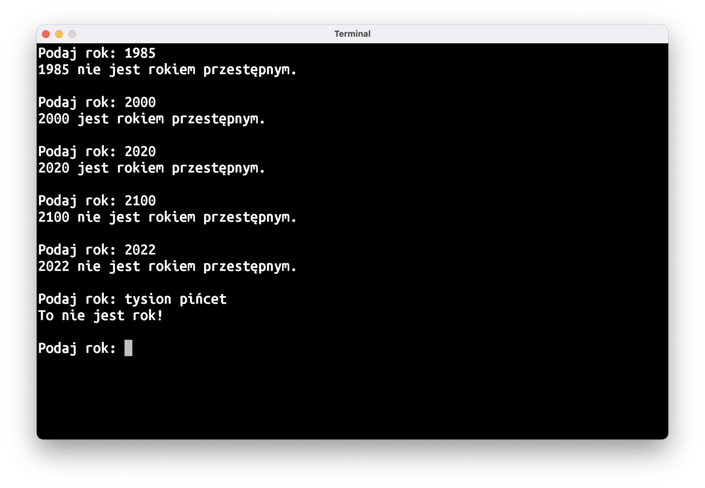
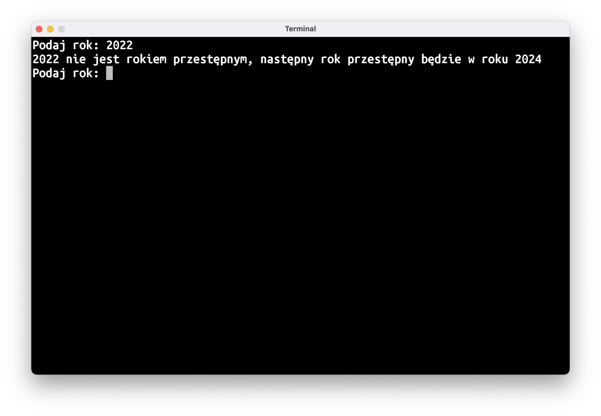
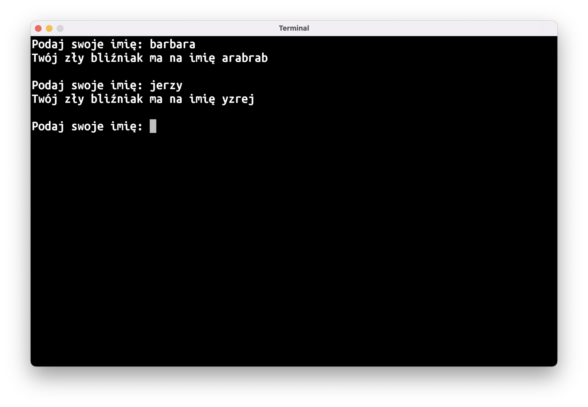
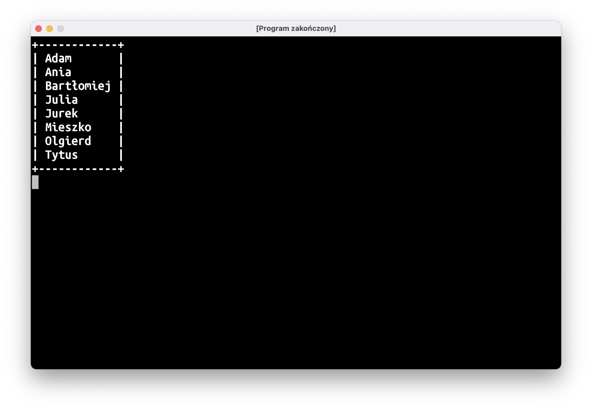
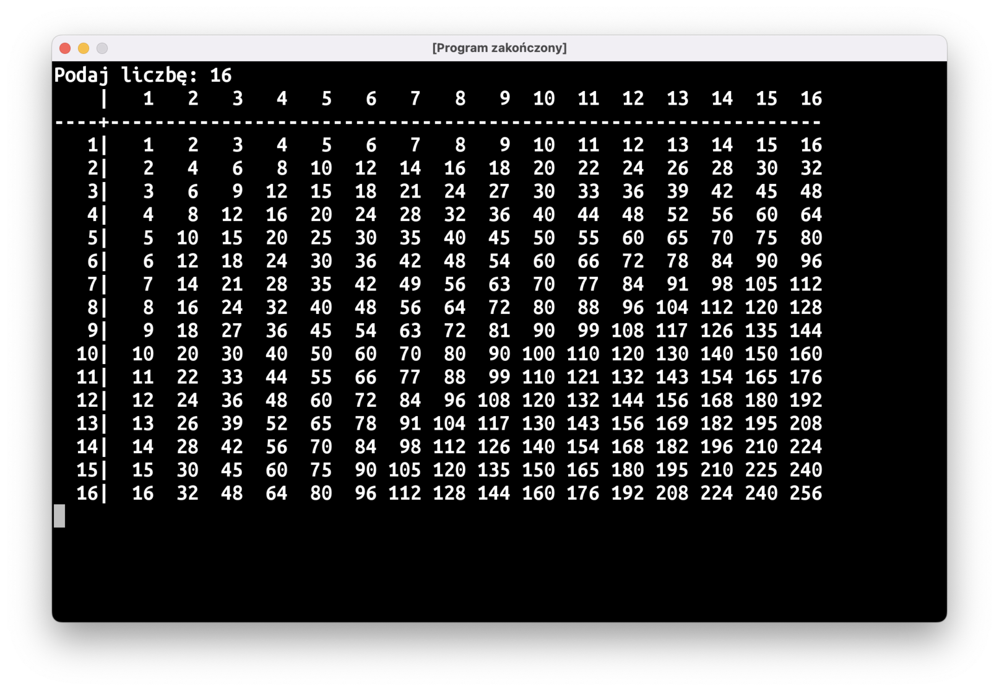
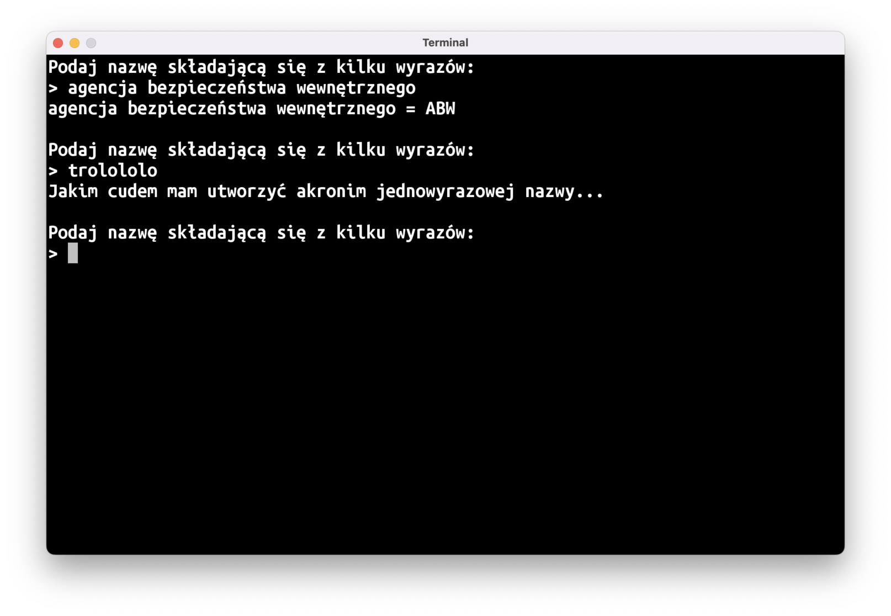
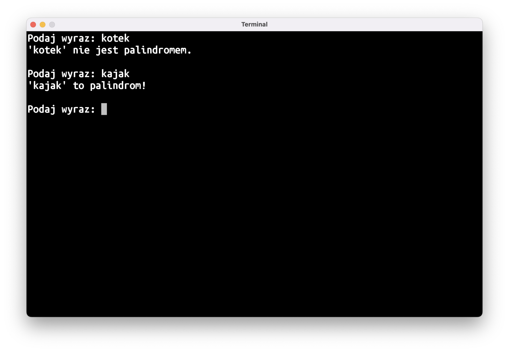
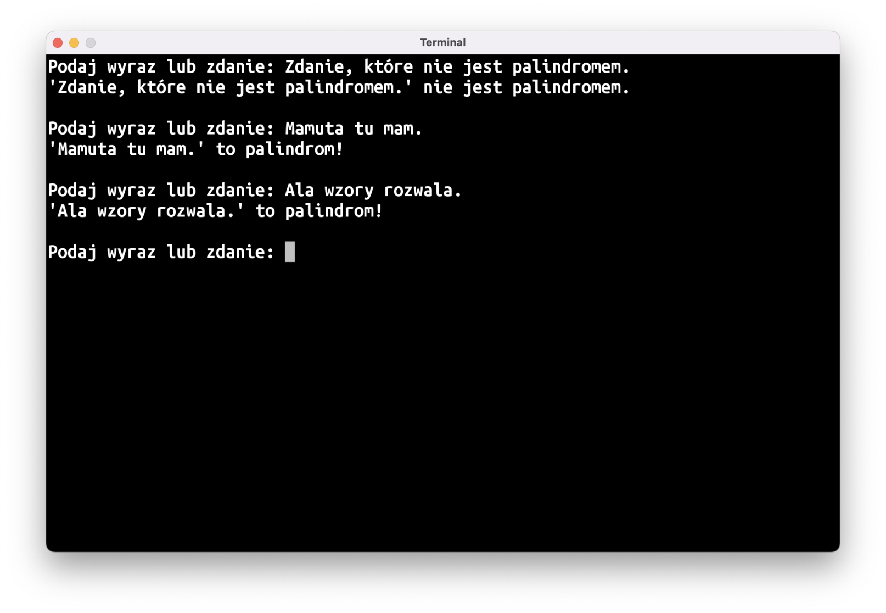
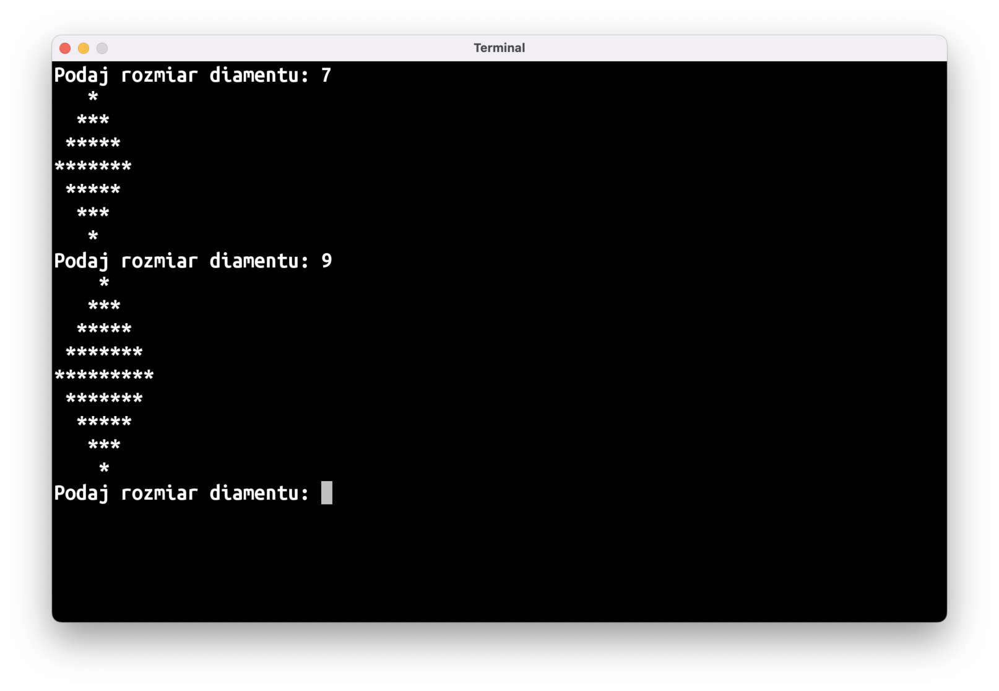
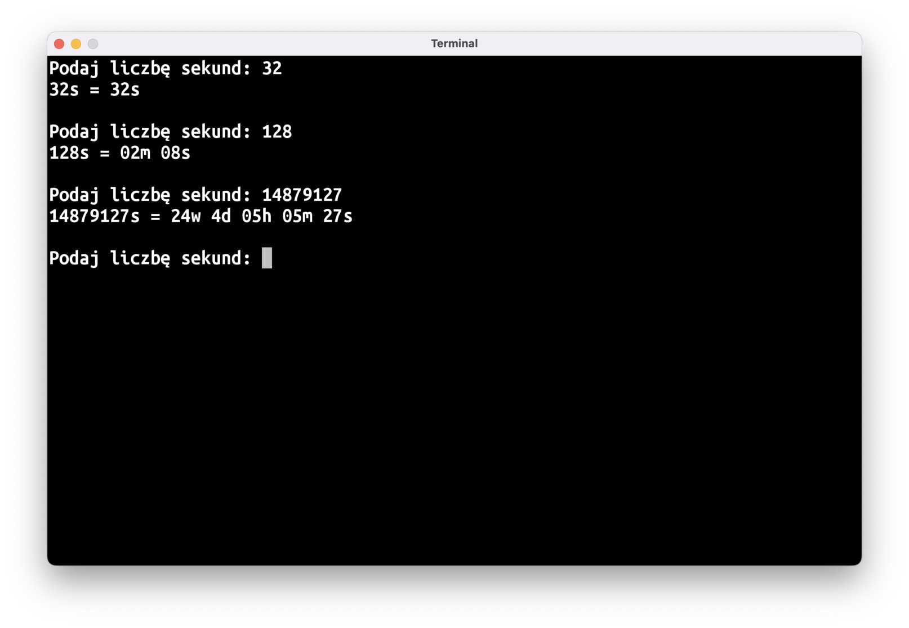



# Powtórka?

Mieliśmy przerabiać dzisiaj nowy materiał, ale po ostatnich zajęciach doszedłem do wniosku, że przyda się wam lekcja powtórkowa. Zrobimy ekspresowy przegląd przerobionego materiału, a potem spróbujemy naszych sił na serii zadań praktycznych.

# Teoria

Na liście poniżej znajdziecie odnośniki do poprzednich wpisów, gdzie tłumaczone są poszczególne tematy:

* Obiekty i typy
* [`val`]() i [`var`]()
* Funkcje ([1]()  [2]() [3]() [4]() [5]())
* Operatory [porównania](), [logiczne]() i [matematyczne]()
* [Typy opcjonalne]()
* [`if..else`]()
* [`if..else if..else`]()
* [`when`]()
* [`when(…)`]()
* [`do..while`]()
* [`for`]()
* [`package` i `import`]()

# Praktyka

Wiedza teoretyczna to jedno, a umiejętność zastosowania jej w praktyce, to drugie. Zauważyłem, że właśnie z praktycznym wykorzystaniem swojej wiedzy macie największe problemy, tak więc większość czasu spędzimy dziś właśnie na tym.

Stoi przed wami aż 10 zadań o różnym poziomie trudności. Nieco trudniejsze zadania oznaczone są ⭐️, zadania bardzo trudne oznaczyłem ☠️.

Na zajęciach zapewne uda się wam zrobić tylko część z nich, resztę możecie spróbować rozwiązać w domu. Jeśli nie macie pomysłu na rozwiązanie jakiegoś zadania albo zatniecie się w pewnym momencie, przejdźcie do kolejnego zadania.

Pamiętajcie, aby każdy program pisać w nowym pliku!

Powodzenia!

## 😈 Piekielny Prowadzący

Prowadzący zajęcia z programowania co tydzień zamieszcza na stronie kilka programów do zrobienia w domu.

Skopiujcie dane wejściowe do waszego programu:

```kotlin
val zadania = listOf<Int>(
    0, // 2022-10-11
    0, // 2022-10-18
    8, // 2022-10-25
    8, // 2022-11-08
    4, // 2022-11-15
    3, // 2022-11-22
    10, // 2022-11-29
)
```

I napiszcie program, który podliczy, ile łącznie zostało zadanych zadań.

## 🔎 Najdłuższe imię

Napiszcie program, który wyszuka najdłuższe imię na liście uczestników:

```kotlin
val uczestnicy = listOf<String>(
    "Adam",
    "Ania",
    "Bartłomiej",
    "Julia",
    "Jurek",
    "Mieszko",
    "Olgierd",
    "Tytus",
)
```

## 📆 Rok Przestępny

Napiszcie program, który będzie wczytywać rok, a następnie napisze, czy dany rok jest przestępny, czy nie. Zgodnie z [Wikipedią](https://pl.wikipedia.org/wiki/Rok_przest%C4%99pny):

> [...] latami przestępnymi są te, których numeracja:
>
> * jest podzielna przez 4 i niepodzielna przez 100 lub
> * jest podzielna przez 400



Podpowiedź: konieczne będzie użycie operatora `%` zwracającego resztę z dzielenia przez liczbę (np.: `12 % 5 == 2`). Mogą przydać się też operatory logiczne `&&` (logiczne "i") oraz `||` (logiczne "lub").

### Bonus: kiedy wypada następny rok przestępny? ⭐️

Jeśli wczytany rok nie jest rokiem przestępnym, niech program napisze, kiedy wypada następny rok przestępny.



## ♊️ Zły Bliźniak ⭐️

Niech wasz program wczyta imię użytkownika, a następnie wypisze imię jego złego bliźniaka z wymiaru lustrzanego (jak powszechnie wiadomo, imię złego bliźniaka z lustrzanego wymiaru to imię z naszego świata czytane od tyłu).



## 🖼 Lista w Ramce ⭐️

Napiszcie program, który wypisze listę obecności na naszych zajęciach w ramce:

```kotlin
val uczestnicy = listOf<String>(
    "Adam",
    "Ania",
    "Bartłomiej",
    "Julia",
    "Jurek",
    "Mieszko",
    "Olgierd",
    "Tytus",
)
```



Łatwy sposób na stworzenie tekstu składającego się z kilku takich samych znaków to użycie funkcji `String.repeat(n: Int): String` (np.: `"-".repeat(10)`).

Przyda się wam też funkcja `String.padEnd(n: Int): String`, która dodaje do tekstu tyle spacji, żeby cały tekst miał dokładnie `n` znaków.

## 🧮️ Tabliczka Mnożenia ⭐️

Napiszcie program, który wczyta liczbę i wypisze tabliczkę mnożenia do wartości `n*n`



Jeśli chcecie osiągnąć taki sam efekt jak na rysunku powyżej, przyda się wam funkcja `String.padStart(n: Int): String`, która działa podobnie jak `padEnd`, przy czym spacje dodawane są na początku tekstu, a nie na końcu.

## 🔤 Akronimy ⭐️

Napiszcie program, który utworzy akronim wpisanej nazwy, czyli skrót złożony się z pierwszych liter wszystkich wyrazów:



Podpowiedź: potrzebne będzie użycie funkcji `String.split(" ")`, która dzieli tekst na wyrazy i zwraca wynik w postaci `List<String>`.

## 🔁 Palindrom ⭐️

Niech wasz program sprawdza, czy podany tekst jest palindromem (czyli wyrazem, który brzmi tak samo czytany od przodu i od tyłu):



Podpowiedź: napiszcie najpierw program ["Zły Bliźniak"]().

### Bonus: palindromiczne zadania ☠️

Zmieńcie program tak, aby wykrywał też zdania, które są palindromami (należy zignorować spacje, przecinki, kropki, itp.):



## 💎 Rysowanie Diamentu ☠️

Napiszcie program, który przy użyciu gwiazdek (`*`) i spacji (` `) narysuje diament o podanej szerokości. Dla uproszczenia możecie przyjąć, że szerokość zawsze będzie liczbą nieparzystą:



## ⏰ Sekundy na Czas ☠️

Napiszcie program, który wczyta liczbę sekund, a następnie zamieni to na czas wyrażony w minutach, godzinach, itd. Za największą jednostkę czasu przyjmijcie tydzień.

