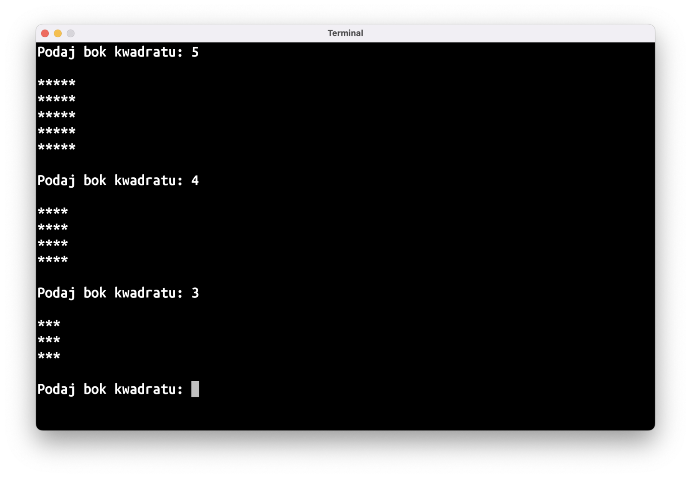
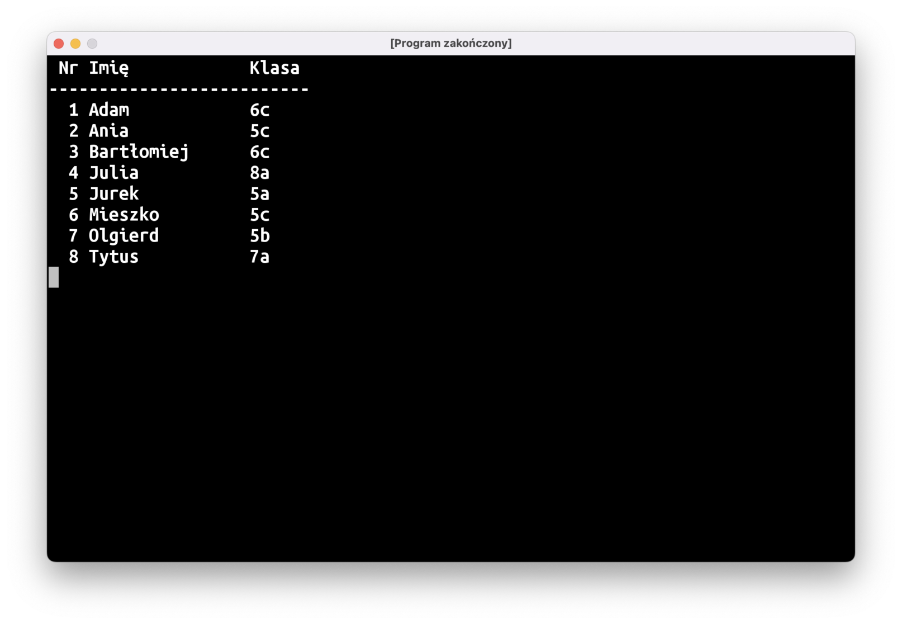
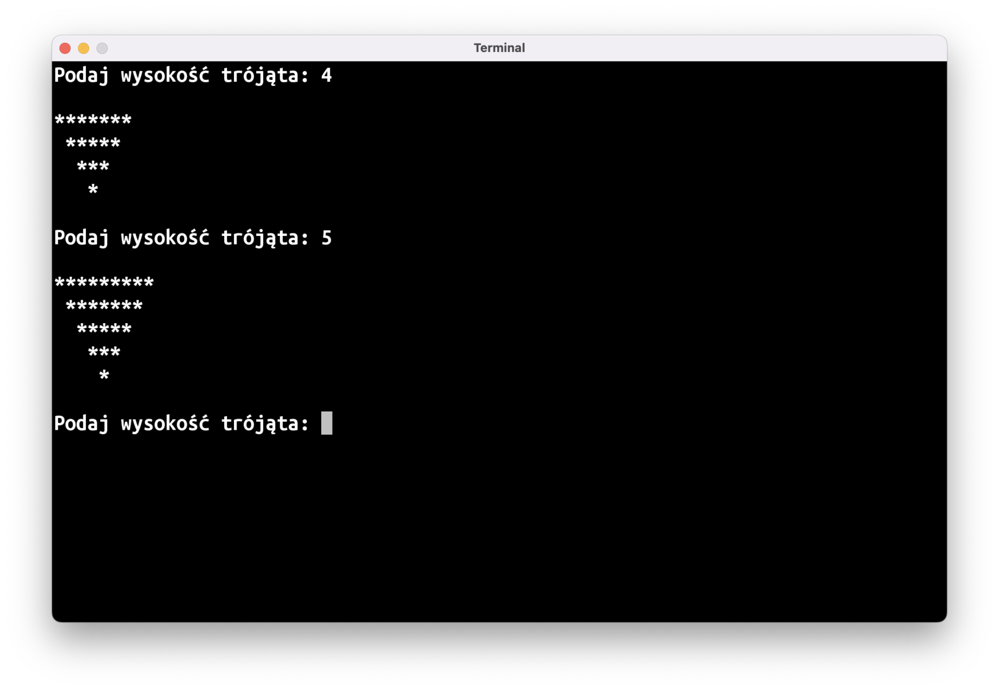



# Omówienie zadania: TBD

# Nowy materiał

## `class`

Kilka zajęć temu, gdy poznawaliśmy listy, pisaliśmy program, który operował na liście uczestników zapisanej w ten sposób:

```kotlin
val uczniowie = listOf<String>(
    "Adam",
    "Ania",
    "Bartłomiej",
    "Julia",
    "Jurek",
    "Mieszko",
    "Olgierd",
    "Tytus",
)
```

Każdy uczeń reprezentowany był w programie przez obiekt `String`. Było to wystarczająco dobre rozwiązanie, gdy potrzebowaliśmy przechowywać tylko imię każdego z uczniów. Co jednak zrobić, jeśli chcemy dla każdego ucznia mieć więcej danych, np.: do której klasy chodzi, albo jakie zna języki programowania?

Oczywiście da się ten problem obejść bez dodatkowych narzędzi (trzymając kilka list albo listę list, albo stosując jakieś jeszcze pokraczniejsze konstrukcje), ale najlepszym rozwiązaniem będzie utworzenie własnego typu danych.

Potrzebujemy specjalnego "klocka", w którym będziemy trzymać dane o uczniu:

```kotlin
class Uczeń
```

Po słowie kluczowym `class` podajemy nazwę typu – w tym przypadku będzie to `Uczeń` (uwaga: zgodnie z przyjętymi konwencjami nazewniczymi, nazwy typów danych zaczynamy od wielkiej litery). Taki zapis wystarczy, żeby stworzyć pierwsze obiekty tego typu:

```kotlin
fun main() = terminal {
    val adam = Uczeń()
}

class Uczeń
```

Obiekty tworzymy "wywołując" typ przy użyciu okrągłych nawiasów `()`, tak jak w robiliśmy to w przypadku funkcji. Tak naprawdę wywołujemy specjalną funkcję nazywaną **konstruktorem** obiektu. Ukrywa się ona w pierwszej linijce kodu opisującego nasz typ:

```kotlin
class Uczeń()
//         ~~
// To jest konstruktor. Jeśli nie przyjmuje on żadnych
// parametrów, można go pominąć, dlatego też w poprzednim
// bloczku kodu tych nawiasów nie było.
```

Ten kod można uruchomić, ale na razie nasz typ `Uczeń` nie jest zbyt użyteczny: nie da się w nim przechować żadnych danych, a przecież chcemy w nim trzymać takie informacje jak imię czy klasę. Podobnie jak w przypadku obiektu typu `List<>`, którego można spytać o ilość elementów na liście przy użyciu właściwości `.size`, chcielibyśmy, żeby nasz obiekt `Uczeń` można było odpytać o imię czy klasę:

```kotlin
fun main() = terminal {
    val adam = Uczeń()

    println("${adam.imię} chodzi do klasy ${adam.klasa}")
}
```

Musimy do naszego typu dodać informację o jego własnościach. Najpierw, po nazwie typu musimy dodać **ciało** (ang. *body*) klasy przy użyciu nawiasów klamrowych `{}`:

```kotlin
class Uczeń {
    // Podobnie jak pusty konstruktor, puste ciało klasy można
    // pominąć – dlatego w poprzednich blokach nie było go.
}
```

A następnie opisać w ciele klasy, jakie własności powinien mieć nasz obiekt:

```kotlin
class Uczeń {
    val imię: String
    val klasa: String
}
```

Powyższy kod dalej będzie podkreślony na czerwono: stałe w obiekcie (czyli ich własności), podobnie jak inne stałe w naszym programie, muszą mieć do siebie przypisany jakiś obiekt.

Wartości tych stałych najlepiej będzie przekazać przy jego tworzeniu:

```kotlin
val adam = Uczeń("Adam", "6c")
```

Pamiętajcie: obiekty tworzone są przy użyciu konstruktora, który jest funkcją. Do tej pory nie przyjmował on żadnych parametrów, ale teraz chcemy, żeby przyjmował imię oraz klasę, musimy więc dodać te parametry – tak jak do zwykłych funkcji:

```kotlin
class Uczeń(imię: String, klasa: String) {
    val imię: String
    val klasa: String
}
```

Ostatnią rzeczą, którą musimy zrobić, jest użycie tych parametrów. Samo przekazanie parametru do funkcji nie oznacza, że program cokolwiek z nim sensownego zrobi, trzeba jeszcze tego parametru użyć w ciele funkcji. Podobnie sprawa się ma z konstruktorami – przekazanych parametrów należy użyć w ciele klasy:

```kotlin
class Uczeń(imię: String, klasa: String) {
    val imię: String = imię
    val klasa: String = klasa
}
```

Kod wyżej może na pierwszy rzut oka wyglądać to dziwacznie: `imię = imię`, wygląda to, jakbyśmy przypisywali stałą do samej siebie. W rzeczywistości to pierwsze `imię` to nazwa własności obiektu, `val imię`, a drugie – parametru konstruktora. Tworzymy własność `imię` przypisując jej wartość parametru `imię`.

Nie tylko wygląda to dziwnie, ale wymaga też powtarzania dwa razy tego samego kodu dla każdej własności tworzonego obiektu. Dlatego też Kotlin proponuje "sklejenie" tych dwóch rzeczy w jedną:

```kotlin
class Uczeń(val imię: String, val klasa: String)
// ciało klasy jest znów puste, więc można je usunąć
```

Poprzez dodanie `val` do parametru konstruktora mówimy, że chcemy wartość przekazaną do tego parametru zapisać we własności obiektu o tej samej nazwie.

Finalnie nasz kod przedstawia się następująco:

```kotlin
fun main() = terminal {
    val adam = Uczeń("Adam", "6c")

    println("${adam.imię} chodzi do klasy ${adam.klasa}")
}

class Uczeń(val imię: String, val klasa: String)
```

## `data class`

Może zdarzyć się sytuacja, gdy do jednej klasy chodzi kilka osób noszących to samo imię:

```kotlin
fun main() = terminal {
    val adamM = Uczeń("Adam", "4d1")
    val adamS = Uczeń("Adam", "4d1")

    println(adamM == adamS) // co się wypisze? true, czy false?
}
```

Powyższy program wypisze na ekran `false`, co może być zaskakujące. Moglibyście się spodziewać, że wypisze `true`: przecież utworzyliśmy i porównujemy jednakowe obiekty!

Z drugiej strony, `adamM` i `adamS` to dwa osobne obiekty, bo przecież wywołaliśmy konstruktor naszego type `Uczeń` dwa razy. Czyli mamy dwa klocki, które wyglądają tak samo, ale nie są jednym i tym samym klockiem.

Dodatkowe zamieszanie w waszych głowach może spowodować zestawienie porównywania obiektów `Uczeń` i ich własności:

```kotlin
fun main() = terminal {
    val adamM = Uczeń("Adam", "4d1")
    val adamS = Uczeń("Adam", "4d1")

    println(adamM == adamS) //             false
    println(adamM.imię == adamS.imię) //   true
    println(adamM.klasa == adamS.klasa) // true
}
```

To w końcu operator porównania `==` patrzy na czy to **ten sam**, czy **taki sam** obiekt? Odpowiedź brzmi "to zależy", a konkretnie zależy to od typu obiektu. Standardowo, przy porównywaniu obiektów sprawdzane jest, czy jest to ten sam obiekt. Niektóre obiekty, jak `String`, `Int`, sprawdzają, czy logiczna "zawartość" obiektu jest taka sama.

Jeśli chcemy, żeby nasz typ `Uczeń` działał w ten sposób, najprościej jest dodać do jego definicji słowo kluczowe `data`:

```kotlin
data class Uczeń(val imię: String, val klasa: String)
```

Po tej zmianie nasza dwójka Adamów będzie sobie równa.

To, czy powinniście użyć `data class`, czy samego `class`, będzie zależało głównie od tego, które zachowanie operatora `==` ma więcej sensu w waszym programie. Na początek proponuję używać `data class`, chyba że potraficie podać bardzo konkretny powód, dla którego potrzebujecie czegoś innego. Po pierwsze jest to bardziej intuicyjne zachowanie; po drugie, zachowanie operatora `==` ma wpływ na zachowanie niektórych struktur danych, o których będziemy się uczyć na późniejszych zajęciach.

# Zadania

## ⏹ Rysowanie: Kwadrat

Napiszcie program, który wczyta długość boku kwadratu, a następnie wyrysuje go przy użyciu gwiazdek:



Pamiętajcie, że tekst będący powtórzeniem jakiegoś znaku można stworzyć przy użyciu funkcji `String.repeat(n: Int): String` (np.: `"-".repeat(10)`).

## 📒 Lista obecności, v2

Wykorzystujcie typ danych:

```kotlin
data class Uczeń(val imię: String, val klasa: String)
```

Aby wypisać listę obecności:

```kotlin
val uczniowie = listOf(
    Uczeń("Adam", "6c"),
    Uczeń("Ania", "5c"),
    Uczeń("Bartłomiej", "6c"),
    Uczeń("Julia", "8a"),
    Uczeń("Jurek", "5a"),
    Uczeń("Mieszko", "5c"),
    Uczeń("Olgierd", "5b"),
    Uczeń("Tytus", "7a"),
)
```

W formie tabelki:



Przydadzą się wam funkcje `String.padEnd(n: Int): String` oraz `String.padStart(n: Int): String`, które dodają do tekstu spacje na końcu/początku, aby cały tekst miał dokładnie `n` znaków.

*(Jeśli uda się wam napisać ten program, proponuję wrócić do ["Tabliczki Mnożenia" z zeszłego tygodnia]())*

## ▶️ Rysowanie: Trójkąt ☠️

Napiszcie program, który wczyta wysokość trójkąta, a następnie wyrysuje go przy użyciu gwiazdek:



*(Po napisaniu tego programu możecie spróbować wrócić do [rysowania diamentu z poprzednich zajęć]())*
