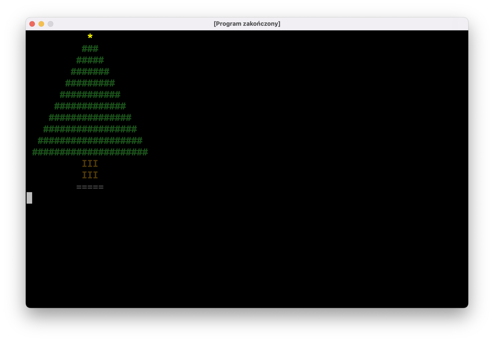



# Omówienie zadania: [Trójkąt]()

Zacznijmy od "nudnych" części programu: wczytania wysokości trójkąta, sprawdzeniu, czy użytkownik nie wpisał głupot, itp.:

```kotlin
fun main() = terminal {
    do {
        print("Podaj wysokość trójkąta: ")
        val wysokość = readln().toIntOrNull()

        if (wysokość != null && wysokość > 0) {
            // tu będziemy rysować coś w ten deseń:
            //
            // *******
            //  *****
            //   ***
            //    *
        }

        println()
    } while (true)
}
```

Zauważcie następującą rzecz: każda linijka składa się z nieparzystej liczby gwiazdek poprzedzonych spacjami. W każdej linii jest o jedną spację więcej i o dwie gwiazdki mniej niż w poprzedniej. Zaczynamy od zera spacji i... no właśnie, ilu gwiazdek?

Popatrzmy na dwa mniejsze trójkąty:

```
strona lewa         strona prawa

   ****                ****
    ***                ***
     **                **
      *                *
```

Każda strona ma w pierwszej linijce tyle samo gwiazdek, ile wynosi wysokość trójkąta, przy czym jedna gwiazdka jest wspólna dla obu stron. Tak więc w pierwszej linijce dużego trójkąta, który chcemy narysować będzie `(wysokość * 2) - 1` gwiazdek.

```kotlin
fun main() = terminal {
    do {
        print("Podaj wysokość trójkąta: ")
        val wysokość = readln().toIntOrNull()

        if (wysokość != null && wysokość > 0) {
            var liczbaSpacji = 0
            var liczbaGwiazdek = (wysokość * 2) - 1
            
            for (i in 1..wysokość) {
                // wypisz spacje
                // wypisz gwiazdki
                // przejdź do następnej linijki
                
                liczbaSpacji += 1
                liczbaGwiazdek -= 2
            }
        }

        println()
    } while (true)
}
```

Do utworzenia tekstu składającego się z powtórzeń tego samego znaku możemy użyć funkcji `String.repeat(n: Int): String`:

```kotlin
fun main() = terminal {
    do {
        print("Podaj wysokość trójkąta: ")
        val wysokość = readln().toIntOrNull()

        if (wysokość != null && wysokość > 0) {
            var liczbaSpacji = 0
            var liczbaGwiazdek = (wysokość * 2) - 1
            
            for (i in 1..wysokość) {
                print(" ".repeat(liczbaSpacji))
                print("*".repeat(liczbaGwiazdek))
                println()
                
                liczbaSpacji += 1
                liczbaGwiazdek -= 2
            }
        }

        println()
    } while (true)
}
```

# Nowy materiał

## Rysowanie w kolorze

Programy, które pisaliśmy do tej pory, zawsze wypisywały tekst z góry na dół, korzystając tylko z jednego koloru czcionki, co bardzo ograniczało ich szatę graficzną. Dobra wiadomość jest taka, że nasze narzędzie `terminal` obsługuje drobną część tzw. [ANSI escape codes](https://en.wikipedia.org/wiki/ANSI_escape_code), które umożliwią nam robienie nieco ciekawszych rzeczy. Zła wiadomość jest taka, że korzystanie z nich jest dość kłopotliwe.

Popatrzcie na następujący program:

```kotlin
fun main() = terminal {
    println("Ten tekst zaraz zniknie! Naciśnij tylko enter...")
    readln()
    
    print("\u001b[2J")
    println("Ha! A nie mówiłem!")
}
```

Tekst `\u001b[2J` to "magiczna" komenda, której wypisanie czyści ekran i przesuwa kursor do lewego górnego rogu.

Jej pierwsza część, `\u001b` to pojedynczy znak, tylko zapisany w specjalny sposób. Każdy znak, który wypisujemy na ekran, ma przypisaną do siebie liczbę. Na przykład literka `A` ma przypisany numer `65`. Zamiast `print('A')` możemy też napisać `print('\u0041')`. `\u` oznacza "następne cztery znaki potraktuj jako liczbę w systemie szesnastkowym". `0041` w systemie szesnastkowym to właśnie `65` w systemie dziesiętnym, więc `print('\u0041')` wypisze na ekran literkę `A`.

Oczywiście nikt o zdrowych zmysłach nie będzie używał tego sposobu do zapisu zwykłego tekstu, ale może być on przydatny, jeśli będziemy chcieli zmusić komputer do wypisania na ekran jakiegoś znaku, którego nie da się wpisać z klawiatury. `\u001b` z naszej "magicznej" komendy to właśnie tego rodzaju znak: `1b` to kod znaku "Escape", od którego zaczynają się wszystkie ANSI escape codes, czyli nasze "magiczne" terminalowe komendy:

- wspomniane wcześniej czyszczenie obrazu: `\u001b[2J`
- zmiana koloru czcionki: `\u001b[38;2;r;g;bm` (gdzie `r`, `g` i `b` to liczby od 0 do 255, będące składowymi tego koloru)
- zmiana koloru tła: `\u001b[48;2;r;g;bm`
- przywrócenie domyślnego koloru czcionki: `\u001b[39m`
- przywrócenie domyślnego koloru tła: `\u001b[49m`
- przywrócenie domyślnych kolorów: `\u001b[0m`
- przesunięcie kursora: `\u001b[y;xH` (gdzie y i x to współrzędne kursora; lewy-górny róg to punkt `[1, 1]`)
- ukrycie kursora: `\u001b[?25l`
- pokazanie kursora: `\u001b[?25h`

Żeby nie musieć pamiętać tych cudacznych sekwencji, napiszemy nasze pierwsze narzędzie, a przy okazji nauczymy się kilku nowych rzeczy.

## Narzędzie `Ansi`

Na dobry początek stwórzmy osobny plik z funkcją, która zwróci komendę ANSI do czyszczenia ekranu:

```kotlin
package jerz.codes.narzedzia

fun wyczyśćEkran(): String {
    return "\u001b[2J"
}
```

Jest to bardzo prosta funkcja składająca się tylko z jednego wyrażenia `return`. Kotlin oferuje specjalną składnię dla takich przypadków. Możemy zmienić naszą funkcję w następujący sposób:

```kotlin
fun wyczyśćEkran(): String = "\u001b[2J"
```

A ponieważ na pierwszy rzut oka widać, że ta funkcja zwraca tekst, możemy pominąć `: String` i skrócić to jeszcze bardziej do `fun wyczyśćEkran() = "\u001b[2J"`.

Dzięki temu nasz program stanie się nieco czytelniejszy:

```kotlin
fun main() = terminal {
    println("Ten tekst zaraz zniknie! Naciśnij tylko enter...")
    readln()

    print(wyczyśćEkran())
    println("Ha! A nie mówiłem!")
}
```

Będziemy mieli więcej takich funkcji i dobrze byłoby je jakoś pogrupować, żeby łatwo było je znaleźć. Zacznijmy od czegoś takiego:
 
```kotlin
package jerz.codes.narzedzia

class Ansi {
    fun wyczyśćEkran(): String = "\u001b[2J"
}
```
 
Stworzyliśmy właśnie nowy typ `Ansi`, dzięki czemu wszystkie powiązane metody będą w jednym miejscu i IntelliJ po napisaniu `Ansi().` będzie wyświetlał wszystkie dostępne w naszym narzędziu funkcje. Sposób użycia nie jest jednak idealny:
 
```kotlin
println("To zaraz zniknie! Naciśnij enter...")
readln()

print(Ansi().wyczyśćEkran())
println("Ha! A nie mówiłem!")
```

`Ansi` to typ danych, i za każdym razem, kiedy chcemy użyć jakiejś funkcji zdefiniowanej w tym typie, musimy stworzyć obiekt tego typu przy użyciu konstruktora `Ansi()`. Wprowadźmy drobną zmianę:

```kotlin
package jerz.codes.narzedzia

object Ansi {
    fun wyczyśćEkran(): String = "\u001b[2J"
}
```

Słówko `object` działa podobnie jak `class` pod tym względem, że też służy ono do zdefiniowania nowego typu danych. Różnica jest taka, że jednocześnie tworzymy obiekt tego typu o nazwie takiej samej jak nazwa typu. Ponadto nie da się utworzyć innych obiektów tego typu: `object Ansi` oznacza, że jest tylko jeden obiekt typu `Ansi`, i nazywa się on `Ansi`. Upraszcza to nieco jego użycie: 

```kotlin
println("To zaraz zniknie! Naciśnij enter...")
readln()

print(Ansi.wyczyśćEkran()) // nie ma nawiasów `()` po `Ansi`
println("Ha! A nie mówiłem!")
```

### `object` vs. `class`

W zrozumieniu różnicy pomiędzy `object` i `class` może pomóc wam następujący przykład:

`class KrzesłoZIkei` to takie krzesło, które jest masowo produkowane w fabryce. Dowolny egzemplarz krzesła nie różni się szczególnie od innych.

`object UnikatoweKrzesłoMisternieWystruganePrzezWujkaWładkaWJegoWarsztaciku` to jedyne w swoim rodzaju krzesło. Nie ma drugiego takiego krzesła, nawet gdyby wujaszek bardzo się postarał, co najwyżej wyjdzie mu `object ZupełnieInneUnikatoweKrzesłoWładkowejProdukcji`.

### Dygresja: dlaczego `return` zamiast `print`?

Możecie się zastanawiać, dlaczego nasza funkcja `wyczyśćEkran` zwraca komendę do czyszczenia obrazu, zamiast od razu wypisać ją na ekran przy użyciu `print`'a. Będzie nam to potrzebne na późniejszych zajęciach, gdy będziemy zajmować się animacjami.   

## Pozostałe funkcje w narzędziu Ansi

Dodajmy metodę do zmiany koloru tekstu:

```kotlin
package jerz.codes.narzedzia

object Ansi {
    fun wyczyśćEkran(): String = "\u001b[2J"
    fun kolorTekstu(kolor: Color?) = …
}
```

Użyłem tutaj typu `Color`, który musimy zaimportować (będzie się on "świecić" na czerwono; po najechaniu na ten tekst kursorem możemy nacisnąć `Alt + Enter`, a IntelliJ doda na górze pliku linijkę `import java.awt.Color`). Jest to typ dostępny w standardowych bibliotekach (tak jak `List`, `IntRange`, itp.) i prościej skorzystać z niego niż pisać od zera własny.

Żeby utworzyć obiekt typu `Color`, możemy użyć konstruktora `Color(r: Int, g: Int, b: Int)`, który
przyjmuje trzy składowe koloru w postaci liczb z przedziału od `0` do `255`. Jeśli podany `kolor` będzie `null`em, przywrócimy domyślny kolor tekstu sekwencją `\u001b[39m`. W przeciwnym razie
użyjemy sekwencji `\u001b[38;2;r;g;bm`, zastępując `r`, `g` i `b` wartościami wyciągniętymi z obiektu `kolor` przy użyciu `kolor.red`, `kolor.blue` itd.:

```kotlin
package jerz.codes.narzedzia

object Ansi {
    fun wyczyśćEkran() = "\u001b[2J"
    fun kolorTekstu(kolor: Color?) = when (kolor) {
        null -> "\u001b[39m"
        else -> "\u001b[38;2;${kolor.red};${kolor.green};${kolor.blue}m"
    }
}
```

Pozostałe funkcje dopiszcie sami!

## Choinka

Możemy troszkę pozmieniać program "Trójkąt", aby wypisać na ekran kolorową choinkę:

```kotlin
fun main() = terminal {
    val wysokośćChoinki = 10
    
    // narysuj gwiazdkę
    print(Ansi.kolorTekstu(Color.YELLOW))
    print(" ".repeat(wysokośćChoinki) + " * ")
    println()
    
    // narysuj gałązki
    var liczbaSpacji = wysokośćChoinki
    var liczbaGałązek = 3

    print(Ansi.kolorTekstu(Color(26, 80, 26)))
    for (i in 1..wysokośćChoinki) {
        print(" ".repeat(liczbaSpacji))
        print("#".repeat(liczbaGałązek))
        println()
        
        // ponieważ rysujemy "trójkąt" w drugą stronę,
        // zmniejszamy liczbę spacji
        // i zwiększamu liczbę gałązek
        liczbaSpacji -= 1
        liczbaGałązek += 2
    }
    
    // narysuj pień i podstawkę
    print(Ansi.kolorTekstu(Color(0x4F, 0x39, 0x08)))
    println(" ".repeat(wysokośćChoinki - 1) + " III ")
    println(" ".repeat(wysokośćChoinki - 1) + " III ")
    print(Ansi.kolorTekstu(Color.DARK_GRAY))
    println(" ".repeat(wysokośćChoinki - 1) + "=====")
}
```



Zwróćcie uwagę na kilka różnych sposobów tworzenia obiektu typu `Color`:
- Do gwiazdki użyliśmy stałej bibliotecznej `Color.YELLOW`
- Dla igliwia podaliśmy składowe RGB jako liczby dziesiętne `Color(26, 80, 26)`
- Dla pnia podaliśmy składowe jako liczby szesnastkowe `Color(0x4F, 0x39, 0x08)`
