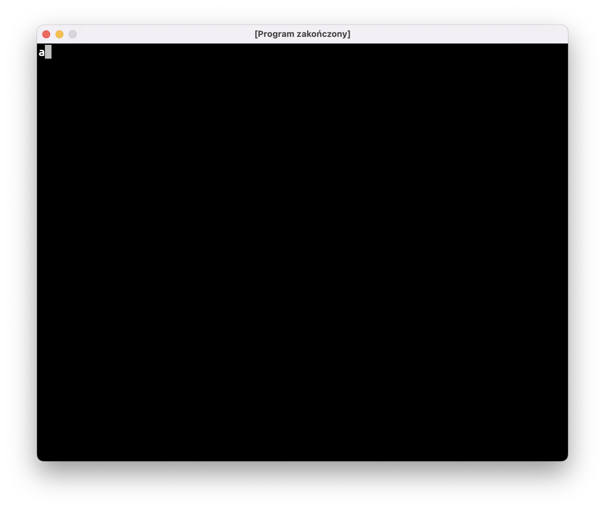
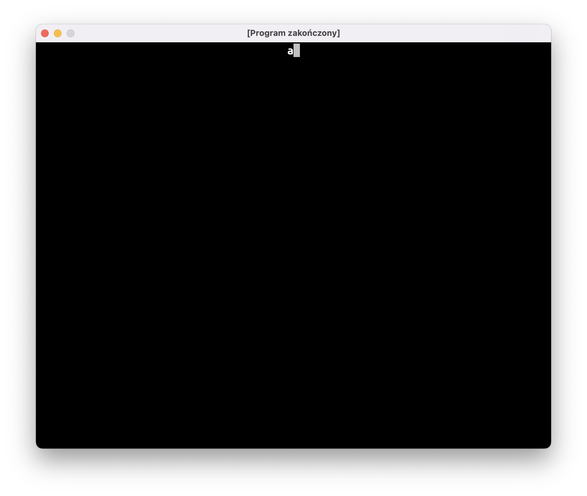
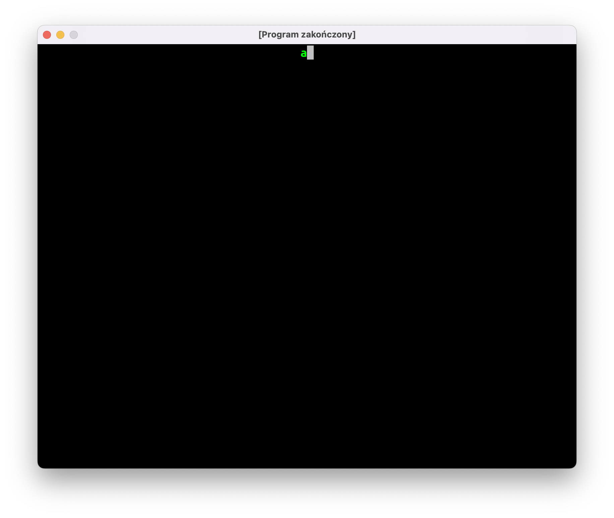
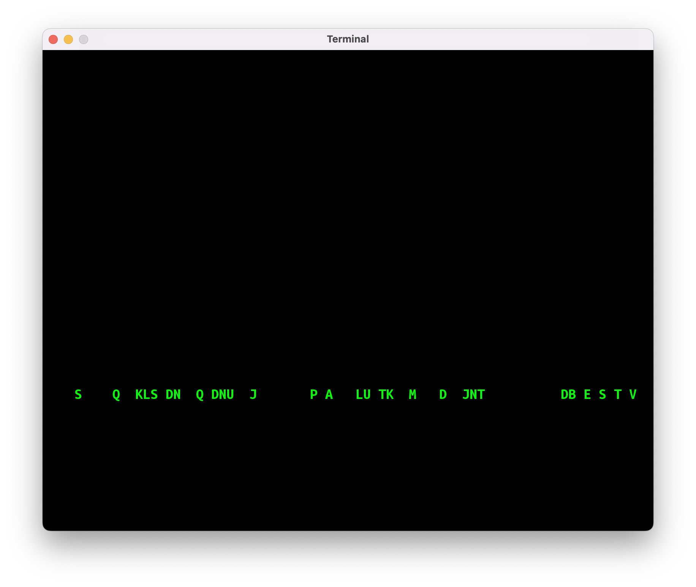
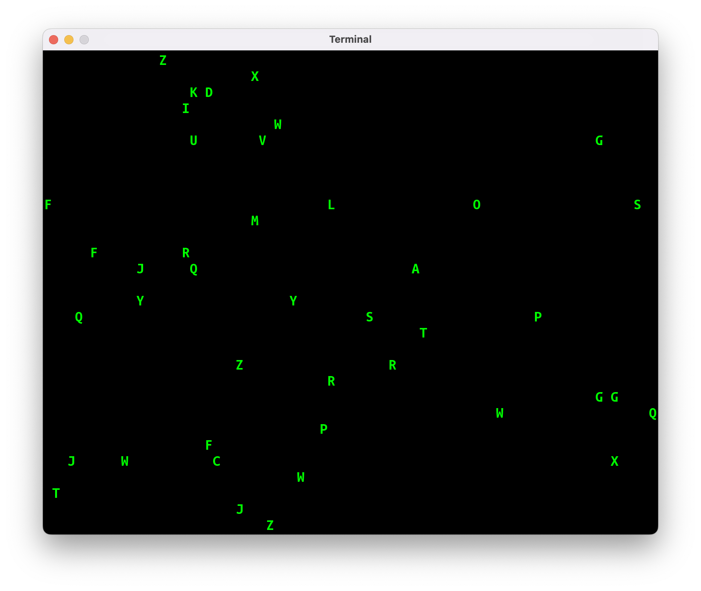
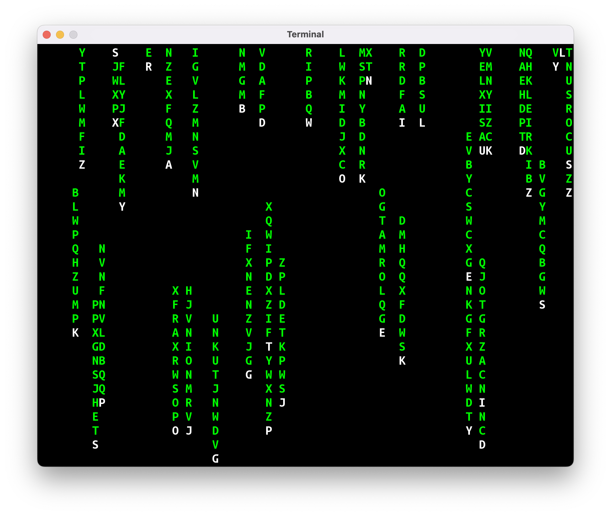



Przez kilka ostatnich zajęć wałkowaliśmy program "Gra w Statki" i powtórki materiału. Jako że wszyscy (włącznie z prowadzącym) odczuwają potrzebę zrobienia czegoś innego, napiszemy dzisiaj naszą pierwszą animację. Weźmiemy na warsztat animację znaną z kultowego filmu Matrix:


Spodziewam się, że nasze pierwsze podejście nie będzie wyglądało raczej biednie, stąd nazwa programu: "Biedamatrix".

# Krok 1: wyświetl literkę

Nasza animacja będzie składać się z literek, tak więc pierwszym krokiem będzie wyświetlenie pojedynczej literki. Ustalmy też rozmiar okna oraz wielkość czcionki:

```kotlin
package jerz.codes.animacje

import jerz.codes.terminal.terminal

val SZEROKOSC = 80
val WYSOKOSC = 30

fun main() = terminal(
    widthInTiles = SZEROKOSC,
    heightInTiles = WYSOKOSC,
    fontSize = 20
) {
    print("a")
}
```



# Krok 2: przesuń literkę na środek ekranu

Nasza litera nie zawsze będzie znajdować się przy lewej krawędzi ekranu. Teoretycznie moglibyśmy przesunąć ją w prawo przez wypisanie odpowiedniej ilości spacji (np.: `print(" ".repeat(15)`), ale lepszym rozwiązaniem będzie użycie odpowiedniej instrukcji Ansi, o których była mowa na [zajęciach nr 9]().

```kotlin
object Ansi {
    // …inne funkcje

    /**
     * Okno konsoli używa następującego układu
     * współrzędnych:
     *  
     * (1, 1)
     *       *-----------------> x
     *       |
     *       |
     *       |
     *       V
     *       
     *       y
     */
    fun przesuńKursor(x: Int, y: Int): String {
        return "\u001B[$y;${x}H"
    }
}
```

Stworzymy też dwie zmienne, żeby przechowywać w nich współrzędne literki.

```kotlin
fun main() = terminal(
    widthInTiles = SZEROKOSC,
    heightInTiles = WYSOKOSC,
    fontSize = 20
) {
    val x = SZEROKOSC / 2
    val y = 1

    print(Ansi.przesunKursor(x, y))
    print("a")
}
```



# Krok 3: zmień kolor litery na zielony

Nasze Biedamatrixowe literki powinny być zielone! Skorzystamy z kolejnej instrukcji ANSI, żeby zmienić kolor czcionki:

```kotlin
fun main() = terminal(
    widthInTiles = SZEROKOSC,
    heightInTiles = WYSOKOSC,
    fontSize = 20
) {
    val x = SZEROKOSC / 2
    val y = 1

    print(Ansi.kolorCzcionki(Color.GREEN))
    print(Ansi.przesuńKursor(x, y))
    print("a")
}
```



# Krok 4: ukryj kursor

Kwadratowy kursor znajdujący się za literką psuje nieco efekt wizualny. Na szczęście jest instrukcja ANSI (`\u001b[?25l`), która ukrywa kursor:

```kotlin
fun main() = terminal(
    widthInTiles = SZEROKOSC,
    heightInTiles = WYSOKOSC,
    fontSize = 20
) {
    val x = SZEROKOSC / 2
    val y = 1

    print(Ansi.ukryjKursor())
    print(Ansi.kolorCzcionki(Color.GREEN))
    print(Ansi.przesuńKursor(x, y))
    print("a")
}
```


# Krok 5: spadająca literka

Czas zacząć animację naszej literki!

Tak naprawdę, animacja komputerowa polega na wyświetlaniu kolejnych obrazów bardzo szybko, jeden po drugim. Tak więc, jeśli chcemy narysować spadającą literkę, musimy narysować literkę na górze ekranu, a następnie wyczyścić ekran i narysować literkę o jedno pole niżej, i powtarzać to, aż literka znajdzie się poza dolną krawędzią ekranu.

W terminalowym układzie współrzędnych `y` to tak naprawdę numer wiersza na ekranie, tak więc przy ruchu w dół będziemy zwiększać `y` o jeden przy każdym kroku:

```kotlin
var x = SZEROKOSC / 2
var y = 1

print(Ansi.ukryjKursor())
print(Ansi.kolorCzcionki(Color.GREEN))

do {
    // wyczyść ekran
    print(Ansi.wyczyśćEkran())
    
    // narysuj literkę
    print(Ansi.przesuńKursor(x, y))
    print("a")
    
    // zmień współrzędną y, aby w następnej klatce
    // animacji literka została narysowana niżej 
    y += 1
    
    // poczekaj 0.1s przed narysowaniem kolejnej klatki
    Thread.sleep(100)
} while (y <= WYSOKOSC) // powtarzaj, dopóki literka nie spadnie na sam dół
```

Ukrywanie kursora i zmiana koloru czcionki wylądowała poza pętlą, ponieważ nie ma potrzeby robić tego wielokrotnie.

Po narysowaniu każdej klatki animacji musimy chwilkę odczekać: w przeciwnym razie nasz program zakończyłby się w mgnieniu oka i nie dostrzeglibyśmy efektu ruchu literki. Wykorzystamy metodę `Thread.sleep(…)`, żeby kazać komputerowi czekać 100 milisekund.

# Krok 6: losowanie litery

W Matrixowej animacji literka podczas spadania cały czas się zmienia. Nasz Biedamatrix na razie pokazuje tylko literkę `a`, co nie wygląda równie imponująco. Możemy nieco poprawić efekt, losując literkę przy każdej klatce animacji:

```kotlin
var x = SZEROKOSC / 2
var y = 1

val znaki = 'A'..'Z'

print(Ansi.ukryjKursor())
print(Ansi.kolorCzcionki(Color.GREEN))

do {
    print(Ansi.wyczyśćEkran())
    print(Ansi.przesuńKursor(x, y))
    print(znaki.random())
    y += 1

    Thread.sleep(100)
} while (y <= 30)
```

# Krok 7: spadanie w nieskończoność

Gdy litera spadnie poza dolną krawędź ekranu, możemy "teleportować" ją z powrotem do pierwszego wiersza i wylosować nową współrzędną `x`. Dzięki temu nasza animacja będzie mogła działać w nieskończonej pętli:

```kotlin
var x = SZEROKOSC / 2
var y = 1

val znaki = 'A'..'Z'

print(Ansi.ukryjKursor())
print(Ansi.kolorCzcionki(Color.GREEN))

do {
    print(Ansi.wyczyśćEkran())
    print(Ansi.przesuńKursor(x, y))
    print(znaki.random())
    y += 1
    
    if (y > WYSOKOSC) {
        x = (1..SZEROKOSC).random()
        y = 1
    }

    Thread.sleep(100)
} while (true)
```

# Krok 8: wiele literek

Czas na dość trudny krok: animowanie wielu liter.

Gdy animowaliśmy jedną literę, mogliśmy po prostu użyć dwóch zmiennych `x` i `y`. Teraz będziemy musieli przechowywać dwie współrzędne dla wielu liter naraz. Po pierwsze, potrzebny będzie "klocek", który może przechować wszystkie dane dotyczące litery:

```kotlin
class Litera(var x: Int, var y: Int)
```

Po drugie, potrzebna będzie `List`a takich klocków:

```kotlin
val litery = mutableListOf<Litera>()
for (i in 1..42) {
    litery.add(Litera(x = (1..SZEROKOSC).random(), y = 1))
}
```

W głównej pętli kod, który wykonywaliśmy dla pojedynczej litery, będziemy musieli wykonać dla wszystkich liter na liście:

```kotlin
do {
    print(Ansi.wyczyśćEkran())

    for (litera in litery) {
        print(Ansi.przesuńKursor(litera.x, litera.y))
        print(znaki.random())
        litera.y += 1

        if (litera.y > WYSOKOSC) {
            litera.x = (1..SZEROKOSC).random()
            litera.y = 1
        }
    }

    Thread.sleep(100)
} while (true)
```

Po powyższych zmianach nasz Biedamatrix wygląda naprawdę biednie, ponieważ nasze literki będą maszerować w zwartym szeregu:



Dzieje się tak, ponieważ tworząc początkową listę literek użyliśmy tego samego `y=1` dla wszystkich liter. Proponuję rozwiązać ten problem losując początkowy `y` z przedziału `-WYSOKOSC..-1`:

```kotlin
val litery = mutableListOf<Litera>()
for (i in 1..42) {
    litery.add(
        Litera(
            x = (1..SZEROKOSC).random(), 
            y = (-WYSOKOSC..-1).random()
        )
    )
}
```

Dzięki temu nasze literki będą "rozrzucone" po całym ekranie, a jednocześnie przy starcie ekranu żadna z liter nie będzie widoczna.

Konieczna będzie jeszcze jedna zmiana: nasz `terminal` nie lubi, gdy ktoś próbuje ustawić kursor na pozycji `y` mniejszej od 0. Musimy "owinąć" kod rysujący literkę w instrukcję warunkową, która sprawdzi, czy `y` jest poprawne:

```kotlin
if (litera.y > 0) {
    print(Ansi.przesuńKursor(litera.x, litera.y))
    print(znaki.random())
}
```

Nasz Biedamatrix jest wciąż biedny, ale zaczyna już być czymś matrixopodobnym:



# Krok 9: smugi za literkami

W prawdziwej Matrixowej animacji wszystkie literki zostawiają za sobą gasnące smugi. My na razie zrobimy coś prostszego: nad każdą literką będziemy rysować smugę o długości 10 znaków. Literka będzie rysowana białym kolorem, smuga zielonym.

```kotlin
if (litera.y > 0) {
    // narysuj białą literkę
    print(Ansi.kolorCzcionki(Color.WHITE))
    print(Ansi.przesuńKursor(litera.x, litera.y))
    print(znaki.random())

    // narysuj zieloną smugę
    print(Ansi.kolorCzcionki(Color.GREEN))
    for (dy in 1..10) {
        val ySmugi = litera.y - dy

        if (ySmugi > 0) {
            print(Ansi.przesuńKursor(litera.x, ySmugi))
            print(znaki.random())
        }
    }
}
```

Do rysowania smugi użyjemy pętli `for` po przedziale `1..10`. Ponieważ smuga rysowana jest powyżej literki, będziemy od współrzędnej `litera.y` odejmować wartość `dy`.

Podobnie jak w przypadku rysowania samej literki, musimy sprawdzić współrzędną `y` dla każdego elementu w smudze.



# Co dalej?

Na następnych zajęciach postaramy się ulepszyć naszą animację!

Przede wszystkim, zaobserwowaliście pewnie dziwne "mruganie" ekranu. Pozbycie się tych "glitchy" to pierwsza rzecz, którą będziemy musieli się zająć.

Po drugie, nasze smugi nie prezentują się zbyt dobrze: znikają nagle, gdy litera dolatuje do krawędzi; cała smuga narysowana jest jednym kolorem; literki w smudze zmieniają się cały czas, a powinny w 90% pozostawać takie same (popatrzcie na animację na początku tego wpisu).