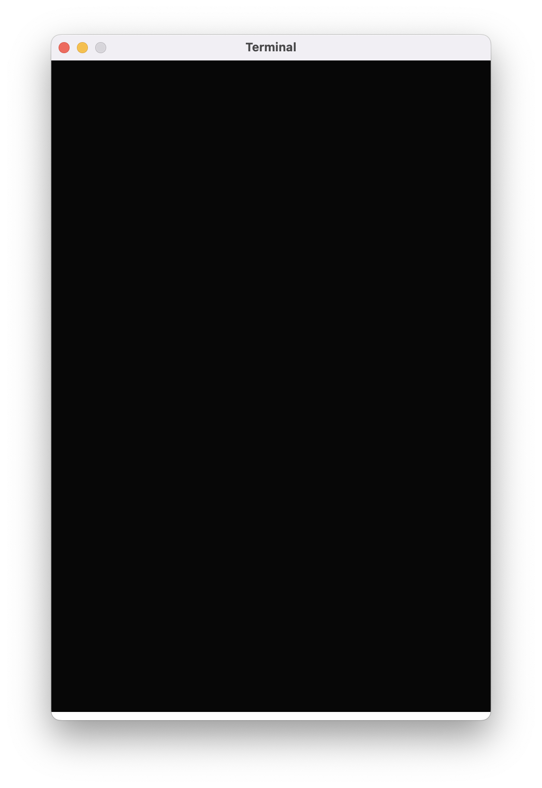
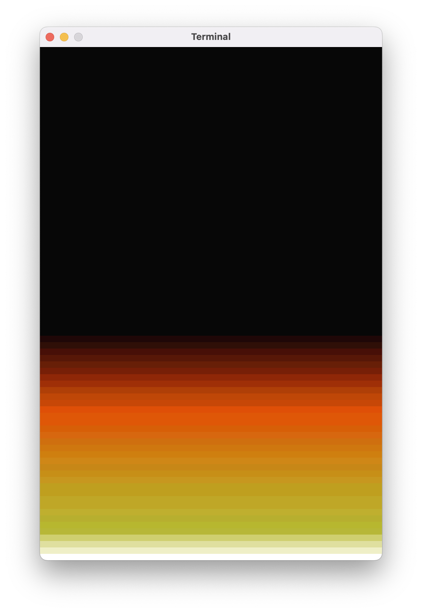



Na poprzednich zajęciach animowaliśmy Matrix'owy deszcz liter. Dziś pobawimy się w piromanów i napiszemy animację płomieni.

# Okienko

Podobnie, jak przy Matrix'owych animacjach, zaczniemy od narysowania pustego okienka. Użyjemy stałych do określenia szerokości i wysokości okna – będziemy potrzebować tych wartości później. Do rysowania płomieni nie będziemy używać żadnych specjalnych znaczków. Zamiast tego będziemy wypisywać różnokolorowe spacje, a więc każdy znak naszego terminala będzie osobnym pikselem (dość sporym i prostokątnym, ale wciąż pikselem). Nasze okno powinno być zatem duży, a rozmiar czcionki – mały:

```kotlin
val SZEROKOSC = 120
val WYSOKOSC = 80

fun main() = terminal(
    widthInTiles = SZEROKOSC,
    heightInTiles = WYSOKOSC,
    fontSize = 8
) {
}
```

# Paleta kolorów

W przypadku Matrix'owych animacji paletę kolorów dla smug ciągnących się za spadającymi tworzyliśmy samodzielnie. W dzisiejszym programie wykorzystamy paletę z gry Doom z 1993 roku. Możecie wkleić poniższy fragment przed funkcją `main`:

```kotlin
val PALETA = listOf(
    Color(0x07, 0x07, 0x07),
    Color(0x1f, 0x07, 0x07),
    Color(0x2f, 0x0f, 0x07),
    Color(0x47, 0x0f, 0x07),
    Color(0x57, 0x17, 0x07),
    Color(0x67, 0x1f, 0x07),
    Color(0x77, 0x1f, 0x07),
    Color(0x8f, 0x27, 0x07),
    Color(0x9f, 0x2f, 0x07),
    Color(0xaf, 0x3f, 0x07),
    Color(0xbf, 0x47, 0x07),
    Color(0xc7, 0x47, 0x07),
    Color(0xDF, 0x4F, 0x07),
    Color(0xDF, 0x57, 0x07),
    Color(0xDF, 0x57, 0x07),
    Color(0xD7, 0x5F, 0x07),
    Color(0xD7, 0x67, 0x0F),
    Color(0xcf, 0x6f, 0x0f),
    Color(0xcf, 0x77, 0x0f),
    Color(0xcf, 0x7f, 0x0f),
    Color(0xCF, 0x87, 0x17),
    Color(0xC7, 0x87, 0x17),
    Color(0xC7, 0x8F, 0x17),
    Color(0xC7, 0x97, 0x1F),
    Color(0xBF, 0x9F, 0x1F),
    Color(0xBF, 0x9F, 0x1F),
    Color(0xBF, 0xA7, 0x27),
    Color(0xBF, 0xA7, 0x27),
    Color(0xBF, 0xAF, 0x2F),
    Color(0xB7, 0xAF, 0x2F),
    Color(0xB7, 0xB7, 0x2F),
    Color(0xB7, 0xB7, 0x37),
    Color(0xCF, 0xCF, 0x6F),
    Color(0xDF, 0xDF, 0x9F),
    Color(0xEF, 0xEF, 0xC7),
    Color(0xFF, 0xFF, 0xFF),
)
```

# Model danych

Dla każdego "piksela" na naszym ekranie będziemy przechowywać jej "poziom ciepła": liczbę od 0 do 35. Te liczby nie wzięły się z kosmosu: mamy dokładnie 36 barw w naszej palecie, więc liczby `0..35` odpowiadają indeksom w tej tablicy. Poziom `0` oznacza prawie całkowicie wygaszoną kratkę, poziom `35` to kratka rozżarzona do białości.

Proponuję przechowywać te dane w zagnieżdżonej liście, tj.: liście linijek, gdzie każda linijka to lista poziomów ciepła kratek w tej linii:

```kotlin
val ekran: MutableList<MutableList<Int>>
```

Początkowo musimy wypełnić wszystkie kratki wartością `0`, poza dolną linią, którą wypełnimy wartościami `35`. Będzie to źródło ciepła i płomieni.

```kotlin
for (y in 1..WYSOKOSC) {
    val linijka = mutableListOf<Int>()

    for (x in 1..SZEROKOSC) {
        val pikselek = if (y == WYSOKOSC) PALETA.lastIndex else 0

        linijka.add(pikselek)
    }

    ekran.add(linijka)
}
```

W powyższym fragmencie kodu są dwie rzeczy, na które chciałbym zwrócić waszą uwagę.

Po pierwsze, dla ostatniej linijki zamiast po prostu wartości `35` używamy własności `PALETA.lastIndex`, czyli odpytujemy paletę barw o indeks ostatniego koloru. Dzięki temu nawet po zmianie palety nasz program będzie działał poprawnie.

Po drugie, do stałej `val pikselek` przypisujemy... `if..else`'a? Taki manewr nie jest dozwolony w wielu językach programowania, ale akurat w Kotlinie `if..else` oraz `when` są **wyrażeniami**, czyli można ich używać wszędzie tam, gdzie spodziewalibyśmy się wywołania funkcji, użycia stałej lub zmiennej, albo po prostu stałej wartości wpisanej bezpośrednio w kodzie.

# Rysowanie ekranu

Skoro mamy już przygotowane dane dla całego ekranu, czas wyrysować wszystko. Co prawda nie będziemy jeszcze nic animować, ale nauczeni doświadczeniem z tworzenia poprzednich animacji, zastosujemy trik z `kartką` i pojedynczym `print`, aby uniknąć później mrugania ekranu:

```kotlin
var kartka = ""
kartka += Ansi.wyczyśćEkran()

for (y in 1..WYSOKOSC) {
    kartka += Ansi.przesuńKursor(1, y)

    val linijka = ekran[y - 1]
    for (x in 1..SZEROKOSC) {
        val pikselek = linijka[x - 1]
        val kolorPiksela = PALETA[pikselek]

        kartka += Ansi.kolorTła(kolorPiksela)
        kartka += ' '
    }
}

print(kartka)
```

Wypisujemy ekran linijka po linijce, dla każdej linijki najpierw przechodząc na jej początek przy użyciu `Ansi.przesuńKursor`, a potem rysując różnokolorową spację dla każdego pikselka w linijce. Jeśli nie macie w swojej klasie `Ansi` metody `kolorTła`, wróćcie do materiałów z [zajęć nr 9]().

Zauważcie też, że pobierając linijkę z listy `ekran` albo piksel z linijki, musimy od `y` i `x` odjąć `1`. Listy indeksowane są od `0`, a więc dla pierwszego wiersza, czyli dla `y` równego `1`, musimy pobrać `0`-wy element.

Po uruchomieniu programu powinniście zobaczyć czarne okienko z białą kreską na dole:



# Pętla animacji…

Skoro mamy coś animować, opakujmy rysowanie ekranu w pętlę:

```kotlin
do {
    var kartka = ""
    kartka += Ansi.wyczyśćEkran()

    for (y in 1..WYSOKOSC) {
        kartka += Ansi.przesuńKursor(1, y)

        val linijka = ekran[y - 1]
        for (x in 1..SZEROKOSC) {
            val pikselek = linijka[x - 1]
            val kolorPiksela = PALETA[pikselek]

            kartka += Ansi.kolorTła(kolorPiksela)
            kartka += ' '
        }
    }

    print(kartka)

    Thread.sleep(16)
    animujOgień(ekran)
} while (true)
```

Po wyrysowaniu kartki dodałem opóźnienie przy użyciu funkcji `Thread.sleep(…)`. Użyta wartość `16` milisekund bierze się z częstotliwości odświeżania ekranu 99% nie-gameing'owych monitorów, które są w stanie wyświetlić 60 klatek na sekundę (`1000ms / 60 = 16.66(7)ms`). Nie ma sensu częściej wywoływać `print(kartka)` – monitor i tak nie będzie w stanie tego wyświetlić.

Ostatnia rzecz w głównej pętli animacji to wywołanie funkcji `animujOgień`. To właśnie ona będzie "sercem" naszego programu. Przekażemy tam `ekran` i wewnątrz tej funkcji będziemy dokonywać w nim zmian, które sprawią, że nasze płomienie ożyją.

# …i faktyczna animacja!

Podstawowa idea jest taka, że każda kratka "ogrzewa" kratkę powyżej. Oczywiście, ciepło nie zostanie w 100% przeniesione, więc będziemy trochę zmniejszać poziom ciepła ogrzewanych kratek. Przejedźmy po wszystkich liniach poza ostatnią (to będzie palenisko będące źródłem ciepła) i ustawmy poziom ciepła na wartość o 1 mniejszą niż poziom kratki poniżej:

```kotlin
fun animujOgień(ekran: MutableList<MutableList<Int>>) {
    // dla każdej linijki oprócz ostatniej
    for (y in 1..(WYSOKOSC - 1)) {
        // dla każdego pikselka
        for (x in 1..SZEROKOSC) {
            // popatrz na kratkę poniżej
            val kratkaPoniżej = ekran[y][x - 1]
            val nowaWartość = (kratkaPoniżej - 1).coerceAtLeast(0)

            // ustaw nową wartość dla kratki
            ekran[y - 1][x - 1] = nowaWartość
        }
    }
}
```

Podobnie jak przy rysowaniu, skoro "jedziemy" po przedziałach `1..WYSOKOSC` i `1..SZEROKOSC`, piksel, którym obecnie się zajmujemy to `ekran[y - 1][x - 1]`, a piksel poniżej to `ekran[y - 1 + 1][x - 1]`, czyli po prostu `ekran[y][x - 1]`.

Musimy pamiętać o tym, żeby nie wstawić do `ekran`u żadnej wartości ujemnej! Nasz "poziom ciepła" zapisany dla każdej kratki **musi** być prawidłowym indeksem palety kolorów. Do tego właśnie służy wywołanie `coerceAtLeast(0)`: *"coerce"* to po angielsku *"wymuszać"*, zatem funkcja `Int.coerceAtLeast(0)` zapewni, że `nowaWartość` nigdy nie będzie ujemne:

```kotlin
20.coerceAtLeast(0)    // 20
(-15).coerceAtLeast(0) // 0
```

# Doom… tęcza?

Efekt działania tego programu nie jest zbyt ciekawy. Po pierwsze miał być ogień, a wyszło coś takiego:



Po drugie, animacja okrutnie się ślimaczy, osiągamy co najwyżej kilka klatek na sekundę.

Na tym zakończymy dzisiejsze zajęcia. Na następnym spotkaniu zastanowimy się, czemu nasz program tak wolno działa, a potem popracujemy nad ulepszeniem efektu animacji. 