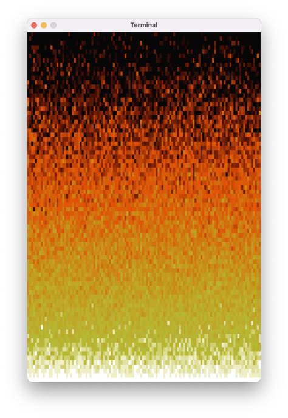
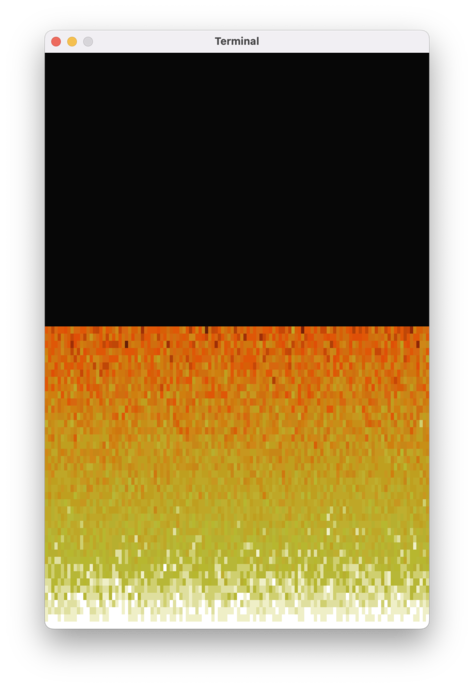
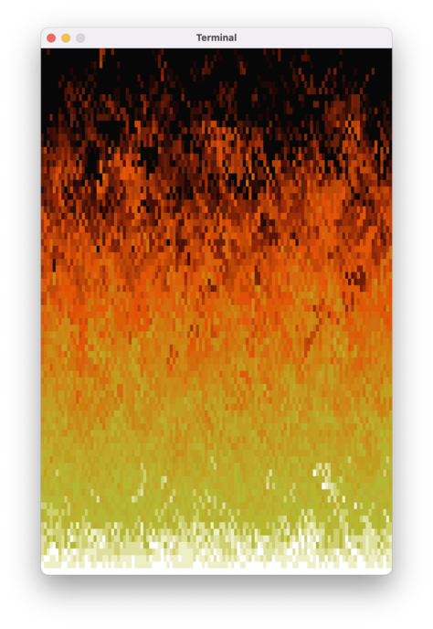
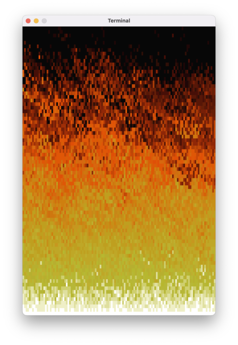



# Sytuacja po poprzednich zajęciach

Miał być ogień, wyszedł zachód słońca w piekielnych kolorach; w dodatku wszystko działa koszmarnie wolno. Podsumowując – szału nie ma.

# Dlaczego to tak wolno działa?!?!

Najpierw zajmiemy się bardziej palącą kwestią: prędkością animacji. W zależności od komputera osiągać będziemy pewnie 2-3 klatki na sekundę (a w przypadku wolniejszych maszyn jedną klatkę na 2-3 sekundy). Brzmi absurdalnie, zwłaszcza biorąc pod uwagę moc obliczeniową waszych komputerów. 

Bardzo uproszczony pseudokod rysowania ognia wygląda następująco:

```text
dla każdego kwadracika 
    narysuj spację w odpowiednim kolorze
```

"Rysowanie" odbywa się za pomocą dodawania do zmiennej `kartka` typu `String` kolejnych spacji i instrukcji ANSI do zmiany koloru tła, tak więc bardziej szczegółowy pseudokod to:

```text
przygotuj zmienną "kartka" z instrukcją ANSI do czyszczenia ekranu 

dla każdego kwadracika
    do zmiennej "kartka" dodaj instrukcję ANSI do zmiany koloru
    do zmiennej "kartka" dodaj znak spacji ' '

wypisz zmienną "kartka" na ekran
```

Samo przygotowanie zmiennej albo wypisanie jej na ekran nie powinno być wolne (gdyby było, problemy pojawiłyby się również przy Biedamatrixowej animacji). Problem musi leżeć gdzieś w pętli "jadącej" po wszystkich pikselach.

Zastanówmy się, ile faktycznie wykonujemy tam pracy. Mamy `120 * 80 = 9600` kwadracików, i dla każdego z nich dodajemy do kartki tekst w rodzaju `"␛[48;2;255;90;90m "` (spacja poprzedzona zmianą koloru tła), czyli ok. 18 znaków. Łącznie nasza kartka będzie mieć ok. `170000` znaków. Może wydawać się to dużą liczbą, ale dla waszych komputerów to powinna być betka: każdy znak zajmuje 1 bajt pamięci, tak więc 170 tysięcy znaków, to 170kb. Wasze komputery mają zapewne conajmniej 4GB pamięci, czyli 4 miliony kilobajtów. W porównaniu 170kb to naprawdę niewiele.

Musimy spojrzeć się na to z jeszcze większego przybliżenia.

```text
przygotuj zmienną "kartka"
dodaj do tekstu ze zmiennej "kartka" 18 znaków dla pierwszego pikselika 
dodaj do tekstu ze zmiennej "kartka" 18 znaków dla drugiego pikselika 
dodaj do tekstu ze zmiennej "kartka" 18 znaków dla trzeciego pikselika
...
dodaj do tekstu ze zmiennej "kartka" 18 znaków dla pikselika nr 9600 
```

W Kotlinie, "dodawanie" dwóch tekstów to tak naprawdę tworzenie trzeciego tekstu na ich podstawie. Tak więc kod naszej pętli wygląda tak:

```text
przygotuj zmienną "kartka"
stwórz tekst z zawartości "kartki" i 18 znaków dla pierwszego pikselika i zapisz go w "kartce" 
stwórz tekst z nowej zawartości "kartki" i 18 znaków dla drugiego pikselika i zapisz go w "kartce"
...
itd. itp.
```

Tak więc ostatecznie nasza `kartka` będzie miała 170kb, ale po drodze stworzymy całą masę pośrednich wartości. Policzmy, ile z grubsza będziemy na to potrzebować miejsca. Dla każdego pikselika nasza kartka będzie rosnąć o ~18 bajtów, czyli łącznie będziemy potrzebować na to:

```text
18 + 36 + 54 + 72 + ... + 172800
```

Czyli inaczej:

```text
18 * (1 + 2 + 3 + 4 + ... + 9600)
```

Suma w nawiasie to suma [ciągu arytmetycznego](https://pl.wikipedia.org/wiki/Ci%C4%85g_arytmetyczny):

```text
18 * (9600 + 1) * 9600 / 2 
```

Dwójka upraszcza się z `18`, `+1` w nawiasach pomijamy, bo nie robi to dużej różnicy, zaokrąglamy wszystkie rzeczy do najbliższej potęgi 10 i dostajemy z grubsza:

```text
10 * 10000 * 10000 = 1000 * 1000 * 1000 = 1GB 🙀
```

Na jedną klatkę animacji! A my chcemy to wykonywać 60 razy w ciągu sekundy! Nic dziwnego, że nasze komputery się nie wyrabiają.

## Dlaczego to w ogóle działa?!?!

Nasze komputery mają 4, 8, albo 16GB pamięci RAM, więc jakim cudem ten program w ogóle działa, jeśli w ciągu sekundy potrzebne mu jest 60GB pamięci? Nie powinien się wykrzaczyć z komunikatem w stylu "za mało pamięci"?

Gdybyśmy spróbowali stworzyć jeden tekst z 60 miliardami znaków, nasze komputery faktycznie by zaprotestowały. Nasz program w ciągu sekundy tworzy tysiące (a może to już idzie w miliony?) obiektów o łącznym rozmiarze 60GB, ale największe z nich, pełne "kartki", które wypisujemy na ekran, zajmują jedynie ~170kb. Po prostu stworzenie tych wszystkich obiektów i posprzątanie ich zajmuje bardzo dużo czasu.

Obrazowo można wyobrazić to sobie w następujący sposób: w pokoju (naszym programie) siedzi stwór zwany Kotlinem i wyczarowuje kolejne "klocki" z tekstami, łączy je ze sobą, itd. Jeśli coś nie jest mu już potrzebne, wyrzuca to w kąt. Co jakiś czas do pokoju zagląda kolega Kotlina, Śmieciarz (ang. *garbage collector*), i zabiera wszystkie wciśnięte w kąt i niepotrzebne już rzeczy. Zazwyczaj dzieje się to bez przerw w działaniu programu – Śmieciarz nie przeszkadza Kotlinowi w jego pracy i po cichutku ogarnia bałagan. 

Czasami zdarza się jednak tak, że Kotlin naprodukuje tyle szpejów, że przestają się one mieścić w pokoju. Nie może nic więcej zrobić, bo nie ma miejsca na wyczarowywane przez niego klocki. Siada wtedy na hałdzie śmieci i woła Śmieciarza na ratunek. Program zostaje zatrzymany, dopóki Śmieciarz nie wyniesie niepotrzebnych rzeczy. 

Przypuszczam, że podobna sytuacja dzieje się w naszym programie nawet kilka razy na klatkę animacji i stąd biorą się nasze problemy z wydajnością programu.

## `StringBuilder`

Rozwiązaniem naszego problemu jest użycie specjalnego narzędzia do łączenia `String`ów – klasy `StringBuilder`. Do obiektu tej klasy można dodawać kolejne elementy, nie powodując lawinowego generowania śmieci. 

Zmieńmy zatem naszą kartkę. Na początku, zamiast tworzyć pusty `String`, użyjmy konstruktora typu `StringBuilder`:

```diff
- var kartka = ""
+ val kartka = StringBuilder()
```

Nasza `kartka` nie musi być już zmienną (`var`), może być to stała (`val`). Co prawda będziemy do niej dodawać teksty, ale w dalszym ciągu będzie to ten sam obiekt.

Po tej zmianie wszystkie `kartka += …` zaczną świecić się na czerwono. Obiekt `StringBuilder` w Kotlinie nie obsługuje tego zapisu. Zamiast tego, będziemy musieli użyć normalnej funkcji `append`:

```diff
- kartka += Ansi.wyczyśćEkran()
+ kartka.append(Ansi.wyczyśćEkran())
```

Po tych wszystkich zabiegach nasz program powinien zacząć działać sprawnie. Wreszcie możemy zabrać się za ciekawsze rzeczy, czyli ulepszenie naszej animacji. Zanim do tego przejdziemy, chciałbym wam zwrócić uwagę na ogólniejszą lekcję, wynikającą z naszej przygody z dodawaniem do siebie `String`ów.

W potocznej terminologii programistów "wykręciliśmy n kwadrat". Czyli nasz program miał coś zrobić ze zbiorem N 
elementów, ale nasz algorytm potrzebował na to N² kroków albo N² pamięci. Wasze komputery są naprawdę bardzo szybkie, wykonywanie kilku milionów operacji to dla nich betka. Wykonanie kilkunastu milionów milionów operacji zajmie im nieco więcej czasu, prawdopodobnie zbyt dużo, zwłaszcza w kontekście gier i animacji, gdzie oczekujemy 60 klatek na sekundę.

# Tęcza? 😒 Ogień? 😚

W naszej animacji każdy kwadracik jest "ogrzewany" przez kwadracik poniżej. To "ciepło" rozprzestrzenia się idealnie równomiernie, co daje nam w wyniku efekt przypominający tęczę (w nieco piekielnej palecie kolorów).

Prawdziwy ogień zachowuje się trochę inaczej. Po pierwsze, nie ma perfekcyjnie równomiernego źródła ciepła. Po drugie, w powietrzu powstają zawirowania, tu i ówdzie powietrze nagrzewa się bardziej, lub mniej. Musimy do naszej funkcji `animujOgień` dodać nieco losowości.

```diff
fun animujOgień(ekran: MutableList<MutableList<Int>>) {
    // dla każdej linijki oprócz ostatniej
    for (y in 1..(WYSOKOSC - 1)) {
        // dla każdego pikselka
        for (x in 1..SZEROKOSC) {
            // popatrz na kratkę poniżej
            val kratkaPoniżej = ekran[y][x - 1]
-           val nowaWartość = (kratkaPoniżej - 1).coerceAtLeast(0)
+           val nowaWartość = (kratkaPoniżej - (0..1).random()).coerceAtLeast(0)

            // ustaw nową wartość dla kratki
            ekran[y - 1][x - 1] = nowaWartość
        }
    }
}
```

Od razu lepiej!



Po kilku sekundach wygląda to nieźle, ale pierwsze kilkadziesiąt klatek animacji wygląda dziwnie:



Wynika to z faktu, że każdy kwadracik zawsze zostaje ogrzany przez kratkę poniżej. W rzeczywistości drewno pali się nierównomiernie, a w powietrzu powstają zawirowania. Żeby to zasymulować, algorytm naszej animacji powinien stwarzać możliwość, że jakiś kwadracik w ogóle nie zmieni koloru.

Po pierwsze, musimy "odwrócić" sposób, w jaki myślimy o przenoszeniu poziom ciepła: zamiast dla każdego kwadracika "patrzeć się" na poziom ciepła kwadracika poniżej, powinniśmy dla każdego źródła ciepła ogrzać kwadrat powyżej:

```diff
fun animujOgień(ekran: MutableList<MutableList<Int>>) {
    // dla każdej linijki oprócz ostatniej
    for (y in 1..(WYSOKOSC - 1)) {
        // dla każdego pikselka
        for (x in 1..SZEROKOSC) {
-           val kratkaPoniżej = ekran[y][x - 1]
+           val mojaWartość = ekran[y][x - 1]
-           val nowaWartość = (mojaWartość - (0..1).random()).coerceAtLeast(0)
+           val nowaWartość = (kratkaPoniżej - (0..1).random()).coerceAtLeast(0)

            // ustaw nową wartość dla ogrzewanej kratki
            ekran[y - 1][x - 1] = nowaWartość
        }
    }
}
```

Na razie tylko zmieniliśmy nazwy stałych – sam algorytm na razie się nie zmienił.

Czas na drugi krok: musimy dodać losowość również do przenoszenia ciepła. Do współrzędnej kratki, która zostanie ogrzana, dodamy losową wartość z przedziału `-1..1` (musimy też zadbać o to, żeby wylosowany `x` był z poprawnego przedziału; użyjemy do tego funkcji `coerceIn`, działającej na podobnej zasadzie co `coerceAtLeast`):

```diff
fun animujOgień(piksele: MutableList<MutableList<Int>>) {
    // dla każdej linijki(oprócz ostatniej)
    for (y in 1..(WYSOKOSC - 1)) {
        // dla każdego pikselka
        for (x in 1..SZEROKOSC) {
            val mojaWartość = piksele[y][x - 1]
            val nowaWartość = (mojaWartość - (0..1).random()).coerceAtLeast(0)

+           val xOgrzanejKratki = (x - 1 + (-1..1).random()).coerceIn(0..SZEROKOSC - 1)
+
            // ustaw nową wartość dla ogrzewanej kratki
-           ekran[y - 1][x - 1] = nowaWartość
+           ekran[y - 1][xOgrzanejKratki] = nowaWartość
        }
    }
}
```



Jeśli zmianę `x` będziemy losować z niesymetrycznego przedziału, otrzymamy efekt ognia rozwiewanego przez wiart:

```diff
-           val xOgrzanejKratki = (x - 1 + (-1..1).random()).coerceIn(0..SZEROKOSC - 1)
+           val xOgrzanejKratki = (x - 1 + (-3..1).random()).coerceIn(0..SZEROKOSC - 1)
```


