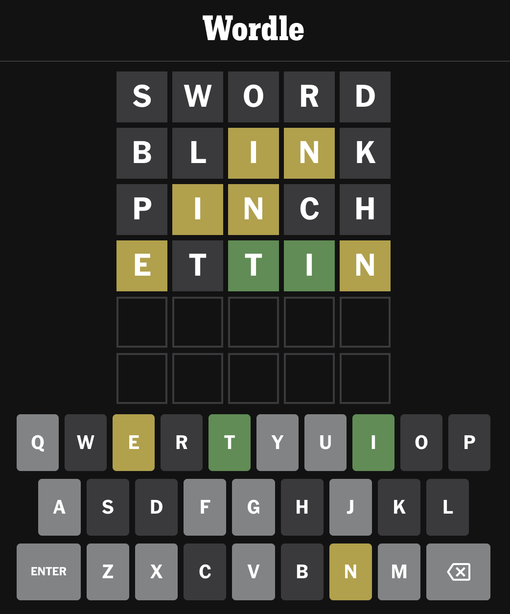



---

Następnym dużym programem, który napiszemy, będzie klon gry Wordle:



Zapewne zajmie nam to kilka zajęć. Musimy przygotować słownik haseł oraz listę dopuszczalnych słów i dobrze byłoby przechowywać je w osobnym pliku, a nie w kodzie programu. Czyli musimy nauczyć się jak wczytywać dane z plików.

Będziemy przeprowadzać sporo operacji na kolekcjach danych (tj. `List`ach i `Map`ach), więc chciałbym wam też pokazać lepszy sposób pracy z nimi. A żeby zrozumieć, jak to wszystko działa i łączy się ze sobą, musimy znów chwilkę porozmawiać o funkcjach i obiektach.

Na koniec poznamy też inne tryby naszego terminala, żeby nasza gra miała sympatyczniejszy interfejs użytkownika. 

Tak więc najbliższe zajęcia będą wyglądały trochę w ten sposób:



# Obsługa plików

Na dobry początek, stwórzcie nowy program w pakiecie `jerz.codes.gry.wordle`:

```kotlin
package jerz.codes.gry.wordle

import jerz.codes.terminal.terminal

fun main() = terminal {
}
```

Następnie, korzystając z panelu `Project` w IntelliJ, dodajcie w tym samym katalogu nowy plik o nazwie `slownik.txt`, a potem dodajcie do niego kilkanaście wyrazów, np.:

```text
TOOTH
BOOTH
RADIO
RUDDY
TORCH
DREAM
DEATH
DESIRE
DESPAIR
DESTINY
DESTRUCTION
DELIRIUM
DELIGHT
PIRATE
COD
CARP
SALMON
```

Do pracy z plikami w języku Kotlin służy klasa `File`. Jeden z jej konstruktorów przyjmuje pełną ścieżkę do pliku w postaci `String`a. Ścieżka to inaczej lokalizacja pliku, np.: `C:\katalog\plik.txt` na Windowsie, albo `/Users/johnnysilverhand/katalog/plik.txt` na Mac'u.

W IntelliJ możemy skopiować ścieżkę pliku do systemowego schowka (czyli potem będziemy mogli ją wkleić w kodzie przez `Ctrl + V`/`Cmd + V`). W panelu `Project` trzeba kliknąć prawym przyciskiem myszy na plik, wybrać opcję `Copy Path/Reference`, a potem `Absolute Path`.

Skopiujcie ścieżkę do pliku `slownik.txt` i wklejcie w kodzie programu do konstruktora klasy `File` (trzeba też będzie dodać odpowiedni `import`):

```kotlin
import java.io.File

fun main() = terminal {
    val plikSłownika = File("/Users/chalup/tmp/kotlin-starter-pack/src/main/kotlin/jerz/codes/gry/wordle/slownik.txt")
}
```

Tak stworzonego obiektu możemy użyć, żeby przeczytać zawartość pliku:

```kotlin
val wyrazy: List<String> = plikSłownika.readLines()
println("Przeczytałem ${wyrazy.size} wyrazów.")
println("Pierwszy z nich to: ${wyrazy.first()}.")
```

Bardzo ważne jest to, że samo stworzenie obiektu `File` nie powoduje utworzenia pliku, ani w ogóle żadnych zmian na dysku. Obiekt typu `File` nie zawiera też samej zawartości pliku. Możecie myśleć o tym jako o karteczce z adresem jakiegoś miejsca: samo napisanie jakiegoś adresu na karteczce nie powoduje, że nagle powstanie w tym miejscu dom. Natomiast mając taką karteczkę, możecie tam dojechać. Możecie też sprawdzić na mapie, czy taki adres faktycznie istnieje.

Inne funkcje, które mogą się nam przydać w najbliższym czasie to:
* `File.exists(): Boolean` - sprawdza, czy plik istnieje
* `File.writeText(text: String)` - nadpisuje zawartość pliku podanym `text`em

# Czy funkcja jest obiektem?

⚠️ **UWAGA**: ta sekcja jest dość "gęsta". Nie starajcie się tego przeczytać na telefonie na przerwie, proponuję usiąść na spokojnie w domu przy laptopie. ⚠️ 

## Powtórka z typów danych

Zróbmy sobie powtórkę z typów. Jakie znacie typy danych? Przypominam: typ danych to "kształt" obiektu (liczba, znak, itp.). Stwórzcie teraz w programie kilka stałych, podając ich typ:

```kotlin
val zero: Int = 0
val tekst: String = "test"
val zakres: IntRange = 1..6
val alfabet: CharRange = 'a'..'z'
val znak: Char = '!'
val lista: List<String> = listOf()
val słownik: Map<String, String> = mapOf()
```

## Funkcja w stałej

Wszystko, co jest obiektem, ma jakiś typ. A funkcja? Czy funkcja też jest obiektem? Jaki jest jej typ? Spróbujmy stworzyć stałą zawierającą funkcję:

```kotlin
val wyjec = fun wyjec() { println("Buu") }
```

Słowo `wyjec` podkreślone jest czerwonym wężykiem, komunikat o błędzie brzmi "Anonymous functions with names are prohibited", i jest dostępny Quick Fix (czyli szybka poprawka dostępna po naciśnięciu `Alt + Enter`). Po jego zastosowaniu dostajemy kod:

```kotlin
val wyjec = fun() { println("Buu") }
```

Nic nie świeci się na czerwono, czyli to jest działający kod! Skoro `wyjec` jest funkcją, to powinniśmy móc z nim zrobić podstawową rzecz, którą robi się z funkcjami – wywołać ją. Robi się to dokładnie w ten sam sposób co z innymi funkcjami, których używaliśmy do tej pory:

```kotlin
wyjec()     // wypisane zostanie na ekran Buu 
```

## Typ funkcji

A jaki funkcja ma typ? Zastosujemy kolejny Quick Fix, tym razem "Specify type explicitly" (czyli "jednoznacznie podaj typ"), dostępny po umieszczeniu kursora na nazwie stałej. Po jego zastosowaniu do `wyjca` zostanie dodana informacja o typie:

```kotlin
val wyjec: () -> Unit = fun() { println("Buu") }
```

Czyli ta funkcja ma typ zapisany jako `() -> Unit`. Na jednym przykładzie dość trudno jest rozszyfrować znaczenie tego zapisu, spróbujmy stworzyć jeszcze jedną funkcję przypisaną do stałej, przy czym tym razem niech ta funkcja przyjmuje parametry i zwraca jakiś obiekt:

```kotlin
val zliczaczLiter = fun(tekst: String): Int { return tekst.length }
```

 Po użyciu Quick Fixu "Specify type explicitly" dodany zostanie taki typ:

```kotlin
val zliczaczLiter: (String) -> Int = fun(tekst: String): Int { return tekst.length }
```

Czyli w zapisie typu funkcji rzeczy w nawiasie po lewej stronie strzałki oznaczają parametry przyjmowane przez tę funkcję, a po prawej stronie znajduje się typ zwracany przez funkcję.

Wróćmy na chwilę do typu stałej `wyjec`: `() -> Unit`. Pusta para nawiasów jest jasna – `wyjec` nie przyjmuje żadnych parametrów. Ale czym jest `Unit` i czemu nie widzieliśmy tego wcześniej?

`Unit` jest domyślnym typem zwracanym przez wszystkie funkcje, więc jeśli nie podaliśmy dla funkcji typu zwracanego, to tak naprawdę zwracała ona właśnie `Unit`. Oczywiście nic nie stoi na przeszkodzie, żeby jawnie powiedzieć, że nasza funkcja zwraca `Unit` (albo wywołać `return Unit` zamiast po prostu `return`), ale jest to zbyteczne i IntelliJ będzie sugerował usunięcie tej informacji:

```
fun zwracamUnit(): Unit {
    return Unit
}
```

## Funkcja jako parametr

Skoro funkcja jest obiektem, to można ją przekazać do innej funkcji jako parametr. Spróbujmy napisać funkcję, która powtórzy kilka razy akcję przekazaną w parametrze:

```kotlin
fun zróbCośKilkaRazy(akcja: () -> Unit) {
    for (i in 1..8) {
        akcja()
    }
}
```

Możemy przekazać tam np. funkcję `wyjec`, żeby nasz program wył wniebogłosy: `zróbCośKilkaRazy(wyjec)`.
 
Funkcje, które dostają inne funkcje jako parametr albo zwracają funkcję, nazywamy **funkcjami wyższego rzędu**. W bibliotece standardowej Kotlina (czyli w zestawie funkcji, które są dostępne razem z językiem), jest cała masa użytecznych funkcji wyższego rzędu, które znacznie zmniejszają ilość kodu potrzebnego do wykonania typowych operacji.

Przykładowo, załóżmy, że mamy listę liczb, i chcemy uzyskać listę liczb dwukrotnie większych (może wydawać się wam to bzdurnym przykładem, ale zapewniam was, cała masa kodu, który piszę na co dzień w pracy to właśnie przemaglowanie kolekcji danych).

Czyli dla każdego elementu listy chcemy go jakoś przekształcić, a wynik dodać do nowej listy. Bez funkcji wyższego rzędu napisalibyśmy to tak:

```kotlin
val liczby = listOf(1, 2, 3, 4)

val podwojoneLiczby = mutableListOf<Int>()
for (liczba in lista) {
    podwojoneLiczby.add(liczba * 2)
}
```

Możemy napisać sobie pomocniczą funkcję wyższego rzędu, która będzie przyjmować funkcję przekształcającą element jako parametr:

```kotlin
fun przemaglujLiczby(lista: List<Int>, przekształcenie: (Int) -> Int): List<Int> {
    val wynik = mutableListOf<Int>()
    for (liczba in lista) {
        wynik.add(przekształcenie(liczba))
    }
    return wynik
}
```

A następnie użyć jej w następujący sposób:

```kotlin
val liczby = listOf(1, 2, 3, 4)
val podwajacz = fun(liczba: Int): Int { return liczba * 2 }
val podwojoneLiczby = przemaglujLiczby(liczby, podwajacz)
```

A jeszcze lepiej nie pisać własnej funkcji do przekształcania listy, tylko użyć bibliotecznej funkcji `map`:

```kotlin
val liczby = listOf(1, 2, 3, 4)
val podwajacz = fun(liczba: Int): Int { return liczba * 2 }
val podwojoneLiczby = liczby.map(podwajacz)
```

## Anonimowe funkcje i wyrażenia lambda

Nie musimy naszego `podwajacza` przypisywać do stałej, można ten sam kod wpisać w wywołaniu funkcji `map`:

```kotlin
val liczby = listOf(1, 2, 3, 4)
val podwojoneLiczby = liczby.map(fun(liczba: Int): Int { return liczba * 2 })
```

Zamiast tworzyć anonimową funkcję, możemy użyć prostszego zapisu, tzw. *wyrażenia lambda*:

```kotlin
val liczby = listOf(1, 2, 3, 4)
val podwojoneLiczby = liczby.map({ liczba: Int -> liczba * 2 })
```

Wygląda to trochę jak wnętrze funkcji, przy czym parametry i ciało funkcji oddzielone są strzałką. Nie ma też słowa kluczowego `return`: wartością zwracaną przez ten kod jest wartość ostatniego wyrażenia.

IntelliJ podpowie nam, że możemy pominąć okrągłe nawiasy przy wywołaniu funkcji `map`:

```kotlin
val liczby = listOf(1, 2, 3, 4)
val podwojoneLiczby = liczby.map { liczba: Int -> liczba * 2 }
```

Ogólna zasada jest taka, że ostatni argument funkcji, który jest wyrażeniem lambda, można zapisać poza okrągłymi nawiasami wywołującymi funkcję. A ponieważ `map` przyjmuje tylko jeden argument, nawiasy okrągłe byłyby puste, i Kotlin zezwala na ich pominięcie.

W wyrażeniach lambda, które przyjmują tylko jeden parametr, można pominąć nazwę parametru. Wtedy w ciele wyrażenia będzie dostępna zmienna `it`. Tak więc nasz kod da się uprościć jeszcze bardziej:

```kotlin
val liczby = listOf(1, 2, 3, 4)
val podwojoneLiczby = liczby.map { it * 2 }
```

Inną przydatną funkcją dostępną dla listy jest `filter`:

```kotlin
fun List<T>.filter(predicate: (T) -> Boolean): List<T>
```

Funkcja `filter` tworzy nową listę, a następnie dodaje do niej wszystkie elementy ze starej listy, dla których funkcja `predicate` zwróci wartość `true`. Czyli "odfiltrowuje" ona listę danych. Przykładowo:

```kotlin
val liczby = listOf(1, 2, 3, 4)
val parzysteLiczby = liczby.filter { it % 2 == 0 }
```

Znacznie prostsze niż:

```kotlin
val liczby = listOf(1, 2, 3, 4)
val parzysteLiczby = mutableListOf<Int>()

for (liczba in liczby) {
    if (liczba % 2 == 0) {
        parzysteLiczby.add(liczba)
    }
}
```

Używanie właściwych funkcji wyższego rzędu nie tylko skraca ilość pisanego kodu, ale przede wszystkim ułatwia jego czytanie. Jeśli widzę wywołanie `map`, wiem, czego mogę się spodziewać. Jeśli widzę pętlę po elementach listy, muszę dokładnie wczytać się w kod, żeby zrozumieć, co ona faktycznie robi.

Na kolejnych zajęciach będziemy poznawać kolejne funkcje tego typu, tak więc upewnijcie się, że dobrze rozumiecie powyższy materiał!