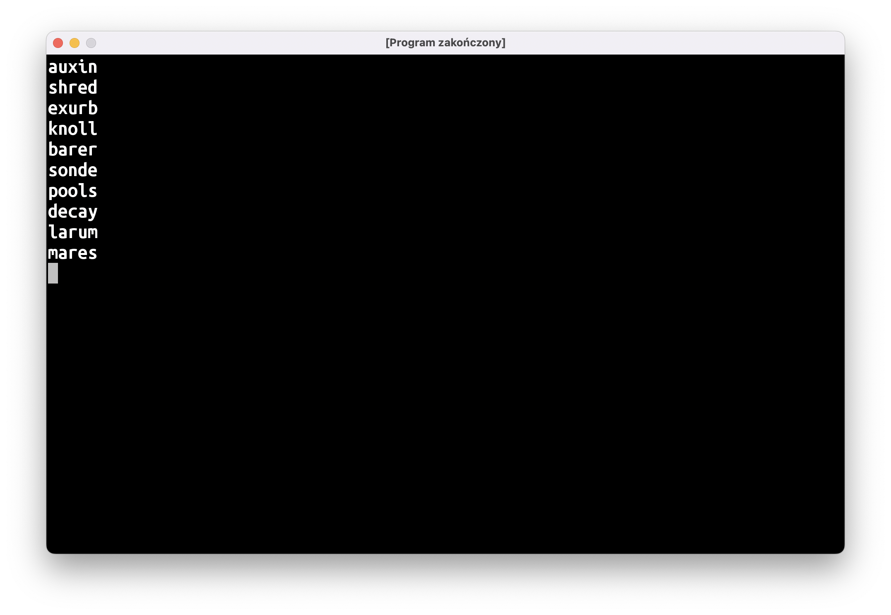



---

# Słownik wszystkich pięcioliterowców

Następnym krokiem przygotowań do pisania klonu Wordle'a będzie utworzenie słownika do gry. Po pierwsze musimy być w stanie wykryć, czy wpisane przez gracza słowo jest faktycznie słowem, czy zlepkiem przypadkowych liter.

Jako bazy dla naszego słownika użyjemy oficjalnego turniejowego słownika do Scrabble. Pobierzcie plik [twl06.txt](https://www.wordgamedictionary.com/twl06/download/twl06.txt) i zapiszcie w katalogu z programem (uwaga dla Czepialskich Czytelników: tak, to nie jest najlepsze miejsce na przechowywanie tego rodzaju plików, ale na dzisiejszych zajęciach skupimy się na nieco innej rzeczy).

Wyrazy w Scrabble mogą mieć od 2 do 15 liter, ale nas interesują jedynie wyrazy pięcioliterowe. Na szczęście na poprzednich zajęciach poznaliśmy wszystkie narzędzia potrzebne do tego, żeby je odfiltrować i zapisać do nowego pliku:

```kotlin
val słownikScrabble = File("/długa/nudna/ścieżka/twl06.txt")

val pięcioliterowce: List<String> = słownikScrabble
    .readLines()
    .filter { it.length == 5 }

val słownikWordle = File(słownikScrabble.parentFile, "słownik.txt")
słownikWordle.writeText(
    pięcioliterowce.joinToString(separator = "\n")
)
```

Pojawiły się tu dwie nowe rzeczy.

Po pierwsze, żeby nie pisać po raz drugi `"/długa/nudna/ścieżka/"`, wykorzystamy fakt, że słownik do Wordle'a ma znaleźć się w tym samym katalogu, co słownik Scrabble'a. Poprosimy `słownikScrabble` o podanie swojego "rodzica" (`parentFile`), czyli katalogu, w którym się znajduje. Następnie użyjemy innego konstruktora `File`, żeby stworzyć `słownikWordle` na podstawie katalogu (obiektu typu `File`) i nazwy pliku podanej jako `String`.

Druga nowa rzecz to użycie funkcji `joinToString`. Wczytana i odfiltrowana lista wyrazów jest typu `List<String>`, a funkcja `writeText` oczekuje pojedynczego `String`'a. Możemy go "zlepić" przy użyciu pętli `for` i funkcji `appendLine()` na obiekcie `StringBuilder`, ale prościej będzie użyć funkcji `joinToString` "dolepionej" do `List`. Jak sama nazwa funkcji wskazuje, łączy (ang. *join*) ona elementy `List`y do `String`a. Parametr `separator` określa jakimi znakami mają być oddzielone elementy listy. Ponieważ chcemy, aby każdy wyraz wylądował w osobnej linijce, przekażemy tam znak nowej linii, czyli `\n`.

# Słownik sensownych pięcioliterowców

Wypiszmy na ekran losowych 10 wyrazów:

```kotlin
val słownikWordle = File(…)
val pięcioliterowce: List<String> = słownikWordle.readLines()

repeat(10) {
    println(pięcioliterowce.random())
}
```

Użyte przeze mnie `repeat` jest jedną z **funkcji wyższego rzędu**, o których była mowa na ostatnich zajęciach. Przyjmuje ona liczbę powtórzeń oraz blok kodu, który ma się wykonać kilka razy. Jest to zamiennik stosowanego przez nas do tej pory:

```kotlin
for (i in 1..10) { /* zrób coś */ }
```

Jest spora szansa, że większość wypisanych haseł będzie bardzo egzotycznymi wyrazami:



(uwaga: słownik do Scrabble zawiera **wszystkie** wyrazy, więc istnieje też niezerowa szansa, że wylosują się jakieś niecenzuralne plugastwa; proszę o dojrzałe podejście i zignorowanie tych bluzgów).

O ile powinniśmy pozwolić graczom na popisanie się swoim słownictwem i wprowadzenie `exurb` albo `sonde` (cokolwiek miałoby to znaczyć), to raczej nie chcemy, aby tego typu wyrazy były odgadywanymi hasłami. Musimy przygotować listę "sensownych" wyrazów. Napiszemy w tym celu program:

```text
wczytaj pięcioliterowce z pliku fiveletter.txt

przygotuj mutableList() na listę haseł

pętelka
    wypisz ile mam wyrazów na liście haseł

    pokaż na ekranie losowy wyraz pięcioliterowy
    wczytaj tekst z klawiatury

    jeśli tekst == 'T'
        dodaj wylosowany wyraz do listy haseł
    jeśli tekst == 'KONIEC!'
        zakończ pętelkę

zapisz listę haseł do pliku hasła.txt
```

W trakcie pisania tego programu na zajęciach zwróciliście uwagę na kilka istotnych problemów.

Po pierwsze, być może ktoś nie będzie miał ochoty albo czasu na przygotowanie słownika haseł za jednym razem. Dobrze by było, żeby przy drugim uruchomieniu nie zaczynać od zera, tylko wczytać `"hasła.txt"` stworzone przy pierwszym uruchomieniu. Tak więc `przygotuj mutableList() na listę haseł` powinno wczytać `hasła.txt` do `MutableList`. Funkcja `File.readlines()` zwraca niemutowalną `List`ę, tak więc będziecie musieli użyć jeszcze metody `.toMutableList()`:

```kotlin
val hasła = plikHaseł
    .readLines()
    .toMutableList()
```

Drugi problem jest taki, że jakiś wyraz może wylosować się kilka razy. Jest to mało prawdopodobne, ale może się zdarzyć, więc dobrze obsłużyć taką sytuację. Przy zapisywaniu haseł musimy usunąć duplikaty. Możemy do tego użyć funkcji `.distinct()`. Mieszko zasugerował również posortowanie alfabetyczne listy. Też da się to załatwić jedną linijką – metoda `.sorted()` zwróci nam posortowaną listę:

```kotlin
plikHaseł.writeText(
    hasła
        .distinct()
        .sorted()
        .joinToString(separator = "\n")
)
```
