Na naszych wtorkowych zajęciach będziecie pracowali na własnym sprzęcie. Chciałbym, żeby wasze komputery były gotowe do pracy już przed zajęciami – możecie to zrobić w domu sami lub z pomocą rodziców albo starszego rodzeństwa.

Na wykonanie poniższych kroków będziecie potrzebować około **jednej godziny** (zależy to m.in. od prędkości waszego łącza internetowego).

Jeśli nie uda się wam wykonać wszystkich kroków – trudno, poradzimy sobie z tym wspólnie w najbliższy wtorek (przyjdźcie wtedy pół godziny wcześniej, o 15:30). Postarajcie się jednak zrobić sami jak najwięcej, pozwoli nam to zaoszczędzić wspólny czas na zajęciach.

# 1. Instalacja środowiska programistycznego IntelliJ

Z oficjalnej strony firmy JetBrains pobierzcie najnowszą wersję IntelliJ Community Edition (czyli darmowy wariant) dla waszego systemu operacyjnego:

https://www.jetbrains.com/idea/download/

A następnie postępujcie zgodnie z instrukcjami programu instalacyjnego.

# 2. Konto e-mailowe {#email}

Krok opcjonalny, tylko jeśli ktoś jeszcze nie ma swojego własnego maila. **Nie zakładajcie osobnego konta tylko na potrzeby naszych zajęć**.

Jeśli musicie założyć nowe konto mailowe, polecam GMaila: wejdźcie na [gmail.com](https://gmail.com/), kliknijcie `Utwórz konto` i postępujcie zgodnie z instrukcjami.

# 3. GitHub

GitHub to narzędzie do przechowywania kodu źródłowego i zespołowej pracy nad kodem. W najbliższym czasie nie będziemy korzystać z większości funkcji tego serwisu, ale użyjemy go jako narzędzia do tworzenia kopii zapasowych napisanego przez was kodu.

Ponadto, szablon projektu, na którym będziemy zaczynać naukę programowania, został zamieszczony na tym serwisie, a żeby go użyć, konieczne będzie utworzenie konta.

Na stronie https://github.com/ kliknijcie przycisk `Sign Up` i postępujcie zgodnie z instrukcjami.

## Przygotowanie projektu startowego

Na stronie https://github.com/jerz-codes/kotlin-starter-pack kliknijcie zielony przycisk z napisem `Use this template`. 

W ten sposób przejdziecie do tworzenia kopii projektu startowego opartego na przygotowanym przeze mnie szablonie. 

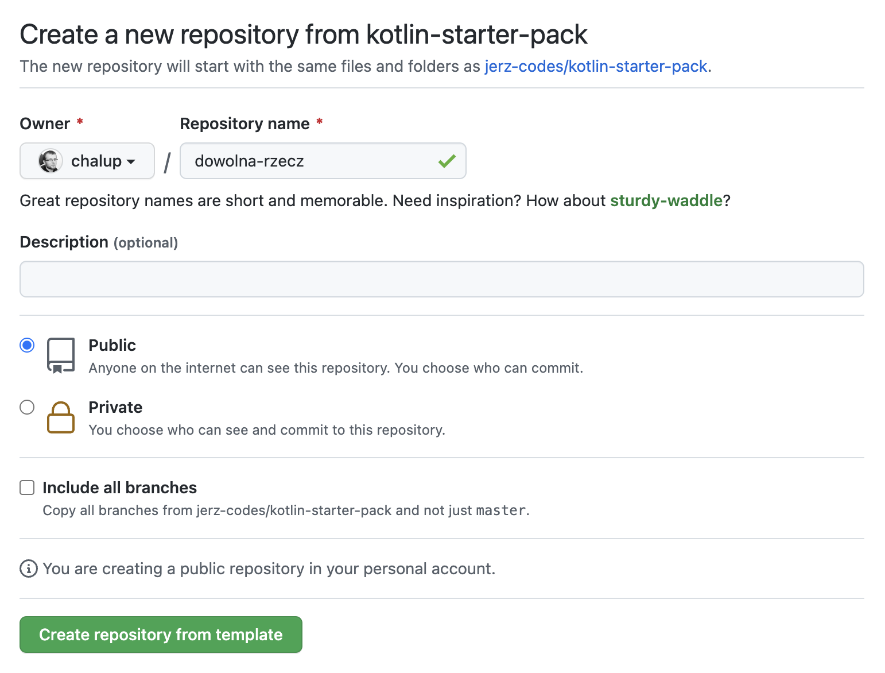

Upewnijcie się, że w polu `Owner` wybrane jest wasze konto; jedynym wymaganym polem jest nazwa projektu (pozostawiam to waszej inwencji twórczej), pozostałych opcji nie trzeba zmieniać.

Po naciśnięciu `Create repository from template` zostaniecie przekierowani na stronę waszego projektu. Gotowe!

# 4. Integracja IntelliJ i GitHuba

Po uruchomieniu programu IntelliJ należy wybrać opcję `Get from VCS`

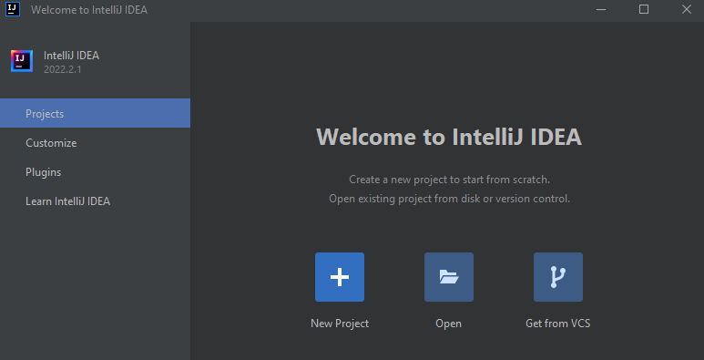

W następnym oknie należy wybrać opcję `GitHub` w menu po lewej stronie, a następnie nacisnąć napis `Use token…`

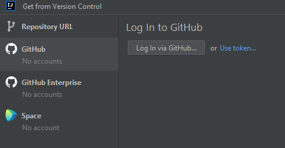

W kolejnym oknie kliknijcie przycisk `Generate…`

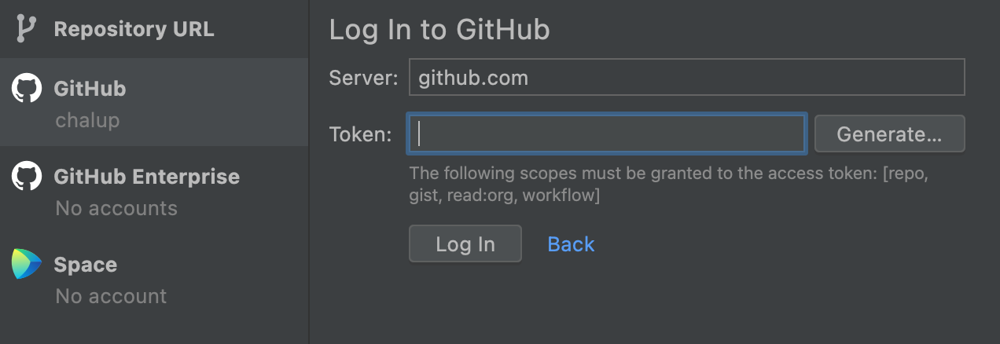

Powinna otworzyć się przeglądarka internetowa na stronie ustawień waszego konta na GitHubie (może być konieczne będzie ponowne zalogowanie)

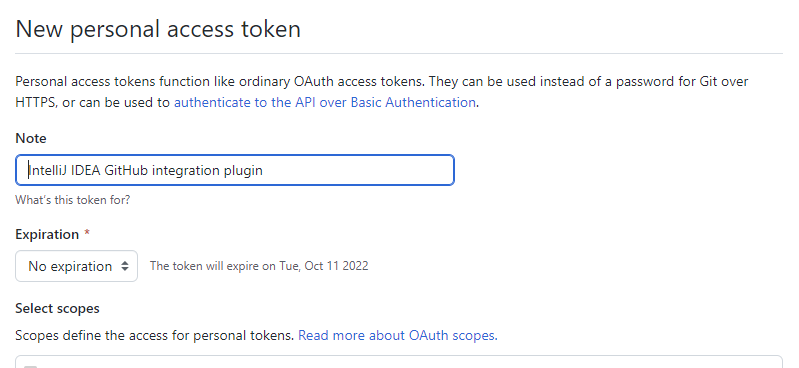

Proponuję, aby zmienić pole `Expiration` na wartość `No expiration`. Następnie należy przescrollować stronę na sam dół i nacisnąć przycisk `Generate token`.

Na następnej stronie konieczne jest skopiowanie do schowka tekstu zaczynającego się od `ghp` (wystarczy nacisnąć niebieską ikonkę po jego prawej stronie).

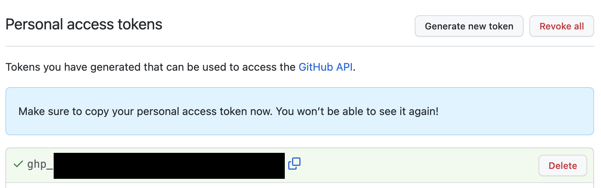

Jest to nasz klucz dostępu, który musicie przekopiować do programu IntelliJ.

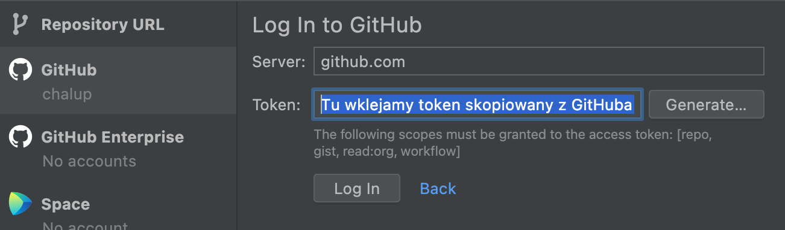

Po naciśnięciu przycisku `Log In` IntelliJ powinien wyświetlić listę wszystkich waszych projektów na GitHubie.

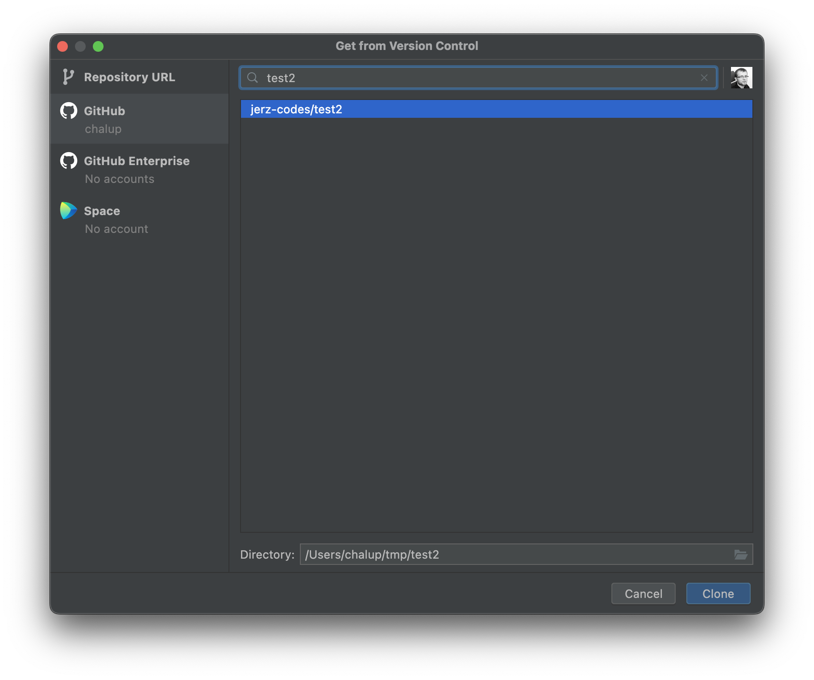

Wybierzcie utworzony wcześniej projekt i naciśnijcie przycisk `Clone`.

IntelliJ może jeszcze zapytać się, czy jest to projekt godny zaufania:

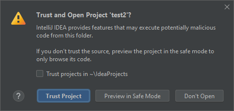

Klikamy oczywiście `Trust Project`.

Rozpocznie się teraz proces klonowania projektu (czyli pobierania go na dysk), konfigurowania projektu (czyli program IntelliJ będzie szukał, z jakich elementów składa się nasz projekt testowy i jak nam je najlepiej wyświetlić), oraz pobierania zależności. Ta ostatnia czynność za pierwszym razem może sporo potrwać, ponieważ oprócz naszego kodu IntelliJ postanowi pobrać ok. trzech-czwartych całego Internetu, na co niestety trzeba chwilę poczekać.

# 5. Uruchomienie programu testowego

Kiedy już wszystko się załaduje i znikną wszelkiego rodzaju paski postępu, w panelu po lewej stronie odszukajcie i wybierzcie plik `HelloWorld.kt`

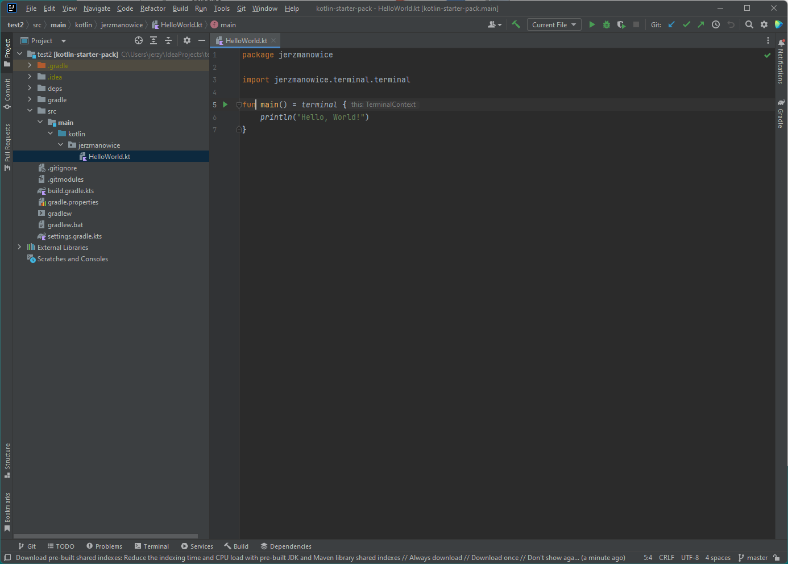

Następnie naciśnijcie na zielony trójkącik obok piątej linii kodu, a z menu, które się pojawi, wybierzcie pierwszą opcję

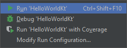

Możliwe jest, że IntelliJ postanowi pobrać pozostałą część Internetu, więc uzbrójcie się w cierpliwość. Jeżeli wszystko dobrze pójdzie, powinniście zobaczyć po chwili następujące okienko

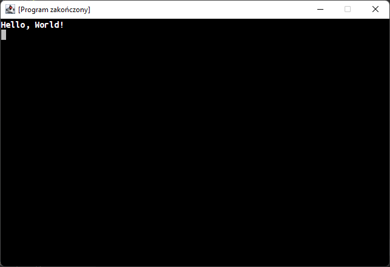

# 6. Slack {#slack}

Slack to platforma komunikacyjna, której będziemy używać do kontaktu pomiędzy zajęciami.

Żeby dodać was do naszego kanału na Slacku, potrzebny będzie mi wasz adres email. Z konta założonego w [punkcie 2](#email) wyślijcie na jerz.codes@gmail.com wiadomość zawierającą wasze imię i nazwisko.

Po kilku godzinach wyślę wam mailem zaproszenie do kanału Slack'owego. W mailu, który otrzymacie, kliknijcie przycisk `JOIN NOW` i postępujcie zgodnie z instrukcjami.

Niestety, jeśli wasze konto e-mailowe na GMailu zostało stworzone jako konto dziecka powiązane z kontem rodzica, nie będziecie mogli użyć przy rejestracji konta na Slacku opcji `Join with Google`. Opcja `Join with Email` powinna działać dobrze.

---

Uff, to chyba wszystko.

Jak widzicie, jest to trochę żmudnej roboty i lepiej zrobić to w domu, żebyśmy mogli na zajęciach zająć się ciekawszymi sprawami.