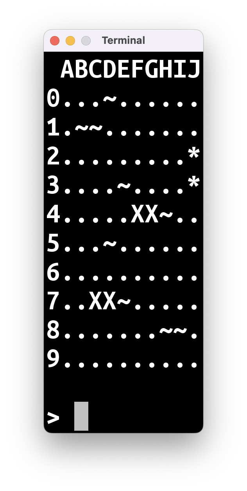
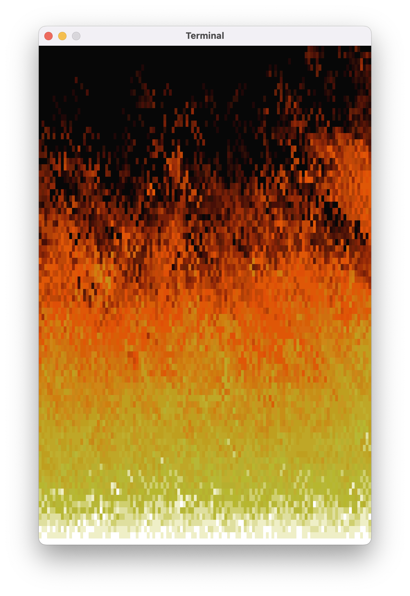
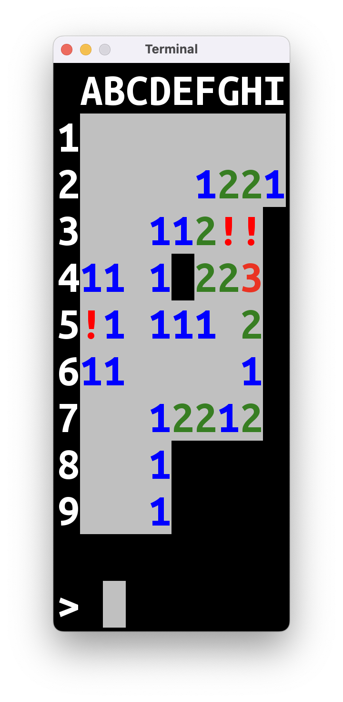

*Ta wersja wpisu przeznaczona jest dla młodzieży – potencjalnych uczestników naszych zajęć. Wersja dla dorosłych znajduje się [tutaj]().*

---

Jeżeli czytacie ten wpis, to w jakiś sposób dotarła do was informacja o organizowanych przez nas zajęciach. Przypuszczam, że chcielibyście wiedzieć więcej, zanim zdecydujecie się wziąć w nich udział.

Właśnie po to powstał ten wpis.

# Co będziemy robić?

Na naszej stronie startowej mamy takie zdanie.

> Będziemy zajmować się nauką programowania w języku Kotlin od podstaw na przykładzie prostych gier komputerowych.

Zawiera ono dwie istotne informacje:

> bla bla bla **nauka programowania** bla **od podstaw** bla bla

Będziemy uczyć się programowania od absolutnych podstaw. Jeśli nie mieliście do czynienia z programowaniem do tej pory – nie ma problemu, wszystkiego się nauczymy. Jeśli już macie jakieś doświadczenie – też dobrze, będzie wam łatwiej zrozumieć to, o czym będę mówił.

Nie będą to zajęcia pt.: "przeklepywanie tego, co prowadzący nabazgrał na tablicy" albo "a teraz dzieci, jak przekleicie ten wielki kawałek kodu, którego nie rozumiecie ni w ząb, to stanie się coś niesamowitego! Łał, nieprawdaż?". Założenie jest takie, że każdą linijkę kodu w waszym programie będziecie pisali własnoręcznie. Będziecie wiedzieli, co ona robi i jak ją zmienić, żeby wasz program robił coś innego.

Druga informacja to:

> cośtam cośtam **proste gry komputerowe**

Programami, które będziemy pisać, będą proste gry. I tu konieczne jest sprostowanie: Minecraft **nie** jest prostą grą. Fortnite też nie. Bardzo możliwe, że nie mieliście okazji grać w prawdziwie **prostą** grę komputerową.

Spodziewam się, że to, co będziecie w stanie napisać po 2-3 miesiącach będzie wyglądało tak:

|  |  |
|-----------------|-----------------|

|  |  |
|-------------------|----------------|

Później przejdziemy do bardziej skomplikowanego trybu graficznego, dodamy obsługę myszy/padów, dźwięki, itp. ale najpierw będziecie musieli opanować podstawy, żeby nie pogubić się w tym trudniejszym materiale. 

# Jak będą wyglądały zajęcia?

Będziemy spotykać się w Bibliotece Publicznej w Jerzmanowicach raz w tygodniu, we wtorki, na półtorej godziny. Zajęcia będą miały formę warsztatów: najpierw będę wam krótko opowiadał o jakiejś nowej koncepcji programistycznej, a potem będziemy wspólnie pisać malutkie programy testowe, na których nauczymy się jak zastosować tę koncepcję w praktyce. Raz na 3-4 tygodnie, przez całe zajęcia będziemy pisać jakiś większy program – najczęściej grę.

Po zajęciach będę wrzucał na stronę podsumowanie zajęć. Dzięki temu, jeśli opuścicie spotkanie, będziecie mogli przeczytać w domu, co robiliśmy i nadrobić braki w stosunku do reszty grupy. Oprócz tego będę zamieszczał listę programów do samodzielnego napisania w domu.

Myślicie pewnie teraz: "*że co, praca domowa?!?!*". 

Nie do końca. Nikt was nie okrzyczy, nie dostaniecie złej oceny, ani nie "wylecicie" z zajęć, jeśli nie będziecie tej dodatkowej pracy robić. Prawda natomiast jest taka, że jeśli podchodzicie do tematu na poważnie i chcecie tworzyć własne gry i inne programy, to trzeba zakasać rękawy i zabrać się do pracy. Tak jak każda umiejętność, programowanie wymaga praktyki.

Przy okazji tej samodzielnej pracy na pewno będziecie mieli masę pytań i zdarzy się, że coś nie będzie wam działać albo w jakimś momencie "utkniecie". Żeby pomóc wam w takich sytuacjach, dostaniecie zaproszenie na kanał na Slacku (platforma komunikacyjna, taka jak Discord albo WhatsApp), gdzie będziecie mogli poprosić o pomoc. 

# Podsumowanie

* Nauka programowania od podstaw
* Samodzielna praca z kodem
* 90 minut warsztatów programistycznych tygodniowo
* Materiały dostępne na stronie
* Kanał Slack dla uczestników

Jeśli to, co opisałem w tym wpisie, wydaje się wam interesujące, poproście waszych rodziców o zgłoszenie was mailowo na adres jerz.codes@gmail.com.

Zapisy na rok szkolny 2022-2023 trwają do końca września. Pierwsze zajęcia odbędą się **11 października**.